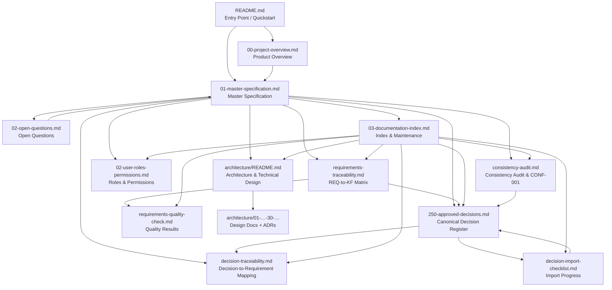

# 03 — Documentation Index

> **Status:** UPDATED (POST PROMPT 04 CONSISTENCY AUDIT + PROMPT 05-FIX DECISIONS + PROMPT 06 ARCHITECTURE)
> **Version:** 0.5.0
> **Last Updated:** 2026-09-05
>
> **PURPOSE:** This is the navigation map for the entire documentation set. It lists every documentation file, its purpose, and how they relate. It also documents **how the documentation is maintained**.

---

## Documentation Map

---

## File Index

| File                                                             | Version                | Role / Purpose                                                                                                                                                                                                                                                                             |
| ---------------------------------------------------------------- | ---------------------- | ------------------------------------------------------------------------------------------------------------------------------------------------------------------------------------------------------------------------------------------------------------------------------------------ |
| [`README.md`](../README.md)                                      | 0.1.0                  | Entry point for the repo overall. Explains what the product is at a high level, points to the documentation, and tells a coding agent where to start.                                                                                                                                      |
| [`00-project-overview.md`](00-project-overview.md)               | **0.5.0**              | Non-technical product overview: what the product is, who uses it, high-level scope, and domain map (now 22 domains).                                                                                                                                                                       |
| [`01-master-specification.md`](01-master-specification.md)       | **0.5.0**              | The **authoritative** source of truth. Contains **232 approved requirements** (REQ-001 … REQ-232) across 22 domains, the **Booking/Payment State Machine and Slot-Lock State** (§26), the **approved Promised-05FIX decisions** (Domain 22 / §30), definition of done, and change control. |
| [`02-open-questions.md`](02-open-questions.md)                   | **0.5.0**              | The explicit log of missing, ambiguous, or contradictory items. **ALL PRODUCT QUESTIONS RESOLVED** (6 OQs + 8 state-machine items resolved; no open product questions remain).                                                                                                             |
| [`02-user-roles-permissions.md`](02-user-roles-permissions.md)   | **0.5.0**              | The five platform roles (Super Admin, Admin, Business Owner, Customer, System) and their Allowed / Not allowed / Conditional / Pending-clarification permissions, each traced to approved facts.                                                                                           |
| [`03-documentation-index.md`](03-documentation-index.md)         | **0.5.0**              | This file. Navigation map and maintenance/change-control guide.                                                                                                                                                                                                                            |
| [`250-approved-decisions.md`](250-approved-decisions.md)         | **0.5.0**              | **Canonical decision register.** Registers `DEC-001`…`DEC-250`, records approved decision content (Appendix A, **242 `KF-*` facts** across 15 groups), the **14 Prompt 05-FIX final approved decisions** (Appendix C), and logs known decision conflicts (CONF-*; CONF-001 **resolved**).  |
| [`consistency-audit.md`](consistency-audit.md)                   | **0.5.0**              | Full internal consistency audit (Prompt 04, updated by Prompt 05-FIX): contradictions, semantic conflicts, duplicates, gaps, state-machine issues, cross-domain findings, and the CONF-001 resolution.                                                                                     |
| [`decision-traceability.md`](decision-traceability.md)           | **0.5.0**              | Reverse index: decision → requirement(s) → affected document(s). Ensures every approved decision produces documented requirements.                                                                                                                                                         |
| [`requirements-traceability.md`](requirements-traceability.md)   | **0.5.0**              | Forward REQ → KF traceability matrix: one row per requirement (REQ-001 … REQ-232) with source facts, decision source, domain, section, and test reference.                                                                                                                                 |
| [`requirements-quality-check.md`](requirements-quality-check.md) | **0.5.0**              | Per-requirement quality checklist and consistency constraints applied to all 232 requirements.                                                                                                                                                                                             |
| [`decision-import-checklist.md`](decision-import-checklist.md)   | **0.5.0**              | Per-decision import progress (`DEC-001`…`DEC-250`) and final validation checklist.                                                                                                                                                                                                         |
| [`architecture/README.md`](architecture/README.md)               | **1.0.0** (src v0.5.0) | **Prompt 06** architecture & technical design entry point + full document map + technology-stack summary.                                                                                                                                                                                  |
| [`architecture/01-…-30-….md`](architecture/README.md)            | **1.0.0** (src v0.5.0) | The 30 architecture design documents (overview → traceability), each tracing to requirements.                                                                                                                                                                                              |
| [`architecture/adr/README.md`](architecture/adr/README.md)       | **1.0.0** (src v0.5.0) | Index of the 12 Architecture Decision Records (ADR-001 … ADR-012).                                                                                                                                                                                                                         |

> **Future files (planned, not yet created):** API contract artifacts (concrete), database migration scripts, detailed test-plan artifacts, and deployment/infrastructure scripts (deployment design exists conceptually in `architecture/27-deployment-environments.md`; runbooks/artifacts are a later implementation-decision prompt). These will be listed here as they are created.

---

## Document Hierarchy

1. **README.md** — entry point / quickstart for any reader.
2. **00-project-overview.md** — the "what is this" layer (business-level).
3. **01-master-specification.md** — the "what must be built" layer (business requirements, decision-traced).
4. **250-approved-decisions.md** — the "what was decided" layer (canonical decision register, imported decisions and captured facts).
5. **consistency-audit.md** — the "what is consistent" layer (Prompt 04 audit and CONF-001 resolution).
6. **02-user-roles-permissions.md** — the roles/permissions layer.
7. **decision-traceability.md** — the decision-to-requirement mapping (reverse index).
8. **requirements-traceability.md** — the REQ → KF forward matrix (one row per requirement).
9. **requirements-quality-check.md** — the per-requirement quality evidence.
10. **decision-import-checklist.md** — the import progress tracker.
11. **02-open-questions.md** — the "what is unresolved" layer.
12. **architecture/** — the "how it must be built" layer (Prompt 06): 30 design docs + 12 ADRs, each traced to the requirement(s) it implements.
13. **03-documentation-index.md** — navigation and governance tool.

### Dependencies

- `README.md` should always remain a stable entry point; seldom changes.
- `00-project-overview.md` depends on final decisions in the Master Specification and the decision register.
- `01-master-specification.md` is the source of truth for requirements; decisions flow into it from `250-approved-decisions.md`.
- `250-approved-decisions.md` is the source of truth for decisions; conflicts and duplicates are recorded there.
- `consistency-audit.md` is derived from a cross-check of the spec and register; re-run it when either changes materially.
- `02-user-roles-permissions.md` is derived from role/security/tenant requirements; update it when those change.
- `decision-traceability.md` maps the register to requirements and must be updated when either changes.
- `requirements-traceability.md` is derived from `01-master-specification.md`; it must list every REQ exactly once and agree with the register's fact identifiers.
- `requirements-quality-check.md` reuses the section/domain structure of `01-master-specification.md` and the counts in `requirements-traceability.md`.
- `decision-import-checklist.md` tracks import state and must be updated on every import.
- `02-open-questions.md` is fed by gaps discovered in any other document.
- `architecture/` is derived from `01-master-specification.md` (v0.5.0): every REQ maps to a component + document (`architecture/30-architecture-traceability.md`); the architecture set must be re-audited when the master specification changes.
- `03-documentation-index.md` must be updated whenever a document is added, removed, or renamed.

---

## Business Requirements vs. Technical Implementation Decisions

The documentation set deliberately **separates** these two categories:

| Category                               | Where it lives                                                                   | Examples                                                            |
| -------------------------------------- | -------------------------------------------------------------------------------- | ------------------------------------------------------------------- |
| **Business requirements**              | `01-master-specification.md` (REQ-* domains)                                     | What the product must do (booking, scheduling, notifications, etc.) |
| **Technical implementation decisions** | `architecture/` (Prompt 06; `01-architecture-overview.md` §5 ADR index + `adr/`) | Technology stack, DBMS, API style, deployment model                 |

**Rule:** Business requirements are decision-traced to the 250-decision process. Technical implementation decisions are recorded separately (architecture docs + ADRs) and must never contradict business requirements — verified by `architecture/30-architecture-traceability.md` and the consistency audit.

---

## Validation Rules (for the coding agent)

When consuming this documentation, a coding agent must:

1. Read the reference before implementing.
2. Not invent business behavior missing from the specification.
3. Record any ambiguity as an open question rather than assuming.
4. Preserve requirement identifiers (`REQ-NNN`) and their traceability in `requirements-traceability.md`.
5. Treat the Master Specification as authoritative over any informal discussion.

---

## Maintaining the Documentation

### Adding Content

- New requirements are added to the appropriate domain in `01-master-specification.md`, using the definition of done and numbering rules defined there.
- New open questions are logged in `02-open-questions.md` with an `OQ-<DOMAIN>-NNN` identifier.
- New documents are registered in this index.

### Resolving Open Questions

- Move the question from the Open list to the Resolved list in `02-open-questions.md`.
- Record the resolution and the source decision number (if any).
- If the resolution changes requirements, apply the change-control procedure in `01-master-specification.md` §29.
- Re-run the consistency checks below and update `requirements-traceability.md` / `requirements-quality-check.md` if any requirement changed.

### Consistency Checks

Documentation consistency is maintained by verifying, at minimum:

- Every `Source decision` referenced actually exists in the decision register (`DEC-*` / `KF-*`).
- Every requirement identifier referenced across documents exists and has matching status.
- Every `DEC-*` in the register appears in the import checklist and traceability mapping.
- Every open question has an identifier and a clear blocker description.
- No two approved requirements contradict each other.
- Every known decision conflict (CONF-*) is documented, with the earlier decision preserved.
- Every requirement REQ-* is mapped exactly once in `architecture/30-architecture-traceability.md`; architecture issues (if any) are listed in `architecture/01-architecture-overview.md` §8.

---

## Related Documents

- [00-project-overview.md](00-project-overview.md)
- [01-master-specification.md](01-master-specification.md)
- [02-open-questions.md](02-open-questions.md)
- [02-user-roles-permissions.md](02-user-roles-permissions.md)
- [250-approved-decisions.md](250-approved-decisions.md)
- [consistency-audit.md](consistency-audit.md)
- [decision-traceability.md](decision-traceability.md)
- [requirements-traceability.md](requirements-traceability.md)
- [requirements-quality-check.md](requirements-quality-check.md)
- [decision-import-checklist.md](decision-import-checklist.md)
- [README.md](../README.md)
- [architecture/README.md](architecture/README.md)
- [architecture/30-architecture-traceability.md](architecture/30-architecture-traceability.md)
- [architecture/adr/README.md](architecture/adr/README.md)
