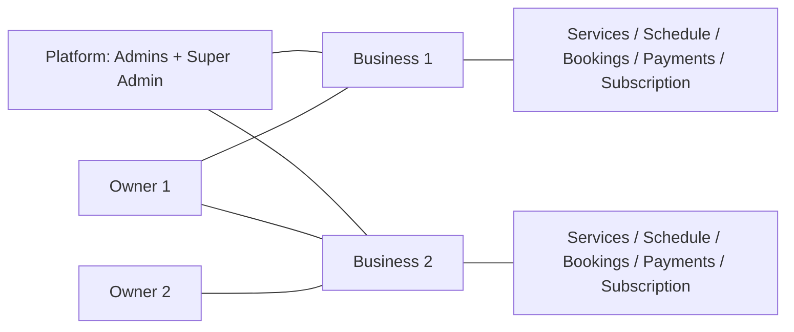
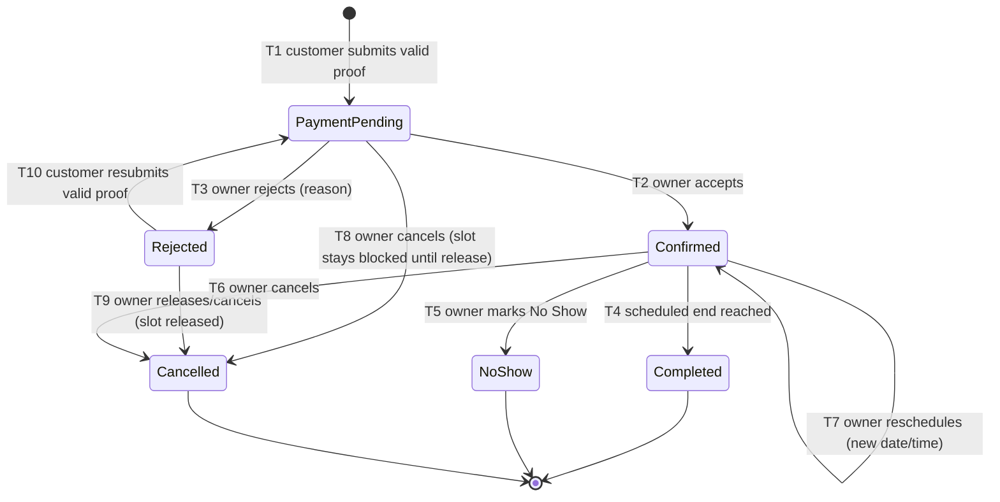

# Werefa — Complete Product Specification

- **Product:** Werefa
- **Version:** 1.0.0-DRAFT
- **Status:** DRAFT — PENDING PRODUCT OWNER APPROVAL
- **Primary owner:** Product Owner
- **Approving authority:** Product Owner (this document is PENDING approval and becomes normative only after explicit approval)
- **Created:** 2026-09-13
- **Canonical location:** `docs/WEREFA-COMPLETE-SPECIFICATION.md`

---

## 1. Document Control

| Item | Value |
| --- | --- |
| Document title | Werefa — Complete Product Specification |
| Document ID | WEREFA-COMPLETE-SPECIFICATION |
| Version | 1.0.0-DRAFT |
| Status | DRAFT — PENDING PRODUCT OWNER APPROVAL |
| Owner | Product Owner |
| Approving authority | Product Owner |
| Categories | Product specification, requirements specification, boundary/context |
| Applies to | The Werefa product as a whole (public booking experience, owner experience, platform administration) |
| Build basis | Prompts 00–26; all approved requirements, decisions, architecture, consistency/audit, and implementation-source documentation (see Section 3) |
| Language | English |
| Normative style | MUST / MUST NOT / SHOULD / SHOULD NOT / MAY (RFC 2119 semantics, restated in Section 8) |

### 1.1 Normative priority

The product behaviors stated in this specification are the canonical product truth. Where any behavior stated here conflicts with behavior described in implementation code, the specification governs. Source priority is defined in Section 3.1.

---

## 2. Revision History

| Version | Date | Change summary |
| --- | --- | --- |
| 1.0.0-DRAFT | 2026-09-13 | Complete specification rebuilt from all approved source material (requirements, decisions, architecture, consistency/audit, and implementation references). Replaces any and all prior partial specifications. Incorporates Prompt 26 confirmed product decisions. Status remains DRAFT — PENDING PRODUCT OWNER APPROVAL. |

---

## 3. Table of Contents

1. Document Control
2. Revision History
3. Table of Contents
4. Methodology and Sources
   - 4.1 Source priority
   - 4.2 Docree roles (requirements, decisions, architecture, consistency, implementation)
   - 4.3 Requirement identity rules
5. Product Concepts
6. Actors and Roles
   - 6.1 Role summary
   - 6.2 Role relationships
7. Multi-Tenancy Model
   - 7.1 Business as tenant
   - 7.2 Platform versus tenant data
   - 7.3 Forward-compatibility policy: backend/frontend separation
8. Normative Language and Compliance Levels
9. Executive Summary
10. Product Vision
    - 10.1 Problem / opportunity
    - 10.2 Value proposition
    - 10.3 Product vision statement (traction)
11. Product Goals
12. Product Scope
    - 12.1 In scope
    - 12.2 Out of scope
13. Customer Experience (Anonymous Public)
    - 13.1 Public booking entry points
    - 13.2 Public booking journey
    - 13.3 Public page states (business-level coexistence rules)
    - 13.4 Customer self-service boundaries
    - 13.5 Public page availability and unavailability states
    - 13.6 Payment proof for prepayment bookings
14. Business Owner Experience
    - 14.1 Onboarding and business management
    - 14.2 Services and offers management
    - 14.3 Scheduling
    - 14.4 Bookings management
    - 14.5 Rescheduling bookings
    - 14.6 Cancellation of bookings
    - 14.7 Subscription and payment management
    - 14.8 Notifications received by the owner
15. Booking Lifecycle and State Machine
    - 15.1 Booking states (with spend-accuracy note)
    - 15.2 Payment statuses (with spend-accuracy note)
    - 15.3 Transition table
    - 15.4 Slot lifecycle rules
    - 15.5 Terminal states
    - 15.6 Invalid transitions
    - 15.7 Booking status history (audit of the booking)
    - 15.8 State machine diagram (textual)
16. Payments and Payment Proofs
    - 17 reference renumbered — see Section 16 note below
17. Subscription Model
    - 16-A note: numbering of Sections 16–17 is corrected in this revision; see Section 16.1
18. Telegram Integration
19. Notification and Messaging Matrix
    - 19.1 Notification catalog
    - 19.2 Notification delivery guarantees
    - 19.3 Idempotency and duplicate suppression
20. Security Model
    - 20.1 Credentials
    - 20.2 Password reset
    - 20.3 Emergency access recovery
    - 20.4 Login and lockout
    - 20.5 Sessions
    - 20.6 Multi-factor authentication (2FA)
    - 20.7 Security history and retention
    - 20.8 Device tracking
    - 20.9 Security event classes
21. Authorization Matrix
22. Tenant Isolation and Row-Level Security
23. Concurrency and Booking Integrity
    - 23.1 Requirements context
    - 23.2 Confirmed controls (approved architecture behavior)
    - 23.3 Resubmission control
24. Audit, Logging, and History
25. Reporting
    - 25.1 Booking reports
    - 25.2 Schedule history export
    - 25.3 Owner booking-history export (pending clarification)
    - 25.4 Filtering and sorting
26. Implementation Model — Frontend and Backend Separation
    - 26.1 Canonical top-level layout
    - 26.2 Boundary rules
    - 26.3 API contract
    - 26.4 Relationship to current repository history
27. Frontend Pages and Flows
    - 27.1 Public pages
    - 27.2 Owner dashboard pages
    - 27.3 Platform administrator pages
28. Backend Architecture and Domain Modules
29. Data Model (Logical)
30. API Specification (Logical)
31. File, Image, and Attachment Storage
32. Background Jobs and Workers
33. Error Handling and Recovery
34. Non-Functional Requirements
35. Testing Strategy and Quality Gates
36. Deployment and Environments
37. Backup, Recovery, and Retention
38. Privacy and Data Protection
39. Business Rules Catalog
40. Requirement Catalog (All Formal REQ-*)
    - 40.0 How to read this catalog
    - 40.1 Domain 1 — Platform / SaaS (REQ-001 … REQ-006)
    - 40.2 Domain 2 — Tenant / Business (REQ-007 … REQ-023)
    - 40.3 Domain 3 — Authentication (REQ-024 … REQ-035)
    - 40.4 Domain 4 — Users / Roles / Permissions (REQ-036 … REQ-044)
    - 40.5 Domain 5 — Public Booking (REQ-045 … REQ-053)
    - 40.6 Domain 6 — Customers (REQ-054 … REQ-059)
    - 40.7 Domain 7 — Telegram (REQ-060 … REQ-069)
    - 40.8 Domain 8 — Services / Pricing (REQ-070 … REQ-081)
    - 40.9 Domain 9 — Scheduling (REQ-082 … REQ-099)
    - 40.10 Domain 10 — Booking Lifecycle (REQ-100 … REQ-109)
    - 40.11 Domain 11 — Payments (REQ-110 … REQ-124)
    - 40.12 Domain 12 — Subscription (REQ-125 … REQ-141)
    - 40.13 Domain 13 — Notifications (REQ-142)
    - 40.14 Domain 14 — Pause / Resume (REQ-143 … REQ-158)
    - 40.15 Domain 15 — Schedule Exceptions (REQ-159 … REQ-161)
    - 40.16 Domain 16 — Audit / History (REQ-162 … REQ-174)
    - 40.17 Domain 17 — Reports / Exports (REQ-175 … REQ-190)
    - 40.18 Domain 18 — Security (REQ-191 … REQ-206)
    - 40.19 Domain 19 — Public Business Page (REQ-207 … REQ-216)
    - 40.20 Domain 20 — Administration (REQ-217 … REQ-221)
    - 40.21 Domain 21 — Cross-cutting Date / Time (REQ-222 … REQ-226)
    - 40.22 Domain 22 — Approved Decisions — Prompt 05-FIX (REQ-227 … REQ-232)
41. Traceability
    - 41.1 Decisions to requirements
    - 41.2 Requirements to specification sections
    - 41.3 Specification sections to implementation areas
    - 41.4 Approved facts (KF-*) status
42. Phase 2 and Deferred Items
43. Non-Goals
44. Acceptance Criteria (Project Level)
45. Glossary
46. Open Issues and Specification Clarifications Required
    - 46.1 Documentation quality check

> **Note on section numbering anomalies:** in earlier source contexts the adjacent numbering of Sections 15–19 varied; this revision standardizes 15 Booking Lifecycle, 16 Payments, 17 Subscription, 18 Telegram, 19 Notification Matrix. The numbering note is resolved in Section 15.8.

---

## 4. Methodology and Sources

This specification is a complete rebuild of the product specification. It integrates:

1. The approved formal requirements (REQ-001 … REQ-232) as documented in `docs/01-master-specification.md` (master specification version 0.5.0 context), the authoritative requirement register.
2. The approved decisions register and fact register in `docs/250-approved-decisions.md` (version 0.5.0 context), including the KF-* fact set (Appendix A) and Prompt 05-FIX decisions (Appendix C).
3. The approved architecture (`docs/architecture/`, version 1.0.1, APPROVED — PROMPT 06 / corrected by PROMPT 06-CORRECTION).
4. The consistency and audit documentation (`docs/consistency-audit.md`) and the roles/permissions documentation (`docs/02-user-roles-permissions.md`).
5. The implementation documentation (`docs/implementation/`) used strictly as a lower-priority reference (see 4.1).

Nothing in this specification invents a feature or a requirement number. Every REQ-* identifier references an actual approved requirement. Every behavior assigned to a product decision is traceable to an approved decision or fact register entry, or is explicitly marked `SPECIFICATION CLARIFICATION REQUIRED`.

### 4.1 Source priority

Where source material conflicts, the following priority ordering is used (highest first):

1. Explicit final product-owner decisions (Prompt 26 confirmed decisions in Section 2; prior Prompt final decisions where they remain in force).
2. Current approved formal requirements (REQ-001 … REQ-232).
3. Approved architecture decisions (architecture version 1.0.1).
4. Consistency and audit documentation.
5. Implementation documentation.
6. Implementation behavior (observed code behavior). Implementation behavior is consulted LAST and is never permitted to redefine product truth.

Conflicts discovered during this rebuild are recorded in Section 46. None of the resolution rules in this document change approved decisions; where a decision is superseded by a later approved decision, the later decision is recorded as the operative one.

### 4.2 Source roles

- **Requirements** — statements the product MUST/SHOULD/MAY satisfy (formal REQ-* set). Source of truth for behavior.
- **Decisions** — formally approved product and technical decisions (the 250-slot register; KF-* facts; Prompt 05-FIX decisions). Only DEC-175 is currently mapped (formal mapping pending) to REQ-159 and REQ-160. No other DEC-* mapping is asserted in this specification, and no attempt is made to fabricate DEC-001 … DEC-250 mappings.
- **Architecture** — approved approach decisions (ADRs and architecture documents) governing how the product is built, extended, and operated.
- **Consistency / audit** — records that resolved contradictions and semantic gaps (for example CONF-001, SEM-008).
- **Implementation** — build evidence (report set under `docs/implementation/`). Reference-only.

### 4.3 Requirement identity rules

- The formal requirement set is contiguous: REQ-001 … REQ-232 (see Section 40.0 for the verification statement).
- Stable IDs are preserved. No silent renumbering occurs.
- Earlier internal requirement drafts (REQ-001 … REQ-226 from Prompt 03; REQ-227 … REQ-232 added by Prompt 05-FIX) are superseded by the current register, and the current register is authoritative.
- No new REQ-* identifiers are added by this specification. Newly confirmed product decisions from Prompt 26 are recorded as "Prompt 26 confirmed decisions" (see Sections 9–38 narrative and Section 46) and are mapped to existing requirements, not added as new requirement numbers.
- Normalization source (KF-*) is retained per requirement where a KF fact exists (Appendix A of the decisions register).

---

## 5. Product Concepts

| Concept | Definition |
| --- | --- |
| Werefa | The proper name of the product and of the public experience. It is used consistently throughout this specification. |
| Business | A single tenant of the platform (service provider), each with its own profile, services, schedule, bookings, and subscription. |
| Business Owner | The person who registers and manages a business through the platform (owner role). |
| Customer | An anonymous member of the public who books a service through a business's public page. Customers have no platform account. |
| Admin | A platform-level administrator (one of exactly two). Has administrative capabilities (subscription payment review, reports, logs) but deliberately limited capability set. |
| Super Admin | The single platform administrator with the highest platform role. |
| System Actor | The automated platform actor that records automatic schedule changes and automatic state changes. |
| Service / Offer | What a customer can book, with name, price, duration, optional variations, and optional add-ons. |
| Schedule | The business's availability definition (working days, periods, special-date overrides, blocked periods). |
| Booking | A protected reservation of a slot for a specific service at a specific schedule time, made by a specific customer (identified by name and phone). |
| Slot | A concrete start time resulting from schedule × service duration. |
| Payment proof | The image or PDF a customer submits to the business to prove payment for a prepayment booking. |
| Payment status | Pending, Accepted, or Rejected (the only three statuses). |
| Public booking page | The single public web page per business, reachable via the business's public link and QR code only. |
| Telegram connection | An optional, opt-in connection between a customer's Telegram account or the owner's Telegram account and the business/booking context. |
| Notification | A message the system delivers via an approved channel (dashboard, email, Telegram) for a defined event. |
| Schedule version | An immutable snapshot of the schedule as it was arranged at a point in time. |
| Schedule exception | An approved, booking-specific departure from the schedule (conflict with a customer's confirmed booking, resolved by the owner choosing "Keep Booking"). |
| Audit event | A security, administrative, booking, or notification event recorded with actor, timestamp, and outcome. |
| Security history | Platform-level history of security events (login, lockout, password change, reset, recovery, forced logout, deletion). |

---

## 6. Actors and Roles

### 6.1 Role summary

| Role | Platform account? | Count / norm | Canonical entry | Administrates | Primary boundaries |
| --- | --- | --- | --- | --- | --- |
| Anonymous Customer | No | unbounded | Public booking page (link / QR) | — | Can submit a booking (name + phone + optional note), submit a payment proof; later identify via phone. |
| Business Owner | Yes | unbounded | Owner dashboard (and optional Telegram) | Own businesses | Manages own business(es): profile, services, schedule, subscriptions, bookings; reviews payment proofs; can cancel/reschedule; cannot create customer bookings. NOT a platform administrator. |
| Admin | Yes | exactly 2 | Admin dashboard | Platform (limited) | Reviews subscription payments; views logs; performs limited administrative actions. Cannot change own password. Cannot view/act on most tenant data. |
| Super Admin | Yes | exactly 1 | Admin dashboard | Platform (highest) | Full platform administration: subscription payments, logs, security history, deletion (audited), fine details reserved to Super Admin. |
| System Actor | No | automated | Platform internals | — | Records automatic schedule changes, automatic state changes, and audit rows with the System Actor identity and an automatic reason. |

Five roles concept is stable: the product documentation defines the three platform administration roles (Business Owner, Admin, Super Admin) plus the Customer (anonymous — not a platform account) plus the System Actor (automated). Customer is deliberately anonymous and not an administration role; System Actor is an automated actor, not a person.

### 6.2 Role relationships

- A Business Owner may manage more than one business (each business has its own subscription and is managed separately).
- A Business Owner is NOT a platform administrator. Platform administrators do not routinely configure a business owner's business on their behalf; an approved requirement must allow a specific administrative action for a platform administrator to perform it on tenant data. The only regularly exercised administrative action on tenant data is subscription payment review (Admin / Super Admin).
- An Admin cannot change their own password; a Super Admin cannot change another person's password (see Section 20).
- No user can be Administrator and Business Owner simultaneously.

---

## 7. Multi-Tenancy Model

### 7.1 Business as tenant

- Each business is a tenant.
- Each business is managed separately with its own services, schedule, bookings, payments, subscription, and settings.
- No customer lives across businesses in a shared account (customers are anonymous, phone-scoped per business).
- Owners are platform users; a single owner may operate multiple businesses (REQ-013).



### 7.2 Platform versus tenant data

- Platform-level data: administrators, audit/security logs, admin actions.
- Tenant-level data: business profile, services, schedule, versions, bookings, payment proofs, customer contact details, Telegram connections, subscription records.
- Tenant data is isolated per business; no tenant can read, mutate, or reference another tenant's data.

### 7.3 Forward-compatibility policy: backend/frontend separation

- Backend and frontend are distinct application boundaries (see Section 26).
- The canonical future repository layout is specified in Section 26.1 and is the direction of record for any future reorganization.

---

## 8. Normative Language and Compliance Levels

- **MUST / MUST NOT** — absolute requirements of the specification (RS-MUST).
- **SHOULD / SHOULD NOT** — strong recommendations (RS-SHOULD); exceptions require a documented rationale.
- **MAY** — optional items (RS-MAY), chosen at the discretion of the product owner.
- **SPECIFICATION CLARIFICATION REQUIRED** — an item that remains genuinely unresolved (Section 46). Such an item is not a requirement until resolved.
- Verification levels for the acceptance criteria in Section 44: automated acceptance tests, manual verification, and owner confirmation.

---

## 9. Executive Summary

- Werefa is a platform that lets service businesses publish a booking queue and management workspace, using a single public link and QR code per business, a shared queue/schedule, and customer identification by name and phone — without forcing customers to create accounts.
- The platform is multi-tenant. Each business has its own profile, services, schedule, bookings, payment proofs, subscriptions, and owner workspace. There is one monthly subscription with a 30-day free trial.
- Booking is prepayment-based where required: a customer submits a payment proof (Bank Transfer or Telebirr/mobile money), and the owner accepts or rejects it. The first valid proof submission claims the slot.
- Optional Telegram interaction supports customer reminders and owner review, including accepting/rejecting proofs from Telegram.
- Platform administration is deliberately narrow: exactly one Super Admin and exactly two Admins, with defined limitation controls, security history retention (one year), and audited deletion.
- Phase 2 (Section 42) reserves 2FA enforcement, Google SSO, production Redis rate limiting, and online payment gateway integration.

---

## 10. Product Vision

### 10.1 Problem / opportunity

Service providers (sole traders, small teams, "Salon & Barber" and other providers) need to let customers claim a spot in their queue without let or hindrance on the internet, avoid double-booking, and prove payment — without requiring customers to create accounts or manage passwords.

### 10.2 Value proposition

- Zero-friction public booking: a single link and QR code per business; customers are identified only by name and phone.
- One shared queue/schedule per business with protected slots.
- Prepayment via manual transfer proof with an owner acceptance/rejection workflow.
- Optional Telegram notifications (reminders for customers; proof review + reminders for owners).
- Simple, honest platform administration with safety controls.

### 10.3 Product vision statement (traction)

An internet scheduler that lets small service businesses accept bookings through a single public link and QR code, with a protected queue, prepayment proof review, and optional Telegram notifications; the entire experience is account-free for the public and uncomplicated for the owner.

---

## 11. Product Goals

1. Allow any service business to publish a single public booking link and QR code, and to manage one shared queue/schedule.
2. Let customers book a service by name and phone, without accounts, and submit prepayment proof when required.
3. Protect booking integrity: first valid proof submission claims the slot; no automatic slot-expiry lock.
4. Keep the owner in control: review proofs on the dashboard or Telegram; cancel/reschedule; manage schedule conflicts explicitly.
5. Provide simple, safe platform administration with a single Super Admin, exactly two Admins, audited security history, and audited deletion.
6. Preserve product truth in one canonical specification while leaving Phase 2 items (2FA enforcement, Google SSO, Redis production rate limiting, payment gateway) clearly staged.

---

## 12. Product Scope

### 12.1 In scope

- Public booking experience (anonymous customers) via public link and QR.
- Owner workspace: profile, services, offers, schedule, bookings, payment proofs, subscriptions, settings, reports.
- Booking lifecycle (Payment Pending → Confirmed → Rejected / Completed / No Show / Cancelled) and payment statuses (Pending / Accepted / Rejected).
- Prepayment proof submission (Bank Transfer, Telebirr/mobile money) and owner review (dashboard and Telegram).
- Optional customer Telegram connection for notifications; optional owner Telegram connection.
- Subscription lifecycle (trial, renewal proofs, reminders, grace, pause, resume).
- Platform administration (Super Admin, exactly two Admins); security history; session and lockout controls; audited deletion.
- Schedule versioning, conflict management, schedule exceptions, and reporting (booking reports, schedule history export).
- Concurrency and booking-integrity controls (advisory locking, partial unique index, idempotency key).
- Multi-tenancy isolation with row-level security (RLS).

### 12.2 Out of scope

- All items listed in Section 43 (Non-Goals) and Phase 2 items listed in Section 42.
- Public self-service cancellation/modification by customers.
- Multi-region or per-tenant timezones (a single fixed global timezone applies).
- Online payment gateway execution (Phase 2, Section 42); payment remains manual-transfer proof based.
- Customer accounts, staff links, owner booking creation, TTL-based slot locks.

## 13. Customer Experience (Anonymous Public)

### 13.1 Public booking entry points

- Access is exclusively through the business's public booking page (REQ-045), which is reachable through one public link (REQ-007) and one QR code (REQ-008).
- Each business has exactly one public link and exactly one QR code.
- The public link and QR code lead to the same public page (QR encodes the same link/slug; REQ-049).
- There are NO staff links (REQ-010): the platform does not generate per-staff public entry points and does not present staff-authored public content.
- The customer experiences a single shared booking flow (a shared queue/schedule for all bookings; REQ-009).

### 13.2 Public booking journey

1. Customer opens the public link or scans the QR code.
2. The public page presents the business profile information (business name, logo, description, location with address/coordinates and map access, contact phone — REQ-209 … REQ-213) and (if applicable) an unavailability notice (Section 13.5).
3. The customer selects a service, option/variation, and any add-ons, if available; the system shows price and duration (from service + combined variation/add-on duration).
4. The customer selects a schedule time from the available time slots (slot availability computed from working hours, duration, existing bookings, blocked periods/state).
5. The customer enters name and phone (required) and an optional note. Selecting a time does not itself reserve the slot (REQ-051).
6. If prepayment is required, the customer is shown the payment instructions (Bank Transfer or Telebirr/mobile money, amount as configured), submits a payment proof (image or PDF), and the system atomically claims the slot for the first valid submission (REQ-121). Otherwise the booking is created directly.
7. The system stores the booking with an internal Booking ID. The customer does NOT receive a customer-facing booking reference or code (REQ-109, OQ-BOOK-001 resolution). Later identification is by name + phone.

### 13.3 Public page wording

The public booking page uses the name "Werefa" for the product where the product name is shown.

### 13.4 Customer self-service boundaries

- Customers cannot cancel or modify a booking (REQ-058). All cancellation and rescheduling is owner-side.
- Customers who submit a proof are notified on acceptance, rejection (with reason), and (if connected to Telegram) reminders, no-show and reschedule/cancel messages per Section 19.
- A rejected-proof customer may choose to resubmit (REQ-230) under the control rules in Section 16/23.

### 13.5 Public page availability and unavailability states

The public page is always visible when the business exists; the availability state determines whether new bookings are accepted:

| State | Public page visible | New bookings | Content |
| --- | --- | --- | --- |
| Active (normal) | Yes | Accepted | Profile + services + available times |
| Paused — indefinite | Yes | Not accepted | Unavailability notice; optional owner message; reopening date shown if set |
| Paused — scheduled | Yes | Not accepted | Unavailability notice; optional owner message; reopening date shown if set |
| Subscription active at resume time | Yes | Accepted again | Profile + services + times (pause lifted) |
| Subscription expired/paused at scheduled resume time | Yes | Not accepted | Recorded record event; schedule remains paused; no auto-reopen (REQ-154, REQ-231) |

### 13.6 Payment proof for prepayment bookings

- When the schedule normalizes and a time is available, a booking created against a prepaid requirement enters Payment Pending until proof review.
- Payment proof must be an image or PDF (bounded size and mime type per approved implementation settings; see Section 31).
- Proof handling is private; only the owner (and trusted references) can download the proof (see Section 31).
- First valid submission wins the slot (REQ-121); no automatic TTL frees the slot (REQ-121, OQ-SLOT-001).

---

## 14. Business Owner Experience

### 14.1 Onboarding and business management

- The owner registers and is granted access to the platform and their business workspace (REQ-005).
- The owner manages the business profile (business name, logo, description, location, contact phone, cover photo, business type — per REQ-207 … REQ-216, REQ-047, REQ-048).
- Each business has its own subscription (REQ-015) and is managed separately (REQ-016).
- An owner may manage multiple businesses (REQ-013).
- Business categories are exactly "Salon & Barber" and "Other" (REQ-215); anyone may register as a Business Owner (REQ-005 reading with OQ-PUB-001) and choose one of the two categories.

### 14.2 Services and offers management

- The owner defines services (name, price, duration), variations, and add-ons (REQ-070 … REQ-074).
- The effective duration of an offer = service duration + variation(s) + add-on(s), which drives slot computation (REQ-074).
- Service snapshots are stored on booking (REQ-076).
- Services with future bookings cannot be hard-deleted (REQ-077); a service can be deactivated (REQ-078).

### 14.3 Scheduling

- The owner defines working hours, per-day periods, multiple periods per day (REQ-082/083), special-date overrides (REQ-086/087), blocked periods (REQ-084), and blocked days (REQ-085).
- Availability is availability-projected from working hours, duration, existing bookings, blocked-state, and pause state (REQ-050).
- The owner may pause the business (indefinite or with a scheduled reopening date) per Section 13.5 / Section 21 (REQ-142 … REQ-158).
- When availability changes (schedule edits, pause, bookings), schedule versioning and conflict preservation apply (Section 23 / 14.4 and Section 25/26 of the source specification; Section 39 rules BR-16…BR-21).

### 14.4 Bookings management

The owner sees the booking queue/schedule with booking details (booked service, time, customer name, phone, optional note, payment status, created & updated timestamps) (REQ-090 … REQ-093).

Owner-side actions:

| Action | Allowed? | Details |
| --- | --- | --- |
| Create a customer booking from the dashboard | No | REQ-059 — the owner cannot manually create a customer booking via dashboard or Telegram |
| Create a booking from Telegram | No | REQ-059 — Telegram is not a booking-creation interface |
| Review payment proof | Yes | Dashboard (REQ-119) and Telegram (REQ-120/066) |
| Accept / Reject proof | Yes | Reject requires reason (REQ-068); rules validate the reason (REQ-124) |
| Reschedule a booking | Yes | See 14.5 |
| Cancel a booking | Yes | See 14.6 |
| Mark a booking as No Show | Yes | REQ-103; notifies the connected customer (REQ-227); terminal |
| Keep a booking during a schedule conflict | Yes | Creates a booking-specific schedule exception (REQ-160) |

### 14.5 Rescheduling bookings

- The owner may reschedule/change a booking (REQ-105).
- The system identifies conflicts for affected bookings (REQ-091/092) and warns before rescheduling (REQ-093).
- A Confirmed booking that is rescheduled remains Confirmed (T7 semantics; Section 15.3); payment status remains attached (REQ-107).
- The slot movement is atomic (release old slot, claim new slot) under the concurrency controls in Section 23.
- If the customer is connected to Telegram, a reschedule notification with the new date and time is sent (REQ-229).
- A reschedule may not silently convert a Confirmed booking into Payment Pending status.

### 14.6 Cancellation of bookings

- The owner may cancel a booking (REQ-104).
- Cancellation of a Confirmed booking notifies the connected customer via Telegram (REQ-228).
- Cancellation of a Payment Pending booking ("Payment Pending → Cancelled", T8) does NOT send a customer notification, and the slot remains blocked until the owner explicitly releases it (slot release semantics in Section 15.4). This is an approved behavior.
- Cancellation of a Rejected booking (release action, T9) releases the slot for reuse; behavior is defined in Section 15.3.
- Customers cannot cancel or modify bookings (REQ-058).

### 14.7 Subscription and payment management

- The owner subscribes (one monthly price, REQ-125), gets a 30-day free trial (REQ-128), and a 3-day trial grace (REQ-129) and 5-day paid grace (REQ-131) apply.
- Payment is by manual bank transfer proof (REQ-135/136); proof is reviewed by the platform (Admin / Super Admin) (REQ-137).
- Rejection records the reason and notifies the owner (REQ-138/6). Reminders are a dual email + business-Telegram channel (REQ-139; schedule in Section 17).
- Pause/resume rules follow Section 13.5 / Section 21 (REQ-142 … REQ-158).

### 14.8 Notifications received by the owner

- New payment proof (REQ-065), containing booking and proof details/attachment (REQ-066), via dashboard and Telegram if connected.
- Schedule-conflict affected-booking email (REQ-094 … REQ-099), optionally grouped within five minutes (REQ-095, MAY).
- Subscription rejection reason (REQ-138).
- Subscription reminders (email + business Telegram) per Section 19/17.
- The owner does NOT receive appointment reminders for their own bookings (REQ-069).

## 15. Booking Lifecycle and State Machine

> **Status:** CONFIRMED STATES AND TRANSITIONS. The previously open state-machine decisions (SM-05 … SM-10, SM-12, SM-13) are RESOLVED by the final approved decisions of Prompt 05-FIX and are reflected below. No product behavior is invented beyond the approved decisions.

### 15.1 Booking states

The booking state set is fixed (REQ-101) and is modeled separately from payment status (REQ-100).

| State | Meaning (per approved facts) |
| --- | --- |
| Payment Pending | Booking created; prepayment proof submitted and awaiting acceptance (REQ-101). |
| Confirmed | Owner accepted/verified the booking/proof (REQ-061, REQ-101). |
| Completed | Passed scheduled end time; transitioned automatically from Confirmed (REQ-102). **Terminal.** |
| No Show | Owner manually marked the appointment as missed (REQ-103). **Terminal.** |
| Cancelled | Owner manually cancelled the booking (REQ-104). **Terminal (no outgoing transition).** |
| Rejected | Owner rejected the booking/proof; reason required (REQ-062, REQ-101). Not terminal (resubmission possible, REQ-230). |

No other user-facing booking states are defined.

### 15.2 Payment statuses

- Booking status and payment status are distinct (REQ-100).
- Payment status is exactly: **Pending, Accepted, Rejected**. No other value — including Refund, Partially Refunded, or Failed — exists (REQ-100/SM-12).
- No refund states are modeled; refunds are handled manually by the owner (REQ-122). There is no automatic refund mechanism.

### 15.3 Transition table

| # | Trigger | Previous state | New state | Actor | Auto/Manual | Conditions | Customer notification | Owner notification | Payment state change | Slot availability change |
| --- | --- | --- | --- | --- | --- | --- | --- | --- | --- | --- |
| T1 | Customer completes public booking flow and submits payment proof | (none — booking created) | Payment Pending | Customer / System | Automatic (on submission) | Name and phone (REQ-054); slot available (REQ-052); payment method selected (REQ-116); proof uploaded (REQ-117). Telegram connection is optional (REQ-056). | Proof-received / verification-pending via Telegram, if connected (REQ-060) | New payment-proof notification (REQ-065) | No proof → proof submitted / Pending (REQ-100) | Slot locked on successful submission; no automatic expiry (REQ-121, OQ-SLOT-001) |
| T2 | Owner accepts/verifies the proof | Payment Pending | Confirmed | Owner | Manual (REQ-119/120) | Proof accepted (REQ-067) | Confirmation via Telegram, if connected (REQ-061) | None (owner acted directly) | Pending → Accepted (REQ-100) | Slot stays allocated to the confirmed booking; released only at lifecycle end |
| T3 | Owner rejects (reason required) | Payment Pending | Rejected | Owner | Manual (REQ-062, REQ-068) | Reject action with a reason | Rejection with the supplied reason via Telegram, if connected (REQ-062, REQ-124) | None (owner acted directly) | Pending → Rejected (REQ-100) | Slot remains blocked until owner releases or customer resubmits (REQ-123) |
| T4 | Scheduled end time reached | Confirmed | Completed | System | Automatic (REQ-102) | Appointment end time passed | None specified | None specified | Unchanged (Accepted, attached) | Slot released |
| T5 | Owner marks the appointment as missed | Confirmed | No Show | Owner | Manual (REQ-103) | Owner action | No Show via Telegram, if connected (REQ-227). Terminal — no transition out. | None (owner acted directly) | Unchanged (Accepted, attached) | Slot released |
| T6 | Owner cancels the booking | Confirmed | Cancelled | Owner | Manual (REQ-104) | Owner action | Cancellation via Telegram, if connected (REQ-228) | None (owner acted directly) | Unchanged (Accepted, attached); refund handling is manual only (REQ-122) | Slot released |
| T7 | Owner reschedules the booking to a new available slot | Confirmed | Confirmed (same booking, new date/time) | Owner | Manual (REQ-105) | New date/time available and fitting (REQ-106, REQ-089) | Reschedule with new date/time via Telegram, if connected (REQ-229) | None (owner acted directly) | Existing payment remains attached (REQ-107); higher difference handled manually (REQ-108) | Old slot released; new slot allocated subject to availability |
| T8 | Owner cancels a Payment Pending booking | Payment Pending | Cancelled | Owner | Manual (REQ-104, SM-08) | Owner action | No customer notification required (SM-08) | None (owner acted directly) | Pending (unchanged); proof no longer processed | Slot remains blocked until the owner explicitly releases it (SM-08, REQ-104) |
| T9 | Owner releases/cancels a rejected booking | Rejected | Cancelled | Owner | Manual (REQ-104, REQ-123) | Owner releases the booking for the slot | None required | None (owner acted directly) | Rejected (unchanged) | Slot released |
| T10 | Customer submits new valid proof after rejection | Rejected | Payment Pending | Customer / System | Automatic (on valid resubmission) | New valid proof submitted | Proof-received / verification-pending via Telegram, if connected (REQ-060) | New payment-proof notification (REQ-065) | Rejected → Pending | Slot remains blocked (REQ-123, REQ-230) |

### 15.4 Slot lifecycle rules

| Phase | Behavior (per approved facts and resolved decisions) |
| --- | --- |
| Before submission | Slot remains available to other customers after a customer selects a time; availability changes only at successful proof submission (REQ-051, REQ-052). |
| Lock (submission) | A successful payment-proof submission locks the slot. The lock has NO automatic expiry — no timeout, no TTL, no automatic unlock (OQ-SLOT-001 RESOLVED; REQ-121). |
| Concurrent claim | Concurrent proof-submission attempts for the same slot are decided atomically: exactly one winner; every losing attempt receives an unavailable result; never two successful bookings for the same slot (REQ-121). |
| Rejection | A rejected proof keeps the slot blocked until the owner releases/cancels the booking or the customer submits valid new proof (back to Payment Pending) (REQ-123, SM-09, REQ-230). |
| Payment Pending cancellation | If the owner cancels a Payment Pending booking, the slot stays blocked until the owner explicitly releases it (SM-08, REQ-104). |
| Lifecycle end | The slot is released when the confirmed booking completes, is marked No Show, is cancelled (Confirmed), or is rescheduled away (T4–T7). Rejected/Payment-Pending cancellations require explicit owner release (SM-08, SM-09). |

### 15.5 Terminal states

- **Completed** and **No Show** are permanently terminal — no outgoing transition exists.
- **Cancelled** is also terminal.
- **Rejected** is NOT terminal: the only valid paths out are T9 (owner release to Cancelled) or T10 (valid resubmission to Payment Pending).

### 15.6 Invalid transitions

- Completed → any state; No Show → any state; Cancelled → any state (all terminal).
- Customer-initiated cancel or modify (prohibited, REQ-058).
- Booking created directly in any state other than Payment Pending.
- Rejected → Confirmed directly without a valid resubmission.
- Confirmed → Rejected (no path).

### 15.7 Booking status history (audit of the booking)

- Full booking status history SHALL be stored internally, recording actor, date/time, previous status, and new status (REQ-173).
- The owner SHALL be able to view the full status history of their own bookings (REQ-174).
- Admin sees only current status, not full history (REQ-176); Super Admin can view full history (REQ-177) and export to PDF (REQ-178, REQ-179, REQ-180, REQ-182). The export contains Booking ID, customer name, business name, status changes, dates/times, and actor (REQ-182) and excludes reasons/notes (REQ-183).



### 15.8 Section numbering note

The numbering anomaly referenced in the table of contents: in source contexts, "Payments" and "Subscription" were historically adjacent sections; in this revision the corridor is: 15 Booking Lifecycle, 16 Payments, 17 Subscription, 18 Telegram, 19 Notification Matrix. The anomaly note in Section 3 is resolved here.

---

## 16. Payments and Payment Proofs

- **Payment methods:** exactly **Bank Transfer** and **Telebirr / mobile money** (REQ-112, OQ-PAY-001). No custom payment methods are configurable in this phase (REQ-115, superseded wording recorded).
- **Prepayment requirement:** owner configures whether prepayment is required and as a percentage or fixed amount (REQ-110, REQ-111). The platform has no universal prepayment amount (the per-business configured amount applies).
- **Customer flow:** during booking the customer selects a payment method (REQ-116) and uploads a payment proof (REQ-117) — an image or PDF (REQ-118).
- **Claim:** a proof submission atomically claims/ locks the slot; exactly one concurrent winner (REQ-121); proof handling is private.
- **Review:** the owner verifies the proof in the dashboard (REQ-119) or via Telegram (REQ-120, REQ-066) and may accept (REQ-067) or reject with a reason (REQ-068).
- **Rejection:** the customer receives the supplied reason (REQ-124, REQ-062). The slot stays blocked until owner release or valid resubmission (REQ-123). The customer may resubmit (REQ-230), returning the booking to Payment Pending (T10) under the resubmission control in Section 23.
- **Refunds:** no automatic refunds; refund handling is manual by the owner (REQ-122). No refund state exists.
- **Reschedule:** existing payment remains attached (REQ-107); a higher price difference is handled manually, never auto-charged (REQ-108).
- **Integrity controls:** see Section 23 (advisory lock, partial unique index, `submission_key` idempotency, bounded retries) and Section 31 (proof storage).

---

## 17. Subscription Model

- One standard monthly subscription price (REQ-125); no tiers initially (REQ-126). The numeric price value is not defined in approved source material — see Section 46 (SPECIFICATION CLARIFICATION REQUIRED).
- **Timeline:** 30-day trial (REQ-006, REQ-128) → 3-day trial grace (REQ-129) → paid period of 30 days per approval (REQ-130) → 5-day paid grace (REQ-131). Bookings continue during any grace period (REQ-132); after grace ends without renewal, new bookings are disabled (REQ-133); the public page stays visible in all states (REQ-134, only new bookings gated).
- **Payment:** manual bank transfer proof (REQ-135); owner uploads image/PDF proof (REQ-136); reviewed by the two Admins/Super Admin (REQ-137); approval activates/extends 30 days (REQ-137/130).
- **Rejection:** requires a reason; the reason is sent to the owner (REQ-138).
- **Notifications:** submission of a subscription payment notifies exactly the two Admin accounts (REQ-140); reminders are delivered by email AND to the business Telegram (REQ-139).
- **Owner access after expiration:** the owner retains dashboard access, existing bookings, customer data and business data, and a prominent subscription warning stays visible until renewal (REQ-141).
- **Reminder schedule (approved source material):** the approved four reminder kinds are: paid-period-end reminder and trial-end reminder (each delivered before the band ends), plus a reminder when a paid grace band begins and when a trial grace band begins. Each band produces a reminder once per band. Reminders are sent with a configurable lead time before the band end; the approved default lead time is 3 days before band end, plus the grace-begin reminders. The lead-time value is treated as a configuration parameter (see Section 46 for the pending confirmation of the numeric default).
- **Business-level pause (Section 13.5) and subscription state are distinct mechanisms.** When both apply, the union of unavailability conditions gates new bookings; the public page never goes blank.
- **Auto-resume rules:** automatic resume occurs only when the subscription is active (REQ-153); if the subscription is expired at the scheduled resume time, bookings remain closed and the resume attempt and outcome are recorded in history (REQ-154, REQ-231); renewal after the pause period ended permits automatic reopening (REQ-155); indefinite pause does not auto-reopen on renewal (REQ-156); manual resume opens immediately if active (REQ-157) and re-checks current schedule/availability (REQ-158). The latest pending schedule becomes active on resume (REQ-151, REQ-150/REQ-152 history retention).

---

## 18. Telegram Integration

- **Optional for customers** (REQ-056, OQ-CUST-001): a customer may connect Telegram during the booking flow; a booking can be completed without it, and no part of the booking is withheld.
- **Customer notifications (Telegram only):** proof received / verification pending (REQ-060), confirmation (REQ-061), rejection with reason (REQ-062), reminders 24h (REQ-063) and 1h (REQ-064), and No Show / cancellation / reschedule messages (REQ-227/228/229). Telegram is the ONLY customer notification channel; customer reminders are not sent by email (SEM-008).
- **Owner:** new proof notification with booking details, customer information, services, date/time, payment amount/method, and the payment proof (REQ-065/066); accept from Telegram (REQ-067); reject from Telegram with a required reason (REQ-068); subscription reminders to the business Telegram (REQ-139). Telegram does NOT replace the dashboard.
- **Boundaries:** bookings cannot be created via Telegram or from the dashboard (REQ-059); the owner does not receive appointment reminders (REQ-069); subscription-payment notification goes to the two Admins, not the owner's Telegram (REQ-140 — the two Admin accounts receive subscription-payment notifications).
- **Security of the channel:** the integration binds a Telegram user to the booking context (connection code flow; connection is per business and per phone). Updates are authenticated by webhook secret and de-duplicated by Telegram `update_id`; callbacks are structured and bound to the connection. These controls (T-09 in the threat model) prevent spoofed messages and cross-business callback routing.

---

## 19. Notification and Messaging Matrix

### 19.1 Notification catalog

| # | Event | Recipient | Channel | Trigger | Reference |
| --- | --- | --- | --- | --- | --- |
| N01 | Proof received / verification pending | Customer (if connected to Telegram) | Telegram | On proof submission (T1) | REQ-060 |
| N02 | Booking confirmed | Customer (if connected) | Telegram | On accept (T2) | REQ-061 |
| N03 | Booking rejected (with reason) | Customer (if connected) | Telegram | On reject (T3) | REQ-062, REQ-124 |
| N04 | Reminder 24 hours before appointment | Customer (if connected) | Telegram | 24h before start of Confirmed booking | REQ-063 |
| N05 | Reminder 1 hour before appointment | Customer (if connected) | Telegram | 1h before start of Confirmed booking | REQ-064 |
| N06 | No Show notification | Customer (if connected) | Telegram | On mark No Show (T5) | REQ-227 |
| N07 | Cancellation of a Confirmed booking | Customer (if connected) | Telegram | On cancel of Confirmed (T6) | REQ-228 |
| N08 | Reschedule with new date/time | Customer (if connected) | Telegram | On reschedule (T7) | REQ-229 |
| N09 | New payment proof submitted | Owner | Dashboard + Telegram (if connected) | On proof submission (T1/T10) | REQ-065 |
| N10 | Owner Telegram proof content | Owner | Telegram | Same as N09 | REQ-066 (details + attachment) |
| N11 | Schedule conflict affected-booking warning | Owner | Dashboard warning | On conflictual schedule change save | REQ-092, REQ-093 |
| N12 | Affected-booking email | Owner | Email | On applied conflictual schedule change | REQ-094 |
| N13 | Affected-booking aggregation | Owner | Email | Close changes MAY group within a 5-minute window | REQ-095 (MAY) |
| N14 | Affected-booking detail and quick access | Owner | Email/Dashboard | Lists each affected booking; direct access; quick actions Reschedule / Cancel / Keep | REQ-096, REQ-097, REQ-098, REQ-099 |
| N15 | Subscription proof rejection reason | Owner | Email (to owner), business Telegram | On subscription-proof rejection | REQ-138 |
| N16 | Subscription reminders | Owner (business) | Email + business Telegram | Per Section 17 schedule | REQ-139 |
| N17 | Subscription payment notification | exactly the two Admins | Email (Admin accounts) | On subscription-proof submission | REQ-140 |
| N18 | Lockout email | Affected platform user | Email | On 15-minute lockout trigger | REQ-195, REQ-196 (includes IP + device/browser) |
| N19 | Forced logout email | Affected user | Email | Immediately upon forced logout | REQ-220, REQ-221 |
| N20 | Password reset / verification-code emails | Platform user | Email | Reset / change / verification requests (time-limited, single-purpose) | REQ-026–REQ-033 |
| N21 | Emergency recovery one-time code | Super Admin | Email (separate recovery email) | On emergency recovery request | REQ-198, REQ-199, REQ-200 |
| N22 | New-device login | none | none (recorded, no email) | First-time recognized-device login recorded without email | REQ-197 |

Notes:

- A customer without Telegram receives NO customer notification for N01–N08 (REQ-056, REQ-227, REQ-228, REQ-229).
- A Payment Pending cancellation issues NO customer notification (SM-08).
- A subscription proof APPROVAL notification to the owner is not defined by approved requirements (only REQ-138 covers rejection reason); the approved catalog therefore does not mandate an approval email to the owner.
- An owner's appointment reminders SHALL NOT be sent (REQ-069).
- Any notification that records a security-sensitive event also produces a security/audit event (Section 20/24).

### 19.2 Notification delivery guarantees

- Every required notification SHALL be recorded in a notification outbox with status (e.g., queued → sent/delivered → failed-handled) and attempt count; retries SHALL be bounded.
- Delivery SHALL be idempotent per notification key; no required notification SHALL be silently dropped.
- Fan-out (email + Telegram) is supported per recipient/channel; each channel's delivery is tracked independently.
- Notifications SHALL be timezone/fixed one-global-timezone-consistent and formatted per REQ-222 … REQ-226.

### 19.3 Idempotency and duplicate suppression

- Each logical notification carries a stable key; the system SHALL NOT send the same logical notification twice.
- Subscription reminders are once per band (de-duplicated). Customer reminders are once per booking window (24h and 1h are distinct, each delivered once). Schedule-change aggregation is MAY, REQ-095.

## 20. Security Model

> Security behaviors below are requirement-backed (Domain 3, 18, 20) plus approved architecture controls (architecture 1.0.1). No security behavior is invented.

### 20.1 Credentials

- Phase 1 authentication is email + password (REQ-024). Google single sign-on is NOT part of Phase 1 (REQ-025).
- Password hashes use a modern, deliberately slow hash (Argon2id) per the approved architecture; passwords are never stored plaintext.
- Email verification is required for owner accounts (REQ-026); unverified users do not reach the normal dashboard (REQ-027); verification links are time-limited (REQ-028), replaceable on expiry (REQ-029), request rate-limited (REQ-030), and a new link invalidates previous links (REQ-031). Successful verification MAY auto-authenticate (REQ-032, MAY).
- Password recovery uses email reset links (REQ-033). Reset/verification codes are one-time, expiring, and single-active; requests are rate limited.

### 20.2 Password reset

- Reset via time-limited email link (REQ-033).
- A successful password reset clears any lockout (REQ-194).
- A password change terminates the user's sessions everywhere (REQ-035). Super Admin changing an Admin password logs the Admin out everywhere (REQ-219 AC1, REQ-035).
- An Admin cannot change their own password (REQ-218); Super Admin can change Admin passwords (REQ-219).

### 20.3 Emergency access recovery

Applies to the single Super Admin account (REQ-198 … REQ-200):

- The Super Admin has a separate emergency recovery email (REQ-198).
- Emergency recovery sends a one-time code (REQ-199).
- A successful code immediately permits a new password (REQ-200).
- Codes are single-use, expiring, stored hashed, rate-limited/backoff-protected, and the recovery usage is audited.

### 20.4 Login and lockout

- Login success and failure are recorded (REQ-191); records include date/time, IP, device/browser, and result (REQ-192).
- Five consecutive failed attempts cause a 15-minute temporary lock (REQ-193); a successful password reset clears it (REQ-194).
- Lockout generates an immediate email (REQ-195) that includes the IP and device/browser (REQ-196).
- Successful login from a new/unrecognized device is recorded WITHOUT an email (REQ-197).

### 20.5 Sessions

- Sessions are server-backed, opaque, and revocable; session cookies are HttpOnly and Secure; session tokens are stored only as hashes (approved architecture ADR-008).
- Session revocation occurs on password change (REQ-035) and on forced logout (REQ-220).
- A single active user session policy is NOT a requirement; parallel sessions are not prohibited. (No approved requirement restricts session count.)

### 20.6 Multi-factor authentication (2FA)

- The Phase 1 architecture SHALL be 2FA-ready (REQ-034). Formal 2FA enforcement is a Phase 2 item (Section 42).

### 20.7 Security history and retention

- Owner views own security/activity history (REQ-201); Admin views own security history (REQ-202); Super Admin views all relevant security history (REQ-203).
- Security/activity records are retained one year (REQ-204).
- Super Admin can delete security/activity records (REQ-205); deletion itself is audited (REQ-206).

### 20.8 Device tracking

- New/unrecognized successful devices are recorded in history (REQ-197); no email is sent for a new device login.

### 20.9 Security event classes

Login (success/failure), lockout, password change, password reset, verification, emergency recovery, forced logout, device first-use, Admin-account lifecycle (create/deactivate/manage), security-record deletion, and security-sensitive notification issuance.

---

## 21. Authorization Matrix

Legend: **Y** = allowed, **—** = not available/not defined, **(Y)** = conditionally (per stated requirement).

| Capability | Anonymous Customer | Business Owner | Admin | Super Admin | System |
| --- | --- | --- | --- | --- | --- |
| Create a booking | Y (public flow only) | — | — | — | — |
| View/manage own business configuration | — | Y (REQ-011) | — | — | — |
| Manage another business's configuration | — | — | — | — | — (not routinely; only where a requirement explicitly allows an admin action) |
| Accept/reject payment proof | — | Y (REQ-119/120) | — | — | — |
| Cancel / reschedule / mark No Show | — | Y (REQ-103/104/105) | — | — | — |
| Review subscription proof | — | (submit: REQ-136) | Y (REQ-137) | Y (REQ-137) | — |
| Create/deactivate/manage Admin accounts | — | — | — | Y (REQ-217/039) | — |
| Change own password | — | Y | NO (REQ-218) | per REQ-219/198 | — |
| Force log out Owners/Admins | — | — | — | Y (REQ-220) | — |
| View schedule history | — | Y (own business, REQ-166) | NO (REQ-168) | Y (REQ-167) | — |
| View schedule history export PDF | — | Y (REQ-170) | — | Y (REQ-170) | — |
| Restore/revert schedule version | — | NO (REQ-169) | — | — | — |
| View booking status history | — | Y (own bookings, REQ-174) | NO (current status only, REQ-176) | Y (REQ-177) | — |
| Export full booking status history PDF | — | pending clarification (Section 25.3) | — | Y (REQ-178) | — |
| View own security/activity history | — | Y (REQ-201) | Y (REQ-202) | all relevant (REQ-203) | — |
| Delete security/activity records | — | — | — | Y (REQ-205), deletion audited (REQ-206) | — |
| Record automatic changes/history | — | — | — | — | Y (REQ-044, REQ-165) |

Platform-wide visibility: Super Admin platform-wide (REQ-041); Admin restricted (REQ-042); Owner operates only within owned businesses (REQ-043). Platform administrators do not routinely configure a business owner's business on their behalf unless an approved requirement explicitly allows the action.

---

## 22. Tenant Isolation and Row-Level Security

- Tenant model: each business is a tenant (REQ-001, REQ-002); tenant data of business A is not accessible to business B.
- The approved architecture uses a shared-schema multi-tenancy model with `business_id` predicates on every tenant-scoped table and PostgreSQL row-level security (RLS) as defense-in-depth (architecture 1.0.1, ADR-003).
- Platform-scoped tables (users/accounts, Admins, platform security history, Admin audit) are not business-scoped.
- Owner authorization: an owner sees and modifies only businesses they own (REQ-002, REQ-043, REQ-014).
- Super Admin has approved platform-wide visibility (REQ-041); Admin access is restricted to approved administrative functions (REQ-042).
- Data classes: tenant-scoped — business profile, services, schedule and versions, bookings and status history, payment proofs, customer contact details, Telegram connections, subscription records, affected-booking notifications. Platform-scoped — platform accounts, Administrators, platform security/activity history, Admin actions.

---

## 23. Concurrency and Booking Integrity

### 23.1 Requirements context

- A slot remains available until a valid proof is submitted (REQ-052); selecting a time does not lock it (REQ-051).
- Concurrent proof submissions for the same slot must yield exactly one winner; losers receive an unavailable result (REQ-053, REQ-121); no two successful bookings for one slot (REQ-121).
- The slot lock has no automatic expiry (OQ-SLOT-001); it is released only by an allowed workflow action (REQ-121/123).

### 23.2 Confirmed controls (approved architecture behavior)

The approved architecture (ADR-004, ADR-005) implements the requirement as:

- A per-business `pg_advisory_xact_lock` serializes claim transactions for the same business during proof submission.
- The authoritative in-transaction recheck re-verifies slot availability inside the guarded transaction before committing a claim.
- A partial unique index `uq_slot_lock_active` prevents two active slot locks for the same slot at the database level.
- A `submission_key` idempotency key ensures retried or duplicated submissions of the same proof are handled idempotently and do not create duplicate bookings.
- Bounded retries with backoff protect against transient contention.
- Durable slot-lock rows have states LOCKED / ALLOCATED / RELEASED and no TTL.
- Rescheduling releases the old slot and claims the new slot atomically in one guarded transaction (T7).

This architecture is the approved mechanism; the product requirements to satisfy are REQ-051 … REQ-053, REQ-089, REQ-121, REQ-123.

### 23.3 Resubmission control

Confirmed product rule (Prompt 26 §2.25 + approved architecture doc 08 §9.2):

- Rejected-proof resubmission SHALL be protected by a one-time code: expiring, stored hashed, validated against the booking's phone scope, rate limited with backoff, and recorded as the appropriate security event.
- The code SHALL be delivered through the approved code delivery channel: the customer's connected Telegram chat when present; otherwise the business-held email when one is held; otherwise no code is delivered and the code is voided (no code path).
- Resubmission of a valid proof returns the booking to Payment Pending with the slot remaining blocked (T10, REQ-230, REQ-123), subject to the same atomic claim control (REQ-121).

---

## 24. Audit, Logging, and History

- **Booking status history:** full status history stored internally — actor, date/time, previous status, new status (REQ-173). Owner views own bookings' full history (REQ-174); Super Admin views platform-wide (REQ-177) and exports to PDF (REQ-178). Admin sees current status only (REQ-176).
- **Schedule versions and history:** every saved schedule state is retained as a version (REQ-162); history records who/when/what/reason (REQ-163); owner manual reason optional (REQ-164); automatic changes use System actor with an automatic reason (REQ-165, REQ-044); changes made while paused are retained in history (REQ-150/REQ-152).
- **Security events:** security/activity records retained one year (REQ-204); deletion audited (REQ-206).
- **System actor:** the System is the actor for automatic/system-generated changes (REQ-044).
- **Reporting vs history separation:** exports intentionally omit internal who/what/reason content (schedule-history PDF: versions and dates/times only, REQ-172; booking-history PDF: no reasons/notes, REQ-183). History with details remains internal (REQ-173).
- **Notification audit:** notification attempts and outcomes are recorded (Section 19.2); security-sensitive notification issuance produces security events (Section 20.9).

---

## 25. Reporting

### 25.1 Booking reports

- Booking reports show current booking status (REQ-175).
- Filters: status, actor, date range, business (REQ-184); AND across categories, OR within a category (REQ-185).
- Filters are not remembered; reset defaults to the most recent 30 days (REQ-186).
- Default sort newest first (REQ-187); sortable by date/time, Booking ID, customer name, business name, status, actor (REQ-188).
- Date/time sorting uses the exact date/time; date-only primary sorting uses exact time as the secondary key (REQ-189).
- Booking ID sorting is numeric/chronological. Final order: **Primary = Booking ID; Secondary = Date/time; Final tie-breaker = Actor A–Z.** Customer/business/status/actor sorting uses Booking ID as the secondary key and date/time as the final key where specified (REQ-190; CONF-001 RESOLVED — later decision supersedes the earlier Actor secondary rule; history preserved).

### 25.2 Schedule history export

- Schedule history is exportable as PDF (REQ-170) with a custom start/end date range (REQ-171).
- The schedule-history PDF contains schedule versions and dates/times ONLY; actor/change/reason details are omitted (REQ-172).
- Available to Owner (own business) and Super Admin (REQ-166/167). Admin cannot view schedule history at all (REQ-168).

### 25.3 Owner booking-report PDF export (pending clarification)

- `02-user-roles-permissions.md` notes an owner PDF export of booking reports as **pending clarification**. It is recorded in Section 46. It is NOT a confirmed requirement: only the Super Admin's full booking status history PDF export is confirmed (REQ-178).
- Owner uses the dashboard booking report with filters/sorting (REQ-175, REQ-184 … REQ-190) and views full per-booking history (REQ-174); an owner-facing PDF export is not confirmed.

### 25.4 Filtering and sorting

Covered by REQ-184 … REQ-190 (see 25.1) and Section 8 normative semantics.

## 26. Implementation Model — Frontend and Backend Separation

Backend and frontend are **separate application boundaries**. The backend is the authority for all business rules, state, persistence, integrity, and security; the frontend consumes backend services through an explicit, versioned API. No frontend surface may implement, bypass, or re-derive a product business rule.

### 26.1 Canonical top-level layout

The canonical future repository organization reserved for Werefa:

```
werefa/
├── docs/             # product specification, decisions, requirements, architecture, audits (canonical docs live here)
├── backend/          # API server, background workers/jobs, database, third-party integrations
├── frontend/         # public application surface plus owner/dashboard surface
├── shared/           # shared contracts/types ONLY if genuinely required; otherwise this directory is not created
├── infrastructure/   # deployment / environment configuration, IF required
└── README.md
```

Rules for this layout:

- `docs/` is the canonical documentation root (this specification, decisions register, master requirements, architecture).
- `backend/` contains the API and any background job workers; no user-facing UI is built there.
- `frontend/` contains the public SPA and the owner/Admin dashboard SPA.
- `shared/` is created ONLY if genuinely required (widely shared type/contract definitions); it is never created speculatively. Shared content is limited to data/contract definitions, never business logic.
- `infrastructure/` appears only if deployment/environment configuration is required.

### 26.2 Boundary rules

- The **backend** owns: business rules enforcement, state machine transitions, slot-lock and concurrency integrity, authorization, persistence, notification dispatch, audit/security records, reporting/exports, and third-party integrations (email, Telegram, storage).
- The **frontend** owns: presentation, input collection, and result display. It MAY pre-validate input for usability but MUST re-validate and enforce every rule at the backend boundary.
- The public booking page is a frontend surface of the public application; it talks ONLY to public/booking backend endpoints.
- The dashboard is a frontend surface of the owner/Admin application; it talks ONLY to authenticated backend endpoints.
- There is no shared mutable state between frontends other than through backend APIs.

### 26.3 API contract

- The public and authenticated surfaces are served by the backend through explicit APIs, versioned for the public surface.
- All endpoints are server-authorized per the authorization matrix (Section 21); authorization is enforced in the backend, never presumed from the caller.
- Mutating claims (booking creation, proof submission, resubmission) are idempotent via `submission_key` and the atomic controls in Section 23.
- Error responses follow a single error format (Section 33) that never leaks tenant data across businesses.
- The Telegram integration is backend-side; the webhook endpoint verifies the bot secret and de-duplicates by `update_id`.

### 26.4 Relationship to current repository history

The current working tree organizes source under `apps/` (API server, dashboard, public) and `packages/` (database schema, shared), with NestJS for the backend and React/Vite frontends. This layout is the current implementation arrangement. The canonical top-level structure in 26.1 is the direction of record for any future reorganization and for how this specification describes the product; renames/restructuring are not required by this document.

---

## 27. Frontend Pages and Flows

### 27.1 Public pages (customer)

| Page / flow | Key content | Notes |
| --- | --- | --- |
| Public booking page | Business name, logo, main cover photo, description, location (address, map link), contact phone; service list with prices/durations, variations, add-ons; available date/time slots; booking form (name, phone, optional note); optional Telegram connect; payment instructions and proof upload when prepayment applies; unavailability notice when paused | Sole entry point for bookings (REQ-045); not a gallery (one cover photo, REQ-208); no customer booking history (REQ-057); no staff links |
| Booking completion / disposition | What happens next; notification message if the customer connected Telegram | No customer-facing booking reference is shown (REQ-109) |
| Unavailability states | Pause message (if set) and reopening date (if set); subscription-expired gate | Public page always visible (REQ-134, REQ-146) |

There is no confirmed customer-facing booking lookup page; the phone number is the identification shared between owner and customer (REQ-109), and customers receive nothing more than the disposition message and optional Telegram notifications.

### 27.2 Owner dashboard pages

- Login, email verification, forgot-password, password change.
- Business selection list / Create Business (REQ-016, REQ-017, REQ-018); business switcher and active-business identity (REQ-019, REQ-020); last selected business remembered (REQ-021; auto-open MAY, REQ-022).
- Business profile settings; services & pricing (services, variations, add-ons, deactivate/reactivate); schedule editor (working hours, periods, special dates, blocked periods/days, booking interval).
- Booking queue/schedule with booking details, conflicts and warnings; affected-booking warning listing with quick actions Reschedule / Cancel / Keep Booking (REQ-092 … REQ-099).
- Booking detail view with full status history (REQ-174), schedule-exception label ("Schedule Exception") with reason/details (REQ-160), payment proof view and accept/reject actions (REQ-119).
- Payment / proofs review; subscription overview with proof upload and warning banner until renewal (REQ-141); pause/resume controls (REQ-143 … REQ-145); reports with filters/sorting (REQ-175, REQ-184 … REQ-190); schedule history (REQ-166) with PDF export (REQ-170 … REQ-172); security/activity history (REQ-201).
- Telegram acceptance is delivered through the Telegram interface (REQ-067/068), not through a dashboard-only surface.

### 27.3 Platform administrator pages

- Admin (limited): login; subscription-proof review (REQ-137); own security/activity history (REQ-202). Admin does NOT see schedule history (REQ-168) or full booking history (REQ-176).
- Super Admin: login; platform security history (REQ-203); security-record deletion with audited deletion (REQ-205/206); full booking status history view and PDF export (REQ-177/178); schedule-history view (REQ-167) and PDF (REQ-170); Admin-account lifecycle (REQ-217); Admin password change (REQ-219); forced logout of Owners/Admins (REQ-220); emergency recovery (REQ-198 … REQ-200).

---

## 28. Backend Architecture and Domain Modules

The approved architecture is a modular monolith (NestJS) with explicit module boundaries. Logical modules:

| Module | Responsibility | Representative requirements |
| --- | --- | --- |
| Identity & Access (AUTH) | Login, sessions, verification, password reset, recovery, logout, roles | REQ-024 … REQ-035, REQ-191 … REQ-200 |
| Tenant / Business | Business profile, slug, categories, owner membership | REQ-001 … REQ-023, REQ-207 … REQ-216 |
| Services / Catalog | Services, variations, add-ons, snapshots, deactivation | REQ-070 … REQ-081 |
| Scheduling & Availability | Working hours, periods, special dates, blocks, interval, availability projection | REQ-082 … REQ-089 |
| Bookings | Lifecycle state machine, slot lock, status history, schedule exceptions, reschedule | REQ-100 … REQ-109, REQ-159 … REQ-161, REQ-173 … REQ-174 |
| Payments | Proofs, payment status, review, resubmission control | REQ-110 … REQ-124, REQ-230 |
| Subscription | Trial/paid/grace lifecycle, subscription proofs, reminders | REQ-125 … REQ-141 |
| Pause / Resume | Paused state, scheduled resume, pending schedule versions | REQ-143 … REQ-158, REQ-231 |
| Notifications | Outbox, dispatch (email + Telegram), template catalog, dedupe | REQ-142, REQ-060 … REQ-069, REQ-094 … REQ-099, REQ-139, REQ-140 |
| Reporting / Exports | Filters, sorting, PDF exports | REQ-175 … REQ-190 |
| Audit / Security / History | Security events, booking history, audit trails | REQ-191 … REQ-206, REQ-162 … REQ-172 |
| Platform Administration | Admin accounts, forced logout, deletion | REQ-217 … REQ-221 |
| Public API | Business page data, booking creation, proof upload, disposition | REQ-045 … REQ-053, REQ-054 … REQ-059 |
| Telegram Gateway | Bot webhook, verification, structured callbacks, dedupe | REQ-056, REQ-060 … REQ-068, REQ-139 |

Cross-cutting: concurrency/integrity (bookings module with DB-level controls, Section 23), timezone/format rules (REQ-222 … REQ-226), and multi-tenancy isolation (RLS, Section 22).

---

## 29. Data Model (Logical)

Logical entities (platform-scoped vs tenant-scoped marked):

**Platform-scoped:** User (platform account; role Owner/Admin/Super Admin), EmailVerification, OneTimeToken (verify/reset/recovery), Session, PasswordReset, SecurityEvent (`business_id` nullable; platform security history), AdminAction / AuditLog, EmergencyRecovery.

**Tenant-scoped:** Business (profile, slug, category, cover photo), BusinessOwner (membership), Subscription, SubscriptionProof, SubscriptionReminderState, Service, ServiceVariation, AddOn, ServiceSnapshot (per booking), Booking, BookingComponent (selected service/variation/add-on snapshot), BookingContact (name, phone, optional note), BookingStatusHistory, ScheduleException, ScheduleWorkingDay, SchedulePeriod, SpecialDate, BlockedPeriod, BlockedDay, ScheduleVersion, SlotLock (LOCKED / ALLOCATED / RELEASED), PaymentProof (with `submission_key`), TelegramConnection (customer/owner), TelegramUpdateCounter (dedupe), NotificationOutbox, NotificationRecord.

Notes:

- One shared queue/schedule per business (REQ-009); one owner per business (REQ-012); a booking belongs to exactly one business and references snapshot data so later service edits do not change existing bookings (REQ-076, REQ-080).
- Timestamps follow REQ-226 (minute precision at input/business-rule boundaries; seconds not stored), one global timezone (REQ-222 … REQ-225).
- The internal Booking ID is stored and used for admin/reporting/audit/sorting; it is not a customer-facing reference (REQ-109).

---

## 30. API Specification (Logical)

Public surface:

| Group | Purpose |
| --- | --- |
| GET public business page + services | Public profile, cover photo, services (active only), availability slots per date |
| POST booking-create / proof submit | Atomically claims slot, idempotent by `submission_key` (REQ-121) |
| POST resubmit proof | Rejected → Payment Pending under the resubmission control (REQ-230, Section 23) |
| POST Telegram connect | Opt-in flow; code delivery per the code channel rule (Section 23.3) |
| POST verification-code challenge (resubmission) | One-time expiring code validation (phone-scoped, rate limited) |

Authenticated owner surface:

| Group | Purpose |
| --- | --- |
| CRUD business config, services, schedule | Owner-only; availability re-projected |
| Bookings list / detail / history | Owned businesses only; full status history (REQ-174) |
| Accept / Reject / Reschedule / Cancel / No Show / Release | State-machine transitions (T2…T9) |
| Pause / Resume controls | REQ-143 … REQ-158 |
| Subscription proof upload | REQ-136 |
| Reports and PDF exports | Filters/sorting (REQ-175, REQ-184 … REQ-190) |
| Schedule history + PDF | REQ-166, REQ-170 … REQ-172 |

Authenticated platform-admin surface:

| Group | Purpose |
| --- | --- |
| Subscription proof review (Admin/Super Admin) | REQ-137; notifications to the two Admins (REQ-140) |
| Security history (Super Admin) | REQ-203; deletion with audit (REQ-205/206) |
| Booking history + PDF export (Super Admin) | REQ-177/178 … REQ-183 |
| Admin accounts lifecycle / forced logout (Super Admin) | REQ-217 … REQ-221 |

Security surface: login, logout, verify email, password reset, password change, emergency recovery, and new-device handling (REQ-024 … REQ-035, REQ-191 … REQ-200) — rate limited, one-time/expiring tokens, audited.

Telegram surface: webhook endpoint (bot secret verified, `update_id` dedupe, structured callbacks bound to connections).

---

## 31. File, Image, and Attachment Storage

- **Payment proofs** (booking proofs and subscription proofs) are private. They are stored in a private object store (S3-compatible/MinIO), served only to authorized parties via short-lived presigned GETs with per-request authorization (proofs private; T-10 in the threat model). Submission accepts image and PDF only (REQ-118); the list of shapes/mime types and size caps are enforced on upload (allow-list MIME + magic bytes; bounded size; binary-only serving with `Content-Disposition: attachment`).
- **Business cover photo:** exactly one main cover photo per business (REQ-208); no gallery. It is public (displayed on the public page).
- Staged uploads validate before claim processing; a failed validation yields a normal, bounded error and does not lock the slot.
- Object keys are namespaced per business to reinforce tenant isolation.

## 32. Background Jobs and Workers

Background processing uses a bounded, durable job queue (BullMQ on Redis, approved architecture ADR-006 with deterministic job identifiers) for:

| Job | Work | Reference |
| --- | --- | --- |
| Booking auto-complete | Confirmed → Completed at scheduled end time (T4) | REQ-102 |
| Customer reminders | 24h and 1h before start of Confirmed bookings (once each) | REQ-063, REQ-064 |
| Subscription reminders | Four kinds per the approved schedule (Section 17); once per band | REQ-139 |
| Auto-resume | Scheduled resume at reopening date; record event and outcome; booking remains closed if subscription expired (REQ-231) | REQ-153, REQ-154, REQ-155, REQ-231 |
| Affected-booking notification | Email generation on conflictual schedule change; optional 5-minute grouping (MAY) | REQ-094, REQ-095, REQ-096 |
| Notification outbox retry | Bounded retry of queued notifications; dedupe by notification key | Section 19.2/19.3 |
| Report/export generation | PDF generation for large exports | REQ-170 … REQ-183 |

Deterministic job identifiers make jobs idempotent and prevent duplicate execution (double reminder, double auto-complete). Scheduled work is deterministic per booking/per band; no numeric performance target is asserted.

---

## 33. Error Handling and Recovery

- A single error format is used across the API surfaces; error categories: validation, not-found, unavailable slot, authorization-denied, rate-limited, locked, conflict/state-transition-invalid, server-internal.
- Booking-claim attempts that lose a race return an explicit "unavailable" result (REQ-053); a locked slot never yields a second winner (REQ-121).
- Validation errors cover required fields (name/phone, REQ-054), proof format/size (REQ-118), rejection reason required (REQ-068), subscription-proof reason required (REQ-138), slug validity (REQ-048), time availability for reschedule (REQ-106).
- Rate-limit and lockout errors are explicit and do not reveal credential specifics (REQ-030, REQ-193 … REQ-196).
- Verification/reset/recovery codes yield one-time single-active behavior; misuse records a security event (REQ-028 … REQ-031, REQ-198 … REQ-200).
- Notification retries are bounded; if a delivery ultimately fails, the outbox records the failure; no required notification is silently dropped (Section 19.2).
- Error responses never leak tenant data across businesses (RLS enforced; Section 22).
- Recovery: scheduled jobs retry deterministically; manual actions are idempotent (submission_key; Section 23); transient infrastructure failures surface as retryable errors.

---

## 34. Non-Functional Requirements

> Numeric performance or availability targets are NOT product requirements. The master specification records: "No numerical performance or availability targets exist." The approved architecture documents optional implementation targets (for future tuning); those are architecture-level, not product NFRs.

- **Reliability:** No two successful bookings for one slot ever (REQ-121); bookings and payment statuses persist durably; notification delivery is recorded and retried.
- **Data integrity:** one shared queue per business; snapshots preserve historical service/price/duration (REQ-076, REQ-080); minute precision and single global timezone (REQ-222 … REQ-226); no refund states (REQ-122).
- **Security:** the security model per Section 20; tenant isolation per Section 22; proofs private per Section 31.
- **Auditability:** full booking status history, schedule versions/history, security history, audited deletion (Section 24).
- **Usability/accessibility:** public flow keeps anonymity and prescription light (name+phone only, REQ-054/055); explicit warnings rather than silent schedule changes (REQ-090 … REQ-093).
- **Multi-tenancy scale:** bounded, per-business concurrency with platform-level isolation; tuning is guided by the approved architecture for future Phase 2 targets.
- **Compatibility:** Telegram optionality must never degrade the non-Telegram journey (REQ-056).

---

## 35. Testing Strategy and Quality Gates

The approved architecture defines the following test tiers (implementation evidence: architecture 1.0.1; no test behavior below is a product rule — they are the accepted verification approach):

- **Unit tests** for business rules and state machines (services).
- **Integration/API tests** for endpoints, authorization matrix, and state transitions.
- **Database-level concurrency tests** for the slot-claim race (first-winner, loser-unavailable; verifies the partial unique index/advisory lock behavior).
- **End-to-end (Playwright-style)** on public booking flow and dashboard flows.
- **Notification-matrix tests** pairing each matrix row (Section 19.1) with its triggering workflow.
- **Security tests** for the event classes in Section 20.9 and control behaviors (lockout, token single-use, redaction).
- Quality gates: lint, type-check, unit + integration tests green; requirements traceability maintained (REQ → KF/DEC → document → test); this specification's acceptance criteria (Section 44) are the completion check.

---

## 36. Deployment and Environments

- Environments: development, staging, production (approved architecture). No specific host topology is asserted as a product requirement.
- Infrastructure building blocks (approved architecture): PostgreSQL 16 (+ Prisma), Redis 7 + BullMQ workers, S3/MinIO for private objects, SES/SMTP for email, the Telegram Bot API, and a Node/TypeScript API server.
- CI/CD runs the quality gates in Section 35. The product specification imposes no specific pipeline tooling.

---

## 37. Backup, Recovery, and Retention

- Security/activity records retained one year (REQ-204); deletion is a Super Admin action and itself audited (REQ-205, REQ-206).
- Schedule versions are retained (REQ-162) and schedule history records who/when/what/reason (REQ-163).
- Full booking status history is stored internally (REQ-173); the source record persists for the booking record.
- Backups must be restorable to a consistent state and must preserve tenant isolation on restore (RLS).
- Private proofs live in the private object store with access controlled per Section 31. No additional retention duration is asserted outside the above requirements.

---

## 38. Privacy and Data Protection

- Customers are anonymous platform-wide: name + phone are collected per booking (REQ-054) and used for booking execution, owner contact, Telegram notification, and reporting; no customer account exists (REQ-040).
- The booking note is optional (REQ-055) and stored with the booking.
- Payment proofs are private and owner-scoped (Section 31); Telegram connections are opt-in and per business (REQ-056).
- Security/activity data is minimized to defined attributes (REQ-192) and structured redaction keeps PII out of operational logs (T-12 in the threat model).
- Nothing in this specification is, or purports to be, legal advice; product commitments are as stated in requirements.

## 39. Business Rules Catalog

The following consolidated business rules express the normative product rules in a single list. Each rule is traceable; none is invented.

| Rule | Business rule | Traceability |
| --- | --- | --- |
| BR-01 | Bookings originate only through the public booking flow (public page/QR). No booking is created from the dashboard or Telegram. | REQ-045, REQ-059 |
| BR-02 | Each business has exactly one public booking URL and one QR code; the QR points to the public URL and follows slug changes. | REQ-007, REQ-008, REQ-046, REQ-049 |
| BR-03 | Each business has exactly one shared booking queue/schedule. | REQ-009 |
| BR-04 | No staff/barber booking links exist. | REQ-010 |
| BR-05 | Customers are anonymous: platform accounts do not exist; name and phone are required to book; the booking note is optional. | REQ-040, REQ-054, REQ-055 |
| BR-06 | Customer identification is the phone number; no customer-facing booking reference/code; the internal Booking ID is internal only. | REQ-109 (OQ-BOOK-001) |
| BR-07 | Customers cannot cancel or modify bookings; the owner can cancel, reschedule, and mark No Show. | REQ-058, REQ-103, REQ-104, REQ-105 |
| BR-08 | Selecting a time does not lock the slot; a slot remains available until a valid payment proof is submitted. | REQ-051, REQ-052 |
| BR-09 | First valid proof submission claims the slot atomically; concurrent attempts yield exactly one winner; the slot lock has no automatic expiry. | REQ-053, REQ-121, OQ-SLOT-001 |
| BR-10 | A rejected proof keeps the slot blocked until the owner releases/cancels or the customer submits valid new proof. | REQ-123, REQ-230 |
| BR-11 | Cancelling a Payment Pending booking keeps the slot blocked until explicit owner release. | SM-08, REQ-104 |
| BR-12 | Booking states are exactly the six defined; payment statuses are exactly Pending/Accepted/Rejected; both are modeled separately. | REQ-100, REQ-101 |
| BR-13 | Completed, No Show, and Cancelled are terminal states. | SM-10, REQ-103 |
| BR-14 | Payment methods are exactly Bank Transfer and Telebirr / mobile money. | REQ-112, REQ-115 |
| BR-15 | Prepayment is configured per business as a percentage or a fixed amount. | REQ-110, REQ-111 |
| BR-16 | No automatic refunds; refund handling is manual. | REQ-122 |
| BR-17 | Reschedule requires an available slot; the existing payment stays attached; a higher price difference is handled manually. | REQ-106, REQ-107, REQ-108 |
| BR-18 | Total duration and total price are derived from selected services/variations/add-ons; existing bookings keep price/duration snapshots. | REQ-074, REQ-075, REQ-076, REQ-080 |
| BR-19 | Services with future bookings cannot be hard-deleted; they can be deactivated and reactivated. | REQ-077, REQ-078, REQ-079, REQ-081 |
| BR-20 | Availability is projected from working hours, duration, existing bookings, blocks, and state; full duration must fit. | REQ-082 … REQ-089 |
| BR-21 | Schedule changes are warned, not blocked; affected bookings are listed; quick actions are Reschedule, Cancel, Keep Booking. | REQ-091 … REQ-099 |
| BR-22 | Keep Booking records an approved, booking-specific schedule exception labeled "Schedule Exception" with reason/details; it persists, appears in exported reports, and never notifies the customer. | REQ-159, REQ-160, REQ-161 |
| BR-23 | Schedule versions are retained; history records who/when/what/reason; manual reason optional; automatic changes use the System actor with an automatic reason. | REQ-162 … REQ-165 |
| BR-24 | The owner cannot restore/revert a schedule version; Owner and Super Admin can view schedule history; Admin cannot. | REQ-166 … REQ-169 |
| BR-25 | Subscription timeline: 30-day trial, 3-day trial grace, 30-day paid period, 5-day paid grace; bookings continue in any grace; new bookings disabled after grace without renewal. | REQ-006, REQ-128 … REQ-133 |
| BR-26 | Subscription payment is by manual bank transfer proof, reviewed by Admin/Super Admin; approval extends 30 days; rejection requires a reason sent to the owner. | REQ-135 … REQ-138 |
| BR-27 | Subscription reminders are sent by email AND business Telegram (four kinds, once per band); subscription-payment notifications go to exactly the two Admin accounts. | REQ-139, REQ-140 |
| BR-28 | Pause is indefinite or scheduled; the public page stays visible; bookings are disabled; an optional message and reopening date may be shown. | REQ-143 … REQ-149 |
| BR-29 | Resume requires an active subscription; an expired subscription at resume time keeps bookings closed and records the event; indefinite pause persists; manual resume reopens immediately and re-checks availability. | REQ-153 … REQ-158, REQ-231 |
| BR-30 | After expiry without renewal, the owner retains access to dashboard, bookings, customer and business data; a prominent subscription warning remains visible until renewal. | REQ-141 |
| BR-31 | One global timezone; 24-hour time; YYYY-MM-DD dates; minute precision (seconds not stored). | REQ-222 … REQ-226 |
| BR-32 | Important dashboard date/time displays include the timezone abbreviation; email and PDF reports do not require the timezone abbreviation. | Prompt 26 §2.7 (confirmed product decision) |
| BR-33 | Roles are exactly Super Admin, Admin, Business Owner, Customer, System; exactly one Super Admin; exactly two Admins; only the Super Admin manages Admin accounts. | REQ-036 … REQ-039, REQ-217 |
| BR-34 | Telegram is optional for customers; customer notifications are Telegram-only (no customer email reminders). | REQ-056, SEM-008 |
| BR-35 | Rejected-proof resubmission is protected by a one-time, expiring, hashed, phone-scoped, rate-limited code delivered via the approved channel (connected Telegram, else business-held email, else void). | REQ-230 + Section 23.3 |
| BR-36 | Notification channels are email and Telegram only. | REQ-142 |
| BR-37 | Five consecutive failed logins cause a 15-minute lock with an immediate email (IP, device/browser); password reset clears the lock; password change logs the user out everywhere; Admin cannot change own password; Super Admin can change Admin passwords and force-log-out users (immediate email). | REQ-191 … REQ-200, REQ-035, REQ-218 … REQ-221 |
| BR-38 | Security/activity records are retained one year; only the Super Admin can delete them and deletion is audited. | REQ-204 … REQ-206 |
| BR-39 | Report filters combine AND between categories and OR within a category; filters are not remembered; reset defaults to the most recent 30 days; default sort newest first; date/time sorting uses exact values. | REQ-184 … REQ-189 |
| BR-40 | Final report sort order: Primary = Booking ID; Secondary = Date/time; Final tie-breaker = Actor A–Z (CONF-001 resolved). | REQ-190 |
| BR-41 | Export rules: schedule-history PDF contains versions and dates/times only; booking-history PDF contains the six fields and no reasons/notes. | REQ-170 … REQ-172, REQ-178 … REQ-183 |
| BR-42 | The product is named "Werefa" in all user-facing contexts. | REQ-232 |

---

## 40. Requirement Catalog (All Formal REQ-*)

### 40.0 How to read this catalog

- This catalog reproduces every formal requirement REQ-001 … REQ-232 with its exact REQ ID, Statement, source KF fact(s), priority, class, decision source, and acceptance criteria, taken verbatim from the master specification (`docs/01-master-specification.md`, version 0.5.0 context).
- Verification performed for this rebuild: the REQ set was checked for continuity and duplicates. The set is **contiguous REQ-001 … REQ-232 (232 requirements, 22 domains), no gaps, no duplicates**. Any gap created during authoring was not filled (per the identifier conventions, gaps are acceptable and are not fabricated).
- Priority and class are reproduced exactly. Decision Source values are reproduced exactly: most are "PENDING DECISION REGISTER MAPPING"; the exceptions are the Prompt 05-FIX resolved decisions (OQ-*/SM-*) and REQ-159/REQ-160 which reference DEC-175 (formal mapping pending).
- Domain membership follows the master specification's 22 domains.

### 40.1 Domain 1 — Platform / SaaS (REQ-001 … REQ-006)

#### REQ-001 — Multi-tenant SaaS platform

- **Statement:** The platform SHALL operate as a multi-tenant SaaS service.
- **Source:** KF-BIZ-01 | **Decision Source:** PENDING DECISION REGISTER MAPPING | **Priority:** MUST | **Class:** FUNC
- AC1: Two distinctly registered businesses can exist and operate concurrently on the platform.

#### REQ-002 — Business as separate tenant

- **Statement:** Each registered business SHALL be a separate tenant; tenant identity SHALL be distinct per business.
- **Source:** KF-BIZ-02 | **Decision Source:** PENDING DECISION REGISTER MAPPING | **Priority:** MUST | **Class:** DATA-INT
- AC1: Tenant-scoped data of business A is not accessible to business B (see REQ-004, REQ-043).

#### REQ-003 — Any business type may register

- **Statement:** The platform SHALL accept registration of any business type.
- **Source:** KF-BIZ-03 | **Decision Source:** PENDING DECISION REGISTER MAPPING | **Priority:** MUST | **Class:** FUNC
- AC1: Registration succeeds for a business type not equal to any predefined category (see REQ-215).

#### REQ-004 — Generic architecture not restricted to initial target types

- **Statement:** The platform architecture SHALL be generic and SHALL NOT impose salon/barber-specific requirements.
- **Source:** KF-BIZ-04 | **Decision Source:** PENDING DECISION REGISTER MAPPING | **Priority:** MUST | **Class:** FUNC
- AC1: No business-type-specific required fields are enforced for non-salon business types.

#### REQ-005 — Self-service Business Owner registration

- **Statement:** Any person SHALL be able to register as a Business Owner without requiring platform approval to create the account.
- **Source:** KF-BIZ-05 | **Decision Source:** PENDING DECISION REGISTER MAPPING | **Priority:** MUST | **Class:** FUNC
- AC1: A new visitor can complete owner registration and proceed to business creation.

#### REQ-006 — 30-day free trial per new business

- **Statement:** Each new business SHALL receive a 30-day free trial.
- **Source:** KF-BIZ-06 | **Decision Source:** PENDING DECISION REGISTER MAPPING | **Priority:** MUST | **Class:** DATA-INT
- AC1: A new business is in trial state for exactly 30 days from creation.

### 40.2 Domain 2 — Tenant / Business (REQ-007 … REQ-023)

#### REQ-007 — One public booking URL per business

- **Statement:** Each business SHALL have exactly one public booking URL.
- **Source:** KF-BIZ-07, KF-PUB-01 | **Decision Source:** PENDING DECISION REGISTER MAPPING | **Priority:** MUST | **Class:** FUNC
- AC1: Given one business, the system exposes one and only one public booking URL.

#### REQ-008 — One QR code per business

- **Statement:** Each business SHALL have exactly one QR code that points to its public booking URL.
- **Source:** KF-BIZ-08, KF-PUB-07 | **Decision Source:** PENDING DECISION REGISTER MAPPING | **Priority:** MUST | **Class:** FUNC
- AC1: Scanning the business QR code opens that business's public booking page.

#### REQ-009 — One shared queue/schedule per business

- **Statement:** Each business SHALL have exactly one shared booking queue/schedule.
- **Source:** KF-BIZ-09 | **Decision Source:** PENDING DECISION REGISTER MAPPING | **Priority:** MUST | **Class:** DATA-INT
- AC1: All bookings for a business write into the business's single schedule context.

#### REQ-010 — No individual staff/barber booking links

- **Statement:** The platform SHALL NOT provide individual staff/barber booking URLs.
- **Source:** KF-BIZ-10 | **Decision Source:** PENDING DECISION REGISTER MAPPING | **Priority:** MUST | **Class:** FUNC
- AC1: There is no path to generate or share a per-staff booking link.

#### REQ-011 — Owners configure their own business

- **Statement:** The Business Owner SHALL be able to configure their own business settings.
- **Source:** KF-BIZ-11 | **Decision Source:** PENDING DECISION REGISTER MAPPING | **Priority:** MUST | **Class:** FUNC
- AC1: The owner can edit business configuration (schedule, services, page, payments — per their domain requirements).

#### REQ-012 — One business has one owner relationship

- **Statement:** Each business SHALL have exactly one owning Business Owner account.
- **Source:** KF-ACCT-01 | **Decision Source:** PENDING DECISION REGISTER MAPPING | **Priority:** MUST | **Class:** DATA-INT
- AC1: A business has exactly one owner record; reassignment is not part of confirmed behavior.

#### REQ-013 — One owner may manage multiple businesses

- **Statement:** One Business Owner account SHALL be able to manage multiple businesses.
- **Source:** KF-ACCT-02 | **Decision Source:** PENDING DECISION REGISTER MAPPING | **Priority:** MUST | **Class:** FUNC
- AC1: A single owner account can own two or more businesses.

#### REQ-014 — Per-business dashboard context

- **Statement:** Each business SHALL have its own dashboard context, distinct from other businesses of the same owner.
- **Source:** KF-ACCT-03 | **Decision Source:** PENDING DECISION REGISTER MAPPING | **Priority:** MUST | **Class:** DATA-INT
- AC1: Data shown in business A's dashboard never includes business B's operational data.

#### REQ-015 — Independent subscription per business

- **Statement:** Each business SHALL have an independent subscription/its own subscription lifecycle, unaffected by other businesses.
- **Source:** KF-ACCT-04, KF-BIZ-12 | **Decision Source:** PENDING DECISION REGISTER MAPPING | **Priority:** MUST | **Class:** DATA-INT
- AC1: Renewing business A does not change business B's subscription state.

#### REQ-016 — Post-login selection when multiple businesses

- **Statement:** After login, if the owner has multiple businesses, the system SHALL present a business selection.
- **Source:** KF-ACCT-05, KF-ACCT-07 | **Decision Source:** PENDING DECISION REGISTER MAPPING | **Priority:** MUST | **Class:** UX
- AC1: Owner with two businesses sees a selection list, not an arbitrary default.

#### REQ-017 — Direct open when exactly one business

- **Statement:** After login, if the owner has exactly one business, the system SHALL open that business directly.
- **Source:** KF-ACCT-06 | **Decision Source:** PENDING DECISION REGISTER MAPPING | **Priority:** MUST | **Class:** UX
- AC1: Owner with one business lands on that business's dashboard without a picker.

#### REQ-018 — Show Create Business when no business exists

- **Statement:** After login, if the owner has no business, the system SHALL present the Create Business flow.
- **Source:** KF-ACCT-08 | **Decision Source:** PENDING DECISION REGISTER MAPPING | **Priority:** MUST | **Class:** FUNC
- AC1: Owner with zero businesses can begin business creation without manual URL navigation.

#### REQ-019 — Business switcher from main dashboard

- **Statement:** A business switcher SHALL be available from the main dashboard/home experience.
- **Source:** KF-ACCT-09 | **Decision Source:** PENDING DECISION REGISTER MAPPING | **Priority:** MUST | **Class:** UX
- AC1: From the active dashboard, the owner can switch to another of their businesses.

#### REQ-020 — Active business identity visible

- **Statement:** The active business identity SHALL remain visible in the dashboard experience.
- **Source:** KF-ACCT-10 | **Decision Source:** PENDING DECISION REGISTER MAPPING | **Priority:** MUST | **Class:** UX
- AC1: The dashboard always indicates which business is currently being managed.

#### REQ-021 — Last selected business remembered

- **Statement:** The system SHALL remember the last selected business per owner.
- **Source:** KF-ACCT-11 | **Decision Source:** PENDING DECISION REGISTER MAPPING | **Priority:** MUST | **Class:** UX
- AC1: After switching businesses, the previously active business is the remembered selection.

#### REQ-022 — Automatic open of last selected business on next login

- **Statement:** On the next login, the system MAY automatically open the last selected business.
- **Source:** KF-ACCT-12 | **Decision Source:** PENDING DECISION REGISTER MAPPING | **Priority:** MAY | **Class:** UX
- AC1: When enabled, login for a multi-business owner opens the remembered business context.

#### REQ-023 — Deactivated/expired businesses openable by owner

- **Statement:** Deactivated or subscription-expired businesses SHALL still be openable by their owner to manage existing data.
- **Source:** KF-ACCT-13 | **Decision Source:** PENDING DECISION REGISTER MAPPING | **Priority:** MUST | **Class:** FUNC
- AC1: Owner of a deactivated business can open its dashboard and access existing bookings/customer data.

### 40.3 Domain 3 — Authentication (REQ-024 … REQ-035)

#### REQ-024 — Phase 1 email/password login

- **Statement:** Phase 1 login SHALL use email and password.
- **Source:** KF-AUTH-01 | **Decision Source:** PENDING DECISION REGISTER MAPPING | **Priority:** MUST | **Class:** FUNC
- AC1: A registered user can authenticate with correct email/password credentials.

#### REQ-025 — Google login not part of Phase 1

- **Statement:** Google single sign-on SHALL NOT be provided in Phase 1.
- **Source:** KF-AUTH-02 | **Decision Source:** PENDING DECISION REGISTER MAPPING | **Priority:** MUST | **Class:** FUNC
- AC1: No Google sign-in option is available on the Phase 1 login surface.

#### REQ-026 — Owner email verification required

- **Statement:** Owner accounts SHALL require email verification.
- **Source:** KF-AUTH-03 | **Decision Source:** PENDING DECISION REGISTER MAPPING | **Priority:** MUST | **Class:** SEC
- AC1: An owner cannot use normal functions until their email is verified.

#### REQ-027 — Unverified users blocked from normal dashboard access

- **Statement:** Unverified users SHALL NOT proceed to normal dashboard access.
- **Source:** KF-AUTH-09 | **Decision Source:** PENDING DECISION REGISTER MAPPING | **Priority:** MUST | **Class:** SEC
- AC1: Unverified user login does not reach the dashboard; a verification prompt is shown.

#### REQ-028 — Verification links time-limited

- **Statement:** Email verification links SHALL be time-limited.
- **Source:** KF-AUTH-10 | **Decision Source:** PENDING DECISION REGISTER MAPPING | **Priority:** MUST | **Class:** SEC
- AC1: A verification link used after its expiry is rejected as invalid.

#### REQ-029 — Expired verification link replacement

- **Statement:** An expired verification link SHALL be replaceable by requesting another.
- **Source:** KF-AUTH-11 | **Decision Source:** PENDING DECISION REGISTER MAPPING | **Priority:** MUST | **Class:** FUNC
- AC1: After requesting a new link, the user can complete verification with the new link.

#### REQ-030 — Verification request rate limiting

- **Statement:** Requests for verification links SHALL be rate limited.
- **Source:** KF-AUTH-12 | **Decision Source:** PENDING DECISION REGISTER MAPPING | **Priority:** MUST | **Class:** SEC
- AC1: Excessive repeated verification-request attempts within a short window are rejected.

#### REQ-031 — New verification link invalidates previous links

- **Statement:** Issuing a new verification link SHALL invalidate previous verification links.
- **Source:** KF-AUTH-13 | **Decision Source:** PENDING DECISION REGISTER MAPPING | **Priority:** MUST | **Class:** SEC
- AC1: After a new link is issued, the older link no longer verifies the account.

#### REQ-032 — Successful verification may auto-authenticate

- **Statement:** Successful verification MAY automatically authenticate the user.
- **Source:** KF-AUTH-14 | **Decision Source:** PENDING DECISION REGISTER MAPPING | **Priority:** MAY | **Class:** UX
- AC1: When implemented, a verified user is signed in directly after verification.

#### REQ-033 — Forgot-password via email reset

- **Statement:** Password recovery SHALL be performed via email reset links.
- **Source:** KF-AUTH-04 | **Decision Source:** PENDING DECISION REGISTER MAPPING | **Priority:** MUST | **Class:** SEC
- AC1: A user requesting a reset receives an email link that allows setting a new password.

#### REQ-034 — 2FA-ready Phase 1 architecture

- **Statement:** The Phase 1 architecture SHALL be 2FA-ready; 2FA itself is Phase 2.
- **Source:** KF-AUTH-05 | **Decision Source:** PENDING DECISION REGISTER MAPPING | **Priority:** MUST | **Class:** SEC
- AC1: The architecture does not preclude adding a second authentication factor in Phase 2.

#### REQ-035 — Password change logs the user out everywhere

- **Statement:** A password change SHALL terminate the affected user's sessions everywhere.
- **Source:** KF-AUTH-06, KF-SEC-08 | **Decision Source:** PENDING DECISION REGISTER MAPPING | **Priority:** MUST | **Class:** SEC
- AC1: After changing the password, all existing sessions of that user are invalid.

### 40.4 Domain 4 — Users / Roles / Permissions (REQ-036 … REQ-044)

#### REQ-036 — Confirmed role set

- **Statement:** The platform SHALL model exactly the roles: Super Admin, Admin, Business Owner, Customer, and System.
- **Source:** KF-ROLE-01 | **Decision Source:** PENDING DECISION REGISTER MAPPING | **Priority:** MUST | **Class:** FUNC
- AC1: The system supports these five roles and no additional platform roles.

#### REQ-037 — Exactly one Super Admin

- **Statement:** The platform SHALL have exactly one Super Admin account.
- **Source:** KF-ROLE-02, KF-SUB-18 | **Decision Source:** PENDING DECISION REGISTER MAPPING | **Priority:** MUST | **Class:** DATA-INT
- AC1: The system enforces a single Super Admin; no second Super Admin can be created.

#### REQ-038 — Exactly two Admin accounts

- **Statement:** The platform SHALL have exactly two Admin accounts.
- **Source:** KF-ROLE-03 | **Decision Source:** PENDING DECISION REGISTER MAPPING | **Priority:** MUST | **Class:** DATA-INT
- AC1: The number of active Admin accounts is two; creation of a third is blocked.

#### REQ-039 — Only Super Admin manages Admin accounts

- **Statement:** Only the Super Admin SHALL be able to create, deactivate, and manage Admin accounts.
- **Source:** KF-ROLE-04 | **Decision Source:** PENDING DECISION REGISTER MAPPING | **Priority:** MUST | **Class:** SEC
- AC1: Non-Super-Admin users cannot create/deactivate/manage Admin accounts.

#### REQ-040 — Customers have no platform account

- **Statement:** Customers SHALL NOT have platform accounts.
- **Source:** KF-CUST-01, KF-ROLE-05 | **Decision Source:** PENDING DECISION REGISTER MAPPING | **Priority:** MUST | **Class:** DATA-INT
- AC1: No customer login/account creation flow exists on the platform.

#### REQ-041 — Super Admin platform-wide access

- **Statement:** The Super Admin SHALL have platform-wide visibility and access.
- **Source:** KF-ROLE-06 | **Decision Source:** PENDING DECISION REGISTER MAPPING | **Priority:** MUST | **Class:** SEC
- AC1: Super Admin can access all businesses and their relevant data per approved permissions.

#### REQ-042 — Admin restricted administrative access

- **Statement:** Admin access SHALL be restricted to approved administrative functions.
- **Source:** KF-ROLE-07 | **Decision Source:** PENDING DECISION REGISTER MAPPING | **Priority:** MUST | **Class:** SEC
- AC1: Admin cannot perform super-admin-only or owner-only operations (e.g., REQ-168, REQ-177).

#### REQ-043 — Owner operates only within owned businesses

- **Statement:** A Business Owner SHALL operate only within businesses they own/manage.
- **Source:** KF-ROLE-08 | **Decision Source:** PENDING DECISION REGISTER MAPPING | **Priority:** MUST | **Class:** SEC
- AC1: Owner of business A cannot view or modify business B's operational data.

#### REQ-044 — System actor for automatic changes

- **Statement:** The System SHALL be used as the actor for automatic/system-generated changes (e.g., automatic schedule changes).
- **Source:** KF-ROLE-09, KF-SCHED-18 | **Decision Source:** PENDING DECISION REGISTER MAPPING | **Priority:** MUST | **Class:** AUDIT
- AC1: Automatic changes record the actor as System with an automatic reason.

### 40.5 Domain 5 — Public Booking (REQ-045 … REQ-053)

#### REQ-045 — Public booking page is the booking entry point

- **Statement:** The public booking page SHALL be the sole entry point for creating bookings.
- **Source:** KF-CUST-05, KF-PUB-01 | **Decision Source:** PENDING DECISION REGISTER MAPPING | **Priority:** MUST | **Class:** FUNC
- AC1: No booking can originate outside the public page/QR flow (see also REQ-059).

#### REQ-046 — QR points to public URL

- **Statement:** The business QR code SHALL point to the business's public booking URL.
- **Source:** KF-PUB-07 | **Decision Source:** PENDING DECISION REGISTER MAPPING | **Priority:** MUST | **Class:** FUNC
- AC1: Scanning the QR opens the correct business public page.

#### REQ-047 — Public URL slug unique

- **Statement:** Each business SHALL choose a public URL slug that is unique platform-wide.
- **Source:** KF-PUB-05 | **Decision Source:** PENDING DECISION REGISTER MAPPING | **Priority:** MUST | **Class:** DATA-INT
- AC1: Two different businesses cannot hold the same public slug.

#### REQ-048 — Invalid/reserved slugs rejected

- **Statement:** The system SHALL reject invalid and reserved slugs.
- **Source:** KF-PUB-06 | **Decision Source:** PENDING DECISION REGISTER MAPPING | **Priority:** MUST | **Class:** FUNC
- AC1: Reserved and format-invalid slugs are refused at slug save time.

#### REQ-049 — Slug change updates QR target

- **Statement:** When the public slug changes, the QR code SHALL automatically follow the new URL.
- **Source:** KF-PUB-08 | **Decision Source:** PENDING DECISION REGISTER MAPPING | **Priority:** MUST | **Class:** FUNC
- AC1: After a slug change, scanning the (re-issued/regenerated) QR resolves to the new URL without manual re-encoding.

#### REQ-050 — Available times computed from schedule, duration, bookings, blocks

- **Statement:** Available booking times SHALL be calculated from the schedule, service duration, existing bookings and blocks.
- **Source:** KF-PUB-21 | **Decision Source:** PENDING DECISION REGISTER MAPPING | **Priority:** MUST | **Class:** DATA-INT
- AC1: A slot that falls inside a block, outside working hours, or overlapping an existing booking is not offered.

#### REQ-051 — Selecting a time does not lock it

- **Statement:** Selecting a time on the public page SHALL NOT lock the slot.
- **Source:** KF-PUB-22 | **Decision Source:** PENDING DECISION REGISTER MAPPING | **Priority:** MUST | **Class:** FUNC
- AC1: After a customer selects a time, another customer can still view the same slot as available.

#### REQ-052 — Slot remains available until payment proof submitted

- **Statement:** A slot SHALL remain available to other customers until a payment proof is successfully submitted.
- **Source:** KF-PUB-23 | **Decision Source:** PENDING DECISION REGISTER MAPPING | **Priority:** MUST | **Class:** DATA-INT
- AC1: Availability of the slot does not change at time selection; it changes only at claimed proof submission.

#### REQ-053 — Second customer receives unavailable result for claimed slot

- **Statement:** A second customer attempting to claim an already-claimed slot SHALL receive an unavailable result.
- **Source:** KF-PUB-24 | **Decision Source:** PENDING DECISION REGISTER MAPPING | **Priority:** MUST | **Class:** DATA-INT
- AC1: When two customers attempt the same slot, exactly one wins; the other sees the slot as unavailable (see REQ-121).

### 40.6 Domain 6 — Customers (REQ-054 … REQ-059)

#### REQ-054 — Customer provides name and phone

- **Statement:** Customer booking information SHALL include name and phone number.
- **Source:** KF-CUST-02 | **Decision Source:** PENDING DECISION REGISTER MAPPING | **Priority:** MUST | **Class:** DATA-INT
- AC1: A booking cannot be submitted without a customer name and phone number.

#### REQ-055 — Booking note optional

- **Statement:** The booking note SHALL be optional.
- **Source:** KF-CUST-03 | **Decision Source:** PENDING DECISION REGISTER MAPPING | **Priority:** MUST | **Class:** FUNC
- AC1: A booking can be submitted with and without a note.

#### REQ-056 — Customer may connect Telegram during booking; Telegram is optional

- **Statement:** Connecting Telegram SHALL be **optional** for the customer during the booking flow. A customer SHALL be able to complete a booking without connecting Telegram. If the customer connects Telegram, Telegram-based notifications to that customer are enabled; if the customer does not connect, no Telegram notification is sent to that customer and no part of the booking is withheld.
- **Source:** KF-CUST-04, KF-TG-01 (as refined by approved decision OQ-CUST-001) | **Decision Source:** RESOLVED — PROMPT 05-FIX OQ-CUST-001 | **Priority:** MUST | **Class:** FUNC
- AC1: A booking can be completed without connecting Telegram. AC2: A customer who connects Telegram receives Telegram notifications; a customer who does not connect receives none. AC3: No booking step fails, and no booking is delayed or rejected, solely because the customer did not connect Telegram.

#### REQ-057 — Customer booking history not exposed on public page

- **Statement:** The public booking page SHALL NOT expose customer booking history.
- **Source:** KF-CUST-10 | **Decision Source:** PENDING DECISION REGISTER MAPPING | **Priority:** MUST | **Class:** SEC
- AC1: No public-page surface retrieves or displays a customer's past bookings.

#### REQ-058 — Customer cannot cancel or modify booked appointments

- **Statement:** Customers SHALL NOT be able to cancel or modify their own bookings.
- **Source:** KF-CUST-08 | **Decision Source:** PENDING DECISION REGISTER MAPPING | **Priority:** MUST | **Class:** FUNC
- AC1: No customer-facing cancel/modify action exists.

#### REQ-059 — No booking creation via Telegram; bookings only from public flow

- **Statement:** Owners SHALL NOT create bookings from the dashboard, and bookings SHALL NOT be created via Telegram; every booking SHALL originate from the public booking flow.
- **Source:** KF-CUST-06, KF-CUST-07, KF-CUST-05 | **Decision Source:** PENDING DECISION REGISTER MAPPING | **Priority:** MUST | **Class:** DATA-INT
- AC1: Attempts to create a booking via the dashboard or Telegram are not supported.

### 40.7 Domain 7 — Telegram (REQ-060 … REQ-069)

#### REQ-060 — Customer receives proof-received / verification-pending notification

- **Statement:** After the customer submits payment proof, the customer SHALL receive a proof-received / verification-pending notification on Telegram **if the customer is connected to Telegram** (REQ-056).
- **Source:** KF-TG-02 (as refined by approved decision OQ-CUST-001) | **Decision Source:** RESOLVED — PROMPT 05-FIX OQ-CUST-001 | **Priority:** MUST | **Class:** FUNC
- AC1: On proof submission, the connected customer's Telegram chat receives the notification; a customer without Telegram receives no notification and the booking still proceeds.

#### REQ-061 — Customer receives accepted/confirmed notification

- **Statement:** When the owner accepts/confirms the booking, the customer SHALL receive a confirmation notification on Telegram **if the customer is connected to Telegram** (REQ-056).
- **Source:** KF-TG-03 (as refined by approved decision OQ-CUST-001) | **Decision Source:** RESOLVED — PROMPT 05-FIX OQ-CUST-001 | **Priority:** MUST | **Class:** FUNC
- AC1: On owner Accept, the connected customer receives the confirmation; a customer without Telegram receives no notification.

#### REQ-062 — Customer receives rejection notification with reason

- **Statement:** When the owner rejects a booking, the customer SHALL receive a rejection notification including the reason **if the customer is connected to Telegram** (REQ-056).
- **Source:** KF-TG-03, KF-TG-09 (as refined by approved decision OQ-CUST-001) | **Decision Source:** RESOLVED — PROMPT 05-FIX OQ-CUST-001 | **Priority:** MUST | **Class:** FUNC
- AC1: On owner Reject, the connected customer receives the rejection and the required reason; a customer without Telegram receives no notification.

#### REQ-063 — Customer reminder 24 hours before appointment

- **Statement:** The system SHALL send the customer a reminder 24 hours before the appointment **if the customer is connected to Telegram** (REQ-056).
- **Source:** KF-TG-04 (as refined by approved decision OQ-CUST-001) | **Decision Source:** RESOLVED — PROMPT 05-FIX OQ-CUST-001 | **Priority:** MUST | **Class:** FUNC
- AC1: For a confirmed appointment, a reminder is delivered to the connected customer at 24 hours before start; no reminder is attempted for a customer without Telegram.

#### REQ-064 — Customer reminder 1 hour before appointment

- **Statement:** The system SHALL send the customer a reminder 1 hour before the appointment **if the customer is connected to Telegram** (REQ-056).
- **Source:** KF-TG-04 (as refined by approved decision OQ-CUST-001) | **Decision Source:** RESOLVED — PROMPT 05-FIX OQ-CUST-001 | **Priority:** MUST | **Class:** FUNC
- AC1: For a confirmed appointment, a reminder is delivered to the connected customer at 1 hour before start; no reminder is attempted for a customer without Telegram.

#### REQ-065 — Owner notified on new payment proof submission

- **Statement:** The owner SHALL receive a notification when a new payment proof is submitted.
- **Source:** KF-TG-05 | **Decision Source:** PENDING DECISION REGISTER MAPPING | **Priority:** MUST | **Class:** FUNC
- AC1: On proof submission, the owner receives the notification.

#### REQ-066 — Owner Telegram notification content

- **Statement:** The owner's Telegram notification SHALL contain booking details, customer information, services, date/time, payment amount/method, and the payment proof.
- **Source:** KF-TG-06 | **Decision Source:** PENDING DECISION REGISTER MAPPING | **Priority:** MUST | **Class:** FUNC
- AC1: The owner notification displays all named fields plus attachment of the proof.

#### REQ-067 — Owner can Accept from Telegram

- **Statement:** The owner SHALL be able to accept a booking from Telegram.
- **Source:** KF-TG-07 | **Decision Source:** PENDING DECISION REGISTER MAPPING | **Priority:** MUST | **Class:** FUNC
- AC1: Accepting via Telegram confirms the booking and triggers the customer confirmation.

#### REQ-068 — Owner can Reject from Telegram; reason required

- **Statement:** The owner SHALL be able to reject a booking from Telegram, and rejection SHALL require a reason.
- **Source:** KF-TG-07, KF-TG-08 | **Decision Source:** PENDING DECISION REGISTER MAPPING | **Priority:** MUST | **Class:** FUNC
- AC1: A Telegram rejection without a reason is refused.

#### REQ-069 — Owner does not receive appointment reminders

- **Statement:** The owner SHALL NOT receive appointment reminders.
- **Source:** KF-TG-10 | **Decision Source:** PENDING DECISION REGISTER MAPPING | **Priority:** MUST | **Class:** FUNC
- AC1: No reminder workflow targets the owner for upcoming appointments.

### 40.8 Domain 8 — Services / Pricing (REQ-070 … REQ-081)

#### REQ-070 — Multiple services selectable

- **Statement:** A booking SHALL allow selection of multiple services.
- **Source:** KF-BOOK-01 | **Decision Source:** PENDING DECISION REGISTER MAPPING | **Priority:** MUST | **Class:** FUNC
- AC1: A booking can contain more than one service.

#### REQ-071 — Base service price and duration

- **Statement:** Each service SHALL have a price and a duration.
- **Source:** KF-SVC-01 | **Decision Source:** PENDING DECISION REGISTER MAPPING | **Priority:** MUST | **Class:** DATA-INT
- AC1: A service cannot be saved without a price and a duration.

#### REQ-072 — Variations/options supported

- **Statement:** Services SHALL support variations/options.
- **Source:** KF-SVC-02 | **Decision Source:** PENDING DECISION REGISTER MAPPING | **Priority:** MUST | **Class:** FUNC
- AC1: A service can have one or more defined variations/options.

#### REQ-073 — Add-ons may change price and duration

- **Statement:** Add-ons SHALL be able to change the price and the duration of a booking.
- **Source:** KF-SVC-03 | **Decision Source:** PENDING DECISION REGISTER MAPPING | **Priority:** MUST | **Class:** DATA-INT
- AC1: Adding an add-on increases the booking's price and/or duration by its configured values.

#### REQ-074 — Total duration is the sum of selected components

- **Statement:** The total booking duration SHALL be the sum of the selected services, variations and add-ons.
- **Source:** KF-BOOK-02 | **Decision Source:** PENDING DECISION REGISTER MAPPING | **Priority:** MUST | **Class:** DATA-INT
- AC1: Total duration equals the sum of the durations of every selected component.

#### REQ-075 — Total price derived from selected components

- **Statement:** The system SHALL derive the booking total price from the selected services/variations/add-ons.
- **Source:** KF-SVC-01, KF-SVC-03 | **Decision Source:** PENDING DECISION REGISTER MAPPING | **Priority:** MUST | **Class:** DATA-INT
- AC1: Total price shown equals the sum of the prices of the selected components as configured.

#### REQ-076 — Existing bookings preserve price/duration snapshots

- **Statement:** Existing bookings SHALL preserve the original price and duration snapshots.
- **Source:** KF-BOOK-03, KF-SVC-06 | **Decision Source:** PENDING DECISION REGISTER MAPPING | **Priority:** MUST | **Class:** DATA-INT
- AC1: Later price/duration changes to a service do not alter an existing booking's recorded price/duration.

#### REQ-077 — Services with future bookings cannot be hard-deleted

- **Statement:** A service that has future bookings SHALL NOT be hard-deleted.
- **Source:** KF-SVC-04 | **Decision Source:** PENDING DECISION REGISTER MAPPING | **Priority:** MUST | **Class:** DATA-INT
- AC1: The system refuses permanent deletion of a service with future bookings.

#### REQ-078 — Such services can be deactivated

- **Statement:** Services with future bookings SHALL be deactivatable instead of deleted.
- **Source:** KF-SVC-05 | **Decision Source:** PENDING DECISION REGISTER MAPPING | **Priority:** MUST | **Class:** FUNC
- AC1: Deactivation succeeds and records the service as inactive.

#### REQ-079 — Deactivated services not selectable and hidden from public page

- **Statement:** Deactivated services SHALL NOT be selectable for new bookings and SHALL disappear from the public booking page.
- **Source:** KF-SVC-05, KF-SVC-07 | **Decision Source:** PENDING DECISION REGISTER MAPPING | **Priority:** MUST | **Class:** FUNC
- AC1: A new booking cannot select a deactivated service; the public page does not show it.

#### REQ-080 — Existing bookings unchanged by deactivation

- **Statement:** Deactivating a service SHALL NOT change existing bookings.
- **Source:** KF-SVC-06 | **Decision Source:** PENDING DECISION REGISTER MAPPING | **Priority:** MUST | **Class:** DATA-INT
- AC1: Bookings containing the deactivated service remain valid and unchanged.

#### REQ-081 — Deactivated services can be reactivated

- **Statement:** A deactivated service SHALL be reactivatable.
- **Source:** KF-SVC-08 | **Decision Source:** PENDING DECISION REGISTER MAPPING | **Priority:** MUST | **Class:** FUNC
- AC1: After reactivation the service returns to the public booking page for new bookings.

### 40.9 Domain 9 — Scheduling (REQ-082 … REQ-099)

#### REQ-082 — Weekly working hours configurable

- **Statement:** Weekly working hours SHALL be configurable per business.
- **Source:** KF-SCHED-06 | **Decision Source:** PENDING DECISION REGISTER MAPPING | **Priority:** MUST | **Class:** FUNC
- AC1: The owner can define working hours for the week.

#### REQ-083 — Multiple working periods per day

- **Statement:** A single day SHALL support multiple working periods.
- **Source:** KF-SCHED-06 | **Decision Source:** PENDING DECISION REGISTER MAPPING | **Priority:** MUST | **Class:** FUNC
- AC1: A day can define two or more separate working periods.

#### REQ-084 — Specific periods can be blocked

- **Statement:** Specific periods within a schedule SHALL be blockable.
- **Source:** KF-SCHED-08 | **Decision Source:** PENDING DECISION REGISTER MAPPING | **Priority:** MUST | **Class:** FUNC
- AC1: A blocked period produces no available booking times (see REQ-050).

#### REQ-085 — Whole days can be blocked

- **Statement:** Whole days SHALL be blockable (no bookings offered).
- **Source:** KF-SCHED-08 | **Decision Source:** PENDING DECISION REGISTER MAPPING | **Priority:** MUST | **Class:** FUNC
- AC1: A blocked day offers no available times.

#### REQ-086 — Special dates can override weekly schedules

- **Statement:** Special dates SHALL be able to override the weekly schedule.
- **Source:** KF-SCHED-07 | **Decision Source:** PENDING DECISION REGISTER MAPPING | **Priority:** MUST | **Class:** FUNC
- AC1: A special date's hours (or closure, per REQ-087) supersede the week's normal hours.

#### REQ-087 — Special dates may be closed or have custom hours

- **Statement:** Special dates SHALL be definable as closed or as having custom hours.
- **Source:** KF-SCHED-34 | **Decision Source:** PENDING DECISION REGISTER MAPPING | **Priority:** MUST | **Class:** FUNC
- AC1: A closed special date yields no availability; a custom-hours special date yields availability per its custom hours.

#### REQ-088 — Booking interval configurable

- **Statement:** The booking interval SHALL be configurable.
- **Source:** KF-SCHED-09 | **Decision Source:** PENDING DECISION REGISTER MAPPING | **Priority:** MUST | **Class:** FUNC
- AC1: Slot start times follow the configured interval.

#### REQ-089 — Full service duration must fit available working time

- **Statement:** A booking SHALL only be offered when the full service duration fits within the available working time.
- **Source:** KF-SCHED-10 | **Decision Source:** PENDING DECISION REGISTER MAPPING | **Priority:** MUST | **Class:** DATA-INT
- AC1: No slot is offered if the combined duration extends beyond working hours or into a block.

#### REQ-090 — Existing bookings unchanged when schedule changes

- **Statement:** Existing bookings SHALL NOT be silently changed by schedule changes.
- **Source:** KF-SCHED-11 | **Decision Source:** PENDING DECISION REGISTER MAPPING | **Priority:** MUST | **Class:** DATA-INT
- AC1: After a schedule change, existing bookings keep their dates/times unless the owner acts.

#### REQ-091 — Schedule changes allowed despite conflicts

- **Statement:** Schedule changes SHALL be permitted even when they produce conflicts with existing bookings.
- **Source:** KF-SCHED-24, KF-SCHED-12 | **Decision Source:** PENDING DECISION REGISTER MAPPING | **Priority:** MUST | **Class:** FUNC
- AC1: The system does not block a schedule change that creates conflicts; it warns (REQ-092).

#### REQ-092 — System warns about affected bookings

- **Statement:** When a schedule change affects existing bookings, the system SHALL generate a warning with affected-booking information.
- **Source:** KF-SCHED-13 | **Decision Source:** PENDING DECISION REGISTER MAPPING | **Priority:** MUST | **Class:** FUNC
- AC1: The owner sees a warning listing affected bookings when saving the schedule change.

#### REQ-093 — Warning identifies affected booking, date/time and reason

- **Statement:** The warning SHALL identify each affected booking, the affected date/time, and the conflict reason.
- **Source:** KF-SCHED-25 | **Decision Source:** PENDING DECISION REGISTER MAPPING | **Priority:** MUST | **Class:** FUNC
- AC1: For each affected booking, the booking, date/time, and reason are shown.

#### REQ-094 — Affected-booking email generated

- **Statement:** An affected-booking email SHALL be generated for the impacted schedule change.
- **Source:** KF-SCHED-26 | **Decision Source:** PENDING DECISION REGISTER MAPPING | **Priority:** MUST | **Class:** FUNC
- AC1: The affected-booking email is sent when a conflictual schedule change is applied.

#### REQ-095 — Close schedule changes may be grouped into a five-minute window

- **Statement:** Close schedule changes MAY be grouped into a five-minute notification window.
- **Source:** KF-SCHED-27 | **Decision Source:** PENDING DECISION REGISTER MAPPING | **Priority:** MAY | **Class:** FUNC
- AC1: When grouping is enabled, notifications for changes within the window are combined into one delivery.

#### REQ-096 — Every affected booking individually listed

- **Statement:** The affected-booking notification SHALL list every affected booking individually.
- **Source:** KF-SCHED-28 | **Decision Source:** PENDING DECISION REGISTER MAPPING | **Priority:** MUST | **Class:** FUNC
- AC1: The notification contains one entry per affected booking.

#### REQ-097 — Notification contains customer name, phone, date/time and services

- **Statement:** The affected-booking notification SHALL contain customer name, phone, date/time and selected services.
- **Source:** KF-SCHED-29 | **Decision Source:** PENDING DECISION REGISTER MAPPING | **Priority:** MUST | **Class:** FUNC
- AC1: Each listed affected booking shows name, phone, date/time, and services.

#### REQ-098 — Direct access to affected bookings

- **Statement:** The affected-booking notification SHALL include direct access to the affected bookings.
- **Source:** KF-SCHED-30 | **Decision Source:** PENDING DECISION REGISTER MAPPING | **Priority:** MUST | **Class:** UX
- AC1: From the notification, the owner can open each affected booking.

#### REQ-099 — Quick actions: Reschedule, Cancel, Keep Booking

- **Statement:** Affected-booking notifications/views SHALL offer quick actions including Reschedule, Cancel, and Keep Booking.
- **Source:** KF-SCHED-31 | **Decision Source:** PENDING DECISION REGISTER MAPPING | **Priority:** MUST | **Class:** FUNC
- AC1: The owner can choose Reschedule, Cancel, or Keep Booking for each affected booking.

### 40.10 Domain 10 — Booking Lifecycle (REQ-100 … REQ-109)

#### REQ-100 — Booking status modeled separately from payment status

- **Statement:** Booking status SHALL be modeled separately from payment status, and the payment status enumeration SHALL be exactly: **Pending, Accepted, Rejected**. No other payment status value (including **Refund, Partially Refunded, Failed**, or any other) SHALL be used.
- **Source:** KF-BOOK-07 (as refined by approved decision SM-12) | **Decision Source:** RESOLVED — PROMPT 05-FIX SM-12 | **Priority:** MUST | **Class:** DATA-INT
- AC1: A booking can be confirmed while a separate payment status is tracked distinctly. AC2: Only the three payment statuses Pending, Accepted, Rejected are ever assignable to a payment. AC3: No payment status value outside {Pending, Accepted, Rejected} exists in any UI, API, data model, or export.

#### REQ-101 — Confirmed booking state set

- **Statement:** The booking state SHALL be limited to: Payment Pending, Confirmed, Completed, No Show, Cancelled, Rejected.
- **Source:** KF-BOOK-15, KF-BOOK-17 | **Decision Source:** PENDING DECISION REGISTER MAPPING | **Priority:** MUST | **Class:** DATA-INT
- AC1: No user-facing booking state outside this set exists.

#### REQ-102 — Confirmed becomes Completed automatically

- **Statement:** Confirmed appointments SHALL automatically become Completed after their scheduled end time.
- **Source:** KF-BOOK-04 | **Decision Source:** PENDING DECISION REGISTER MAPPING | **Priority:** MUST | **Class:** DATA-INT
- AC1: At the scheduled end time, a confirmed booking transitions to Completed (see Section 15).

#### REQ-103 — Owner can manually mark No Show

- **Statement:** The owner SHALL be able to manually mark a booking as No Show. No Show is a **permanently terminal** state: once set, no further transition out of No Show is permitted.
- **Source:** KF-BOOK-05 (as refined by approved decision SM-10) | **Decision Source:** RESOLVED — PROMPT 05-FIX SM-10 | **Priority:** MUST | **Class:** FUNC
- AC1: The owner can set a booking to No Show and the transition is recorded. AC2: No UI, API, or workflow offers any transition out of the No Show state.

#### REQ-104 — Owner can manually cancel

- **Statement:** The owner SHALL be able to manually cancel a booking. The owner MAY cancel a booking in the Confirmed state or in the **Payment Pending** state (a booking still awaiting proof verification). When a Payment Pending booking is cancelled, the associated slot SHALL remain blocked until the owner explicitly releases it through the permitted release action (it is NOT released automatically by the cancellation).
- **Source:** KF-BOOK-06, KF-CUST-09 (as refined by approved decisions SM-06 and SM-08) | **Decision Source:** RESOLVED — PROMPT 05-FIX SM-06, SM-08 | **Priority:** MUST | **Class:** FUNC
- AC1: The owner can cancel a Confirmed booking and the transition is recorded. AC2: The owner can cancel a Payment Pending booking; the booking becomes Cancelled. AC3: Cancelling a Payment Pending booking does NOT release the slot; the slot remains blocked until the owner explicitly releases it. AC4: For a Cancelled Confirmed booking, the customer is notified via Telegram if connected (REQ-228); no notification is imposed for a Payment Pending cancellation.

#### REQ-105 — Owner can reschedule confirmed bookings

- **Statement:** The owner SHALL be able to reschedule a confirmed booking.
- **Source:** KF-BOOK-11 | **Decision Source:** PENDING DECISION REGISTER MAPPING | **Priority:** MUST | **Class:** FUNC
- AC1: Rescheduling changes the booking's date/time to an available slot.

#### REQ-106 — Reschedule requires an available date/time

- **Statement:** Rescheduling a confirmed booking SHALL require an available date/time.
- **Source:** KF-BOOK-16 | **Decision Source:** PENDING DECISION REGISTER MAPPING | **Priority:** MUST | **Class:** DATA-INT
- AC1: Reschedule to an unavailable or non-fitting slot is refused.

#### REQ-107 — Existing payment remains attached after reschedule

- **Statement:** The existing payment SHALL remain attached to the booking after rescheduling.
- **Source:** KF-BOOK-12 | **Decision Source:** PENDING DECISION REGISTER MAPPING | **Priority:** MUST | **Class:** DATA-INT
- AC1: After reschedule, the previously received payment stays on the booking.

#### REQ-108 — Higher new price handled manually by owner

- **Statement:** If the rescheduled price would be higher, the owner SHALL handle the difference manually.
- **Source:** KF-BOOK-13 | **Decision Source:** PENDING DECISION REGISTER MAPPING | **Priority:** MUST | **Class:** FUNC
- AC1: The system does not automatically charge a price difference on reschedule.

#### REQ-109 — Customer identifies booking by phone number; no customer-facing reference/code

- **Statement:** A customer SHALL identify their booking using their **phone number**. The platform SHALL NOT issue a separate customer-facing booking reference/code. The internal **Booking ID** SHALL be retained for administration, reporting, audit, sorting, and internal traceability, and is not intended to be shown to customers as a reference.
- **Source:** KF-BOOK-14 (as refined by approved decision OQ-BOOK-001) | **Decision Source:** RESOLVED — PROMPT 05-FIX OQ-BOOK-001 | **Priority:** MUST | **Class:** FUNC
- AC1: The customer can reference/identify their booking by their phone number. AC2: No visible booking reference/code is shown to customers. AC3: The internal Booking ID continues to exist for admin/reporting/audit/sorting/traceability and remains distinct from any customer-facing identification.

### 40.11 Domain 11 — Payments (REQ-110 … REQ-124)

#### REQ-110 — Prepayment required per business configuration

- **Statement:** Customer prepayment SHALL be required according to each business's configuration.
- **Source:** KF-PAY-01 | **Decision Source:** PENDING DECISION REGISTER MAPPING | **Priority:** MUST | **Class:** DATA-INT
- AC1: A business configured for prepayment shows a prepayment requirement in booking.

#### REQ-111 — Owner configures percentage or fixed prepayment

- **Statement:** The owner SHALL configure prepayment as either a percentage or a fixed amount.
- **Source:** KF-PAY-02 | **Decision Source:** PENDING DECISION REGISTER MAPPING | **Priority:** MUST | **Class:** FUNC
- AC1: The configuration accepts one of the two forms and rejects mixing.

#### REQ-112 — Multiple payment methods supported

- **Statement:** The platform SHALL support multiple payment methods. The initial customer payment-method set is exactly: **Bank Transfer** and **Telebirr / mobile money**; no other payment method SHALL be offered in this phase.
- **Source:** KF-PAY-03 (as refined by approved decision OQ-PAY-001) | **Decision Source:** RESOLVED — PROMPT 05-FIX OQ-PAY-001 | **Priority:** MUST | **Class:** FUNC
- AC1: A business can offer both Bank Transfer and Telebirr / mobile money. AC2: No payment method other than Bank Transfer and Telebirr / mobile money can be configured or selected in this phase.

#### REQ-113 — Manual bank transfer supported

- **Statement:** Manual bank transfer SHALL be a supported payment method.
- **Source:** KF-PAY-04 | **Decision Source:** PENDING DECISION REGISTER MAPPING | **Priority:** MUST | **Class:** FUNC
- AC1: A business can enable manual bank transfer and customers can select it.

#### REQ-114 — Mobile-money (e.g., Telebirr) supported

- **Statement:** Mobile-money payment methods such as Telebirr SHALL be supported.
- **Source:** KF-PAY-05 | **Decision Source:** PENDING DECISION REGISTER MAPPING | **Priority:** MUST | **Class:** FUNC
- AC1: A business can configure a mobile-money method and customers can select it.

#### REQ-115 — Custom payment methods NOT configured in this phase

- **Statement:** Custom payment methods SHALL NOT be configurable in this phase. The initial set of payment methods is fixed to **Bank Transfer** and **Telebirr / mobile money** (OQ-PAY-001); no custom method may be added.
- **Source:** KF-PAY-05 (superseded by approved decision OQ-PAY-001) | **Decision Source:** RESOLVED — PROMPT 05-FIX OQ-PAY-001 (SUPERSEDES the prior "custom payment methods configurable" reading) | **Priority:** MUST | **Class:** FUNC
- AC1: No UI, configuration, or API allows defining a custom payment method.

#### REQ-116 — Customer selects a payment method

- **Statement:** During booking, the customer SHALL select a payment method.
- **Source:** KF-PAY-10 | **Decision Source:** PENDING DECISION REGISTER MAPPING | **Priority:** MUST | **Class:** FUNC
- AC1: The booking flow requires a payment-method choice before proof submission.

#### REQ-117 — Customer uploads payment proof

- **Statement:** The customer SHALL upload payment proof during booking.
- **Source:** KF-PAY-11 | **Decision Source:** PENDING DECISION REGISTER MAPPING | **Priority:** MUST | **Class:** FUNC
- AC1: A booking proceeds only after proof upload (see REQ-052).

#### REQ-118 — Payment proof supports image and PDF

- **Statement:** Payment proof upload SHALL accept image and PDF files.
- **Source:** KF-PAY-06, KF-SUB-06 | **Decision Source:** PENDING DECISION REGISTER MAPPING | **Priority:** MUST | **Class:** FUNC
- AC1: Both image and PDF proofs upload successfully; other formats are refused.

#### REQ-119 — Owner verifies proof in dashboard

- **Statement:** The owner SHALL be able to verify payment proof in the dashboard.
- **Source:** KF-PAY-07 | **Decision Source:** PENDING DECISION REGISTER MAPPING | **Priority:** MUST | **Class:** FUNC
- AC1: The dashboard exposes the proof and accept/reject actions.

#### REQ-120 — Owner verifies proof via Telegram

- **Statement:** The owner SHALL be able to verify payment proof through Telegram.
- **Source:** KF-PAY-07 | **Decision Source:** PENDING DECISION REGISTER MAPPING | **Priority:** MUST | **Class:** FUNC
- AC1: Telegram presents proof details and accept/reject actions (see REQ-067).

#### REQ-121 — Slot claim is atomic; exactly one winner (race condition)

- **Statement:** Two customers MUST NOT both successfully claim the same appointment slot through concurrent payment-proof submissions … the system SHALL determine ownership of the slot atomically; exactly one successful claim SHALL win; every losing attempt SHALL receive an unavailable result; and the system SHALL never create two successful bookings for the same slot, including under concurrent requests. A slot SHALL be locked upon a successful proof submission … The lock SHALL have **no automatic expiry** (no timeout, TTL, or automatic unlock).
- **Source:** KF-BOOK-08, KF-BOOK-09, KF-PUB-24 (as refined by approved decision OQ-SLOT-001) | **Decision Source:** RESOLVED — PROMPT 05-FIX OQ-SLOT-001 | **Priority:** MUST | **Class:** DATA-INT
- AC1: Concurrent submissions for the same slot yield exactly one winner. AC2: Every losing attempt sees the slot as unavailable. AC3: At most one successful booking ever exists for a given slot. AC4: The decision is atomic. AC5: A successful proof submission locks the slot; the lock never expires and is removed only by an allowed workflow release.

#### REQ-122 — No automatic refunds; refund handling manual

- **Statement:** The system SHALL NOT issue automatic refunds; cancellation/refund handling SHALL be manual.
- **Source:** KF-PAY-08, KF-PAY-09 | **Decision Source:** PENDING DECISION REGISTER MAPPING | **Priority:** MUST | **Class:** FUNC
- AC1: No refund action occurs automatically; any refund requires manual owner action.

#### REQ-123 — Rejected proof keeps slot blocked until release or valid resubmission

- **Statement:** A rejected payment proof SHALL keep the slot blocked. The slot SHALL be released only when the owner explicitly releases/cancels the booking (releasing the slot) OR when the customer submits new valid proof (booking returns to Payment Pending while the slot remains blocked).
- **Source:** KF-BOOK-10 (as refined by approved decisions SM-09 and OQ-SLOT-001) | **Decision Source:** RESOLVED — PROMPT 05-FIX SM-09, OQ-SLOT-001 | **Priority:** MUST | **Class:** DATA-INT
- AC1: After rejection, the slot is not offered to new customers until the owner releases it or a valid resubmission returns the booking to Payment Pending. AC2: A valid resubmission (REQ-230) keeps the slot blocked and returns the booking to Payment Pending. AC3: No automatic release occurs at any time for a rejected booking.

#### REQ-124 — Proof rejection may include a reason sent to the customer

- **Statement:** Payment-proof rejection MAY include a reason, and the customer SHALL receive the rejection reason.
- **Source:** KF-PAY-12, KF-TG-09 | **Decision Source:** PENDING DECISION REGISTER MAPPING | **Priority:** MUST | **Class:** FUNC
- AC1: When a reason is supplied, the customer receives it.

### 40.12 Domain 12 — Subscription (REQ-125 … REQ-141)

#### REQ-125 — One standard monthly price

- **Statement:** The platform SHALL have one standard monthly subscription price.
- **Source:** KF-SUB-01 | **Decision Source:** PENDING DECISION REGISTER MAPPING | **Priority:** MUST | **Class:** DATA-INT
- AC1: Exactly one standard monthly price exists for subscription.

#### REQ-126 — No subscription tiers initially

- **Statement:** The platform SHALL NOT have subscription tiers initially.
- **Source:** KF-SUB-02 | **Decision Source:** PENDING DECISION REGISTER MAPPING | **Priority:** MUST | **Class:** FUNC
- AC1: No tier selection exists in subscription.

#### REQ-127 — Independent subscription state per business

- **Statement:** Each business SHALL track its own independent subscription state.
- **Source:** KF-SUB-03, KF-BIZ-12 | **Decision Source:** PENDING DECISION REGISTER MAPPING | **Priority:** MUST | **Class:** DATA-INT
- AC1: Two businesses can be in different subscription states.

#### REQ-128 — Trial is 30 days

- **Statement:** The free trial SHALL last 30 days.
- **Source:** KF-SUB-03 | **Decision Source:** PENDING DECISION REGISTER MAPPING | **Priority:** MUST | **Class:** DATA-INT
- AC1: Trial duration is 30 days per business.

#### REQ-129 — Trial grace is 3 days

- **Statement:** The trial grace period SHALL be 3 days.
- **Source:** KF-SUB-09 | **Decision Source:** PENDING DECISION REGISTER MAPPING | **Priority:** MUST | **Class:** DATA-INT
- AC1: Trial grace lasts 3 days.

#### REQ-130 — Paid subscription period is 30 days

- **Statement:** A paid subscription period SHALL be 30 days (activation/extension).
- **Source:** KF-SUB-08 | **Decision Source:** PENDING DECISION REGISTER MAPPING | **Priority:** MUST | **Class:** DATA-INT
- AC1: Approval activates or extends the subscription by 30 days.

#### REQ-131 — Paid grace is 5 days

- **Statement:** The paid-subscription grace period SHALL be 5 days.
- **Source:** KF-SUB-10 | **Decision Source:** PENDING DECISION REGISTER MAPPING | **Priority:** MUST | **Class:** DATA-INT
- AC1: After period end, 5 days of paid grace apply.

#### REQ-132 — Bookings continue during grace

- **Statement:** New bookings SHALL continue to be accepted during any grace period (trial or paid).
- **Source:** KF-SUB-11 | **Decision Source:** PENDING DECISION REGISTER MAPPING | **Priority:** MUST | **Class:** FUNC
- AC1: During grace, booking remains enabled.

#### REQ-133 — After grace, new bookings disabled

- **Statement:** After the grace period ends (without renewal), new bookings SHALL be disabled.
- **Source:** KF-SUB-12 | **Decision Source:** PENDING DECISION REGISTER MAPPING | **Priority:** MUST | **Class:** FUNC
- AC1: At grace expiry, the public flow refuses new bookings.

#### REQ-134 — Public page remains visible (expired/grace states)

- **Statement:** The public page SHALL remain visible during grace and after subscription expiration.
- **Source:** KF-SUB-13, KF-PUB-20 | **Decision Source:** PENDING DECISION REGISTER MAPPING | **Priority:** MUST | **Class:** FUNC
- AC1: The public page renders in all subscription states; only new bookings are gated.

#### REQ-135 — Subscription paid via manual bank transfer

- **Statement:** Subscription payment SHALL be made by manual bank transfer.
- **Source:** KF-SUB-04 | **Decision Source:** PENDING DECISION REGISTER MAPPING | **Priority:** MUST | **Class:** FUNC
- AC1: The subscription-payment flow instructs manual bank transfer.

#### REQ-136 — Owner uploads subscription payment proof

- **Statement:** The owner SHALL upload subscription payment proof; proof SHALL accept image and PDF.
- **Source:** KF-SUB-05, KF-SUB-06 | **Decision Source:** PENDING DECISION REGISTER MAPPING | **Priority:** MUST | **Class:** FUNC
- AC1: A subscription payment requires owner proof upload (image/PDF).

#### REQ-137 — Admin/Super Admin reviews subscription proof; approval extends 30 days

- **Statement:** An Admin or the Super Admin SHALL review subscription payment proof; approval SHALL activate/extend the subscription by 30 days.
- **Source:** KF-SUB-07, KF-SUB-08 | **Decision Source:** PENDING DECISION REGISTER MAPPING | **Priority:** MUST | **Class:** FUNC
- AC1: Only Admin/Super Admin can approve subscription proof. AC2: Approval extends the subscription by 30 days.

#### REQ-138 — Rejection requires a reason; sent to owner

- **Statement:** Subscription-proof rejection SHALL require a reason, and the reason SHALL be sent to the owner.
- **Source:** KF-SUB-14, KF-SUB-15 | **Decision Source:** PENDING DECISION REGISTER MAPPING | **Priority:** MUST | **Class:** FUNC
- AC1: Rejection without reason is refused; owner receives the reason.

#### REQ-139 — Reminders use email and business Telegram

- **Statement:** Subscription reminders SHALL be delivered by email and to the business Telegram.
- **Source:** KF-SUB-16 | **Decision Source:** PENDING DECISION REGISTER MAPPING | **Priority:** MUST | **Class:** FUNC
- AC1: Subscription reminders are sent via both channels.

#### REQ-140 — Exactly two Admin accounts receive subscription payment notifications

- **Statement:** Exactly the two Admin accounts SHALL receive subscription-payment notifications.
- **Source:** KF-SUB-17 | **Decision Source:** PENDING DECISION REGISTER MAPPING | **Priority:** MUST | **Class:** DATA-INT
- AC1: Subscription-payment notifications are delivered to the two Admins only.

#### REQ-141 — Owner retains access and data after expiration; warning until renewal

- **Statement:** After the paid grace period ends, the owner SHALL retain dashboard access, access to existing bookings, customer data and business data, and a prominent subscription warning SHALL remain visible until renewal.
- **Source:** KF-SUB-19, KF-SUB-20, KF-SUB-21, KF-SUB-22, KF-SUB-23 | **Decision Source:** PENDING DECISION REGISTER MAPPING | **Priority:** MUST | **Class:** FUNC
- AC1: Expired business owner can access dashboard and existing data (see REQ-023). AC2: A subscription warning remains until renewal.

### 40.13 Domain 13 — Notifications (REQ-142)

#### REQ-142 — Notification channels are email and Telegram

- **Statement:** Notifications SHALL be delivered via email and Telegram as specified by the confirmed flows (booking, schedule, subscription, security); no other channel is confirmed.
- **Source:** KF-SUB-16, KF-TG-02 … KF-TG-10, KF-SCHED-26, KF-SEC-05, KF-SEC-18 | **Decision Source:** PENDING DECISION REGISTER MAPPING | **Priority:** MUST | **Class:** FUNC
- AC1: Every confirmed notification (customer/owner/subscription/security/schedule) maps to email or Telegram.

### 40.14 Domain 14 — Pause / Resume (REQ-143 … REQ-158)

#### REQ-143 — Business can pause bookings

- **Statement:** A business SHALL be able to pause bookings.
- **Source:** KF-PUB-13 | **Decision Source:** PENDING DECISION REGISTER MAPPING | **Priority:** MUST | **Class:** FUNC
- AC1: The owner can put the business into the paused state.

#### REQ-144 — Pause can be indefinite or with automatic resume date

- **Statement:** A pause SHALL be configurable as indefinite or with an automatic resume date.
- **Source:** KF-PUB-14 | **Decision Source:** PENDING DECISION REGISTER MAPPING | **Priority:** MUST | **Class:** FUNC
- AC1: Both pause forms are supported.

#### REQ-145 — Resume date can be changed, removed or extended

- **Statement:** An automatic resume date SHALL be changeable, removable, or extendable.
- **Source:** KF-PAUSE-09 | **Decision Source:** PENDING DECISION REGISTER MAPPING | **Priority:** MUST | **Class:** FUNC
- AC1: The owner can modify, remove, or extend the scheduled resume date.

#### REQ-146 — Public page visible while paused

- **Statement:** The public page SHALL remain visible while the business is paused.
- **Source:** KF-PUB-15 | **Decision Source:** PENDING DECISION REGISTER MAPPING | **Priority:** MUST | **Class:** FUNC
- AC1: The paused page still renders to visitors.

#### REQ-147 — New bookings disabled while paused

- **Statement:** New bookings SHALL be disabled while the business is paused.
- **Source:** KF-PUB-16 | **Decision Source:** PENDING DECISION REGISTER MAPPING | **Priority:** MUST | **Class:** FUNC
- AC1: No new booking can be started while paused.

#### REQ-148 — Optional pause message shown

- **Statement:** An optional pause message SHALL be displayable on the page.
- **Source:** KF-PUB-17 | **Decision Source:** PENDING DECISION REGISTER MAPPING | **Priority:** MUST | **Class:** UX
- AC1: If set, the pause message is shown to visitors.

#### REQ-149 — Optional reopening date shown

- **Statement:** The reopening date, when set, SHALL be displayable on the page.
- **Source:** KF-PUB-17 | **Decision Source:** PENDING DECISION REGISTER MAPPING | **Priority:** MUST | **Class:** UX
- AC1: If set, the reopening date is shown to visitors.

#### REQ-150 — Schedule changes while paused are pending and versioned

- **Statement:** Schedule changes made while bookings are paused SHALL be recorded as pending and versioned.
- **Source:** KF-SCHED-14, KF-PAUSE-07 | **Decision Source:** PENDING DECISION REGISTER MAPPING | **Priority:** MUST | **Class:** DATA-INT
- AC1: A paused business accepts schedule edits that are flagged pending, never auto-activated.

#### REQ-151 — Latest pending schedule becomes active on resume

- **Statement:** When bookings resume, the latest pending schedule SHALL become active.
- **Source:** KF-SCHED-15, KF-PAUSE-08 | **Decision Source:** PENDING DECISION REGISTER MAPPING | **Priority:** MUST | **Class:** DATA-INT
- AC1: On resume, the most recent pending schedule supersedes earlier pending versions.

#### REQ-152 — Multiple changes while paused retained in history

- **Statement:** Multiple schedule changes made during a pause SHALL remain in schedule history.
- **Source:** KF-PAUSE-07, KF-SCHED-16 | **Decision Source:** PENDING DECISION REGISTER MAPPING | **Priority:** MUST | **Class:** AUDIT
- AC1: Each paused-period change appears in schedule history (see REQ-163).

#### REQ-153 — Automatic resume only if subscription active

- **Statement:** Automatic resume SHALL occur only when the subscription is active.
- **Source:** KF-PAUSE-01 | **Decision Source:** PENDING DECISION REGISTER MAPPING | **Priority:** MUST | **Class:** DATA-INT
- AC1: No auto-resume when the subscription is not active.

#### REQ-154 — Expired subscription prevents automatic reopening

- **Statement:** If the subscription is expired at the scheduled resume time, bookings SHALL remain closed.
- **Source:** KF-PAUSE-02 (as refined by approved decision SM-13) | **Decision Source:** RESOLVED — PROMPT 05-FIX SM-13 | **Priority:** MUST | **Class:** DATA-INT
- AC1: At scheduled resume with expired subscription, bookings stay closed. AC2: The automatic resume event and its outcome are recorded in history (REQ-231); the recorded event is never interpreted as the business being available for bookings.

#### REQ-155 — Renewal after pause period ended permits automatic reopening

- **Statement:** If the subscription is renewed later and the scheduled pause period has already ended, automatic reopening SHALL occur.
- **Source:** KF-PAUSE-03 | **Decision Source:** PENDING DECISION REGISTER MAPPING | **Priority:** MUST | **Class:** DATA-INT
- AC1: Renewal after the pause end date reopens bookings automatically.

#### REQ-156 — Indefinite pause stays paused on renewal

- **Statement:** An indefinitely paused business SHALL NOT automatically reopen merely because the subscription is renewed.
- **Source:** KF-PAUSE-04 | **Decision Source:** PENDING DECISION REGISTER MAPPING | **Priority:** MUST | **Class:** DATA-INT
- AC1: Renewal does not resume an indefinite pause.

#### REQ-157 — Manual resume opens immediately if subscription active

- **Statement:** Manual resume SHALL immediately open bookings if the subscription is active.
- **Source:** KF-PAUSE-05 | **Decision Source:** PENDING DECISION REGISTER MAPPING | **Priority:** MUST | **Class:** FUNC
- AC1: Manual resume with an active subscription reopens bookings at once.

#### REQ-158 — Resume checks current schedule/availability

- **Statement:** Resume SHALL check the current schedule/availability.
- **Source:** KF-PAUSE-06 | **Decision Source:** PENDING DECISION REGISTER MAPPING | **Priority:** MUST | **Class:** DATA-INT
- AC1: On resume, availability is recomputed against the active schedule.

### 40.15 Domain 15 — Schedule Exceptions (REQ-159 … REQ-161)

#### REQ-159 — Owner may choose Keep Booking on conflict

- **Statement:** When a schedule change conflicts with an existing booking, the owner SHALL be able to choose Keep Booking.
- **Source:** KF-SCHED-31 | **Decision Source:** DEC-175 (per earlier documentation example; formal mapping pending) | **Priority:** MUST | **Class:** FUNC
- AC1: Keep Booking is available as a quick action for affected bookings (see REQ-099).

#### REQ-160 — Kept booking becomes an approved schedule exception

- **Statement:** When the owner chooses Keep Booking, the conflicting booking SHALL become an approved schedule exception and remain intact. The exception SHALL be specific to that booking, SHALL NOT modify the normal schedule, SHALL be visible in the booking dashboard with a "Schedule Exception" label and the reason/details, SHALL remain attached to the booking record after the appointment is completed, and SHALL appear in exported booking reports. The customer SHALL NOT be notified about the exception itself.
- **Source:** KF-SCHED-31, KF-SCHED-11 | **Decision Source:** DEC-175 (per earlier documentation example; formal mapping pending) | **Priority:** MUST | **Class:** DATA-INT
- AC1: The booking is retained despite the schedule change and is recorded as an approved exception. AC2: The exception is labeled "Schedule Exception" and carries the reason/details. AC3: The exception does not alter the normal schedule. AC4: The exception is visible in the booking dashboard and remains after the appointment completes. AC5: The exception appears in exported booking reports. AC6: No customer notification is triggered by the exception.

#### REQ-161 — Exception creation is recorded and visible

- **Statement:** The creation of a schedule exception SHALL be recorded and visible in the affected booking's history.
- **Source:** KF-SCHED-16, KF-SCHED-17 | **Decision Source:** PENDING DECISION REGISTER MAPPING | **Priority:** MUST | **Class:** AUDIT
- AC1: The affected booking's audit/history records the exception decision.

### 40.16 Domain 16 — Audit / History (REQ-162 … REQ-174)

#### REQ-162 — Schedule versions retained

- **Statement:** Schedule versions SHALL be retained.
- **Source:** KF-SCHED-16 | **Decision Source:** PENDING DECISION REGISTER MAPPING | **Priority:** MUST | **Class:** AUDIT
- AC1: Every saved schedule state is stored as a retrievable version.

#### REQ-163 — Schedule history records who/when/what/reason

- **Statement:** Schedule history SHALL record who changed the schedule, when, what changed, and the reason.
- **Source:** KF-SCHED-17 | **Decision Source:** PENDING DECISION REGISTER MAPPING | **Priority:** MUST | **Class:** AUDIT
- AC1: Each history entry contains actor, date/time, changed content, and reason.

#### REQ-164 — Manual reason optional

- **Statement:** A manually entered change reason SHALL be optional.
- **Source:** KF-SCHED-33 | **Decision Source:** PENDING DECISION REGISTER MAPPING | **Priority:** MUST | **Class:** FUNC
- AC1: A manual schedule change can be saved with or without a reason.

#### REQ-165 — Automatic changes use System actor and automatic reason

- **Statement:** Automatic schedule changes SHALL use System as the actor and carry an automatic reason.
- **Source:** KF-SCHED-18, KF-ROLE-09 | **Decision Source:** PENDING DECISION REGISTER MAPPING | **Priority:** MUST | **Class:** AUDIT
- AC1: History entries for automatic changes show System and an automatic reason.

#### REQ-166 — Owner can view schedule history

- **Statement:** The owner SHALL be able to view schedule history for their business.
- **Source:** KF-SCHED-19 | **Decision Source:** PENDING DECISION REGISTER MAPPING | **Priority:** MUST | **Class:** FUNC
- AC1: Owner's schedule-history view is available.

#### REQ-167 — Super Admin can view schedule history

- **Statement:** The Super Admin SHALL be able to view schedule history.
- **Source:** KF-SCHED-19 | **Decision Source:** PENDING DECISION REGISTER MAPPING | **Priority:** MUST | **Class:** FUNC
- AC1: Super Admin can view any business's schedule history.

#### REQ-168 — Admin cannot view schedule history

- **Statement:** Admin SHALL NOT be able to view schedule history.
- **Source:** KF-SCHED-20 | **Decision Source:** PENDING DECISION REGISTER MAPPING | **Priority:** MUST | **Class:** SEC
- AC1: Admins receive no schedule-history access.

#### REQ-169 — Owner cannot restore/revert; history view-only

- **Statement:** The owner SHALL NOT be able to restore/revert a previous schedule version; schedule history SHALL be view-only.
- **Source:** KF-SCHED-21 | **Decision Source:** PENDING DECISION REGISTER MAPPING | **Priority:** MUST | **Class:** FUNC
- AC1: No restore/revert action exists for the owner.

#### REQ-170 — Schedule history export as PDF

- **Statement:** Schedule history SHALL be exportable as PDF.
- **Source:** KF-SCHED-22 | **Decision Source:** PENDING DECISION REGISTER MAPPING | **Priority:** MUST | **Class:** FUNC
- AC1: The owner/Super Admin can export the schedule history to a PDF file.

#### REQ-171 — Schedule-history export supports custom start/end date

- **Statement:** The schedule-history PDF export SHALL support a custom start/end date range.
- **Source:** KF-SCHED-32 | **Decision Source:** PENDING DECISION REGISTER MAPPING | **Priority:** MUST | **Class:** FUNC
- AC1: Export respects the selected date range.

#### REQ-172 — Schedule-history PDF contains versions and dates/times only

- **Statement:** The schedule-history PDF SHALL contain schedule versions and dates/times, and SHALL NOT contain actor/change/reason details.
- **Source:** KF-SCHED-23 | **Decision Source:** PENDING DECISION REGISTER MAPPING | **Priority:** MUST | **Class:** FUNC
- AC1: The PDF omits actor, change details, and reasons.

#### REQ-173 — Full booking status history retained internally

- **Statement:** Full booking status history SHALL be stored internally, recording actor, date/time, previous status and new status.
- **Source:** KF-REPORT-02, KF-REPORT-03 | **Decision Source:** PENDING DECISION REGISTER MAPPING | **Priority:** MUST | **Class:** AUDIT
- AC1: Each booking state transition records actor, date/time, previous and new status.

#### REQ-174 — Owner can view full history for own bookings

- **Statement:** The owner SHALL be able to view the full status history of their own bookings.
- **Source:** KF-REPORT-04 | **Decision Source:** PENDING DECISION REGISTER MAPPING | **Priority:** MUST | **Class:** FUNC
- AC1: The owner sees the complete history for bookings in their business.

### 40.17 Domain 17 — Reports / Exports (REQ-175 … REQ-190)

#### REQ-175 — Booking reports show current status

- **Statement:** Booking reports SHALL show the current booking status.
- **Source:** KF-REPORT-01 | **Decision Source:** PENDING DECISION REGISTER MAPPING | **Priority:** MUST | **Class:** FUNC
- AC1: The report lists bookings with their current status.

#### REQ-176 — Admin sees current status only

- **Statement:** Admin SHALL see only the current booking status, not full history.
- **Source:** KF-REPORT-05 | **Decision Source:** PENDING DECISION REGISTER MAPPING | **Priority:** MUST | **Class:** SEC
- AC1: Admin-facing booking views expose current status only.

#### REQ-177 — Super Admin can view full booking history

- **Statement:** The Super Admin SHALL be able to view full booking status history.
- **Source:** KF-REPORT-06 | **Decision Source:** PENDING DECISION REGISTER MAPPING | **Priority:** MUST | **Class:** FUNC
- AC1: Super Admin's view includes complete status history across businesses.

#### REQ-178 — Super Admin can export full booking status history to PDF

- **Statement:** The Super Admin SHALL be able to export the full booking status history as PDF.
- **Source:** KF-REPORT-07 | **Decision Source:** PENDING DECISION REGISTER MAPPING | **Priority:** MUST | **Class:** FUNC
- AC1: A PDF export of full status history is available to Super Admin.

#### REQ-179 — Export supports custom date range

- **Statement:** The booking-history PDF export SHALL support a custom date range.
- **Source:** KF-REPORT-08 | **Decision Source:** PENDING DECISION REGISTER MAPPING | **Priority:** MUST | **Class:** FUNC
- AC1: Export output is limited to the chosen date range.

#### REQ-180 — Export covers all businesses or one selected business

- **Statement:** The export SHALL cover all businesses or one selected business.
- **Source:** KF-REPORT-09 | **Decision Source:** PENDING DECISION REGISTER MAPPING | **Priority:** MUST | **Class:** FUNC
- AC1: Export scope is either all businesses or exactly one selected business.

#### REQ-181 — Business multi-select not allowed

- **Statement:** Multi-selecting multiple businesses for export SHALL NOT be allowed.
- **Source:** KF-REPORT-10 | **Decision Source:** PENDING DECISION REGISTER MAPPING | **Priority:** MUST | **Class:** FUNC
- AC1: The export UI cannot select more than one specific business.

#### REQ-182 — PDF contains Booking ID, customer, business, status changes, dates/times, actor

- **Statement:** The exported PDF SHALL contain Booking ID, customer name, business name, status changes, dates/times and actor.
- **Source:** KF-REPORT-11 | **Decision Source:** PENDING DECISION REGISTER MAPPING | **Priority:** MUST | **Class:** FUNC
- AC1: Each history row in the PDF shows the six named fields.

#### REQ-183 — PDF excludes reasons/notes

- **Statement:** The exported PDF SHALL NOT contain reasons/notes.
- **Source:** KF-REPORT-12 | **Decision Source:** PENDING DECISION REGISTER MAPPING | **Priority:** MUST | **Class:** FUNC
- AC1: The PDF includes no reason/note fields.

#### REQ-184 — Filters: status, actor, date range, business

- **Statement:** Booking-history reporting SHALL support filters for status, actor, date range and business.
- **Source:** KF-REPORT-13 | **Decision Source:** PENDING DECISION REGISTER MAPPING | **Priority:** MUST | **Class:** FUNC
- AC1: Each named filter is available.

#### REQ-185 — Filter AND/OR semantics

- **Statement:** Filters SHALL combine with AND between categories and OR within a category.
- **Source:** KF-REPORT-14 | **Decision Source:** PENDING DECISION REGISTER MAPPING | **Priority:** MUST | **Class:** FUNC
- AC1: Selecting two categories requires both (AND); two values in one category include either (OR).

#### REQ-186 — Filters not remembered; reset defaults to 30 days

- **Statement:** Report filters SHALL NOT be remembered after leaving; reset SHALL default to the most recent 30 days (based on the current date/time when the report is opened).
- **Source:** KF-REPORT-15, KF-REPORT-16 | **Decision Source:** PENDING DECISION REGISTER MAPPING | **Priority:** MUST | **Class:** FUNC
- AC1: Reopening the report shows the default 30-day window with no stale selections.

#### REQ-187 — Default sort newest first

- **Statement:** The report SHALL default to newest-first ordering.
- **Source:** KF-REPORT-17 | **Decision Source:** PENDING DECISION REGISTER MAPPING | **Priority:** MUST | **Class:** UX
- AC1: On open/reset, rows are ordered newest first.

#### REQ-188 — Sortable columns

- **Statement:** The report SHALL support sorting by date/time, Booking ID, customer name, business name, status and actor.
- **Source:** KF-REPORT-18 | **Decision Source:** PENDING DECISION REGISTER MAPPING | **Priority:** MUST | **Class:** UX
- AC1: Each named column is sortable.

#### REQ-189 — Date/time sorting rules

- **Statement:** Date/time sorting SHALL use the exact date/time; date-only primary sorting SHALL use the exact time as the secondary key.
- **Source:** KF-REPORT-19, KF-REPORT-20 | **Decision Source:** PENDING DECISION REGISTER MAPPING | **Priority:** MUST | **Class:** DATA-INT
- AC1: Rows sort by exact timestamp; date-only keys break ties by exact time.

#### REQ-190 — Booking ID and other-column sorting rules (CONF-001 recorded)

- **Statement:** Booking ID sorting SHALL be numeric/chronological. The final sort order for rows is: **Primary = Booking ID; Secondary = Date/time; Final tie-breaker = Actor A–Z** (identical Booking ID and timestamp). Customer/business/status/actor sorting SHALL use Booking ID as the secondary key and date/time as the final key where specified.
- **Source:** KF-REPORT-21, KF-REPORT-22, KF-REPORT-23, KF-REPORT-24 | **Decision Source:** PENDING DECISION REGISTER MAPPING | **Priority:** MUST | **Class:** DATA-INT
- AC1: Booking ID sort is numeric/chronological. AC2: Ties on Booking ID are secondarily ordered by date/time. AC3: If Booking ID and timestamp are identical, Actor A–Z is the final order. AC4: Customer/business/status/actor sorts apply the specified Booking-ID secondary and date/time final behavior.

### 40.18 Domain 18 — Security (REQ-191 … REQ-206)

#### REQ-191 — Login success and failure recorded

- **Statement:** Login success and login failure SHALL be recorded.
- **Source:** KF-SEC-09 | **Decision Source:** PENDING DECISION REGISTER MAPPING | **Priority:** MUST | **Class:** AUDIT
- AC1: Both successful and failed login events produce records.

#### REQ-192 — Login records include date/time, IP, device/browser and result

- **Statement:** Login records SHALL include date/time, IP, device/browser, and result.
- **Source:** KF-SEC-10 | **Decision Source:** PENDING DECISION REGISTER MAPPING | **Priority:** MUST | **Class:** AUDIT
- AC1: Every login record contains the four named attributes.

#### REQ-193 — Five consecutive failed attempts cause a 15-minute lock

- **Statement:** Five consecutive failed login attempts SHALL cause a 15-minute temporary lock of the account.
- **Source:** KF-SEC-11 | **Decision Source:** PENDING DECISION REGISTER MAPPING | **Priority:** MUST | **Class:** SEC
- AC1: After 5 consecutive failures, further attempts are refused for 15 minutes.

#### REQ-194 — Successful password reset clears the lock

- **Statement:** A successful password reset SHALL clear the temporary lock.
- **Source:** KF-SEC-12 | **Decision Source:** PENDING DECISION REGISTER MAPPING | **Priority:** MUST | **Class:** SEC
- AC1: After a password reset, the locked account can log in.

#### REQ-195 — Lockout generates an immediate email

- **Statement:** A 15-minute lockout SHALL generate an immediate email.
- **Source:** KF-SEC-18 | **Decision Source:** PENDING DECISION REGISTER MAPPING | **Priority:** MUST | **Class:** SEC
- AC1: The lockout email is generated at lock time.

#### REQ-196 — Lockout email includes IP and device/browser

- **Statement:** The lockout email SHALL include the IP and device/browser.
- **Source:** KF-SEC-13 | **Decision Source:** PENDING DECISION REGISTER MAPPING | **Priority:** MUST | **Class:** SEC
- AC1: The email shows IP and device/browser of the attempts.

#### REQ-197 — New/unrecognized successful devices recorded

- **Statement:** Successful login from a new/unrecognized device SHALL be recorded (without email).
- **Source:** KF-SEC-14 | **Decision Source:** PENDING DECISION REGISTER MAPPING | **Priority:** MUST | **Class:** AUDIT
- AC1: First-time device logins are entered into the activity history; no email is sent.

#### REQ-198 — Super Admin emergency recovery email

- **Statement:** The Super Admin SHALL have a separate emergency recovery email.
- **Source:** KF-SEC-01 | **Decision Source:** PENDING DECISION REGISTER MAPPING | **Priority:** MUST | **Class:** SEC
- AC1: A distinct recovery email is configured for the Super Admin.

#### REQ-199 — Emergency recovery sends a one-time code

- **Statement:** Emergency recovery SHALL send a one-time code.
- **Source:** KF-SEC-02 | **Decision Source:** PENDING DECISION REGISTER MAPPING | **Priority:** MUST | **Class:** SEC
- AC1: Requesting emergency recovery delivers a one-time code.

#### REQ-200 — Recovery code permits immediate password replacement

- **Statement:** A successful recovery code SHALL immediately permit a new password.
- **Source:** KF-SEC-03 | **Decision Source:** PENDING DECISION REGISTER MAPPING | **Priority:** MUST | **Class:** SEC
- AC1: After valid code entry, the Super Admin can set a new password at once.

#### REQ-201 — Owner views own security/activity history

- **Statement:** The owner SHALL be able to view their own security/activity history.
- **Source:** KF-SEC-15 | **Decision Source:** PENDING DECISION REGISTER MAPPING | **Priority:** MUST | **Class:** AUDIT
- AC1: The owner's security/activity history is viewable.

#### REQ-202 — Admin views own security history

- **Statement:** Admin SHALL be able to view their own security history.
- **Source:** KF-SEC-16 | **Decision Source:** PENDING DECISION REGISTER MAPPING | **Priority:** MUST | **Class:** AUDIT
- AC1: Admin's own security history is viewable.

#### REQ-203 — Super Admin views all relevant security history

- **Statement:** The Super Admin SHALL be able to view all relevant security history.
- **Source:** KF-SEC-17 | **Decision Source:** PENDING DECISION REGISTER MAPPING | **Priority:** MUST | **Class:** AUDIT
- AC1: Super Admin can view security history platform-wide as relevant.

#### REQ-204 — Security/activity records retained one year

- **Statement:** Security/activity records SHALL be retained for one year.
- **Source:** KF-AUTH-07 | **Decision Source:** PENDING DECISION REGISTER MAPPING | **Priority:** MUST | **Class:** DATA-INT
- AC1: Security/activity records are available for one year.

#### REQ-205 — Super Admin can delete security/activity records

- **Statement:** The Super Admin SHALL be able to delete security/activity records.
- **Source:** KF-AUTH-08 | **Decision Source:** PENDING DECISION REGISTER MAPPING | **Priority:** MUST | **Class:** SEC
- AC1: Super Admin can delete qualifying security/activity records.

#### REQ-206 — Deletion itself audited

- **Statement:** The deletion of security/activity records SHALL itself be audited.
- **Source:** KF-AUTH-08 | **Decision Source:** PENDING DECISION REGISTER MAPPING | **Priority:** MUST | **Class:** AUDIT
- AC1: A deletion event produces its own audit record.

### 40.19 Domain 19 — Public Business Page (REQ-207 … REQ-216)

#### REQ-207 — Public page customizable

- **Statement:** The business SHALL be able to customize its public page.
- **Source:** KF-PUB-02 | **Decision Source:** PENDING DECISION REGISTER MAPPING | **Priority:** MUST | **Class:** UX
- AC1: Page customization settings are available to the owner.

#### REQ-208 — One main cover photo; no gallery

- **Statement:** The public page SHALL support exactly one main cover photo and SHALL NOT have a gallery.
- **Source:** KF-PUB-03, KF-PUB-04 | **Decision Source:** PENDING DECISION REGISTER MAPPING | **Priority:** MUST | **Class:** FUNC
- AC1: Only one cover photo can be set; no gallery UI exists.

#### REQ-209 — Page includes business name and logo

- **Statement:** The public page SHALL include the business name and logo.
- **Source:** KF-PUB-27 | **Decision Source:** PENDING DECISION REGISTER MAPPING | **Priority:** MUST | **Class:** FUNC
- AC1: Business name and logo render on the page.

#### REQ-210 — Page includes business description

- **Statement:** The public page SHALL include a business description.
- **Source:** KF-PUB-28 | **Decision Source:** PENDING DECISION REGISTER MAPPING | **Priority:** MUST | **Class:** FUNC
- AC1: The business description is displayed on the page.

#### REQ-211 — Location includes address and latitude/longitude

- **Statement:** Business location SHALL include an address and latitude/longitude.
- **Source:** KF-PUB-09 | **Decision Source:** PENDING DECISION REGISTER MAPPING | **Priority:** MUST | **Class:** DATA-INT
- AC1: The location may be saved with all three attributes.

#### REQ-212 — Map access (Google Maps / OpenStreetMap)

- **Statement:** The public page SHALL be able to provide map access via Google Maps and/or OpenStreetMap.
- **Source:** KF-PUB-10 | **Decision Source:** PENDING DECISION REGISTER MAPPING | **Priority:** MUST | **Class:** FUNC
- AC1: A map link/embed for the business location is available on the page.

#### REQ-213 — Public contact is phone

- **Statement:** Public contact information SHALL be the business phone number.
- **Source:** KF-PUB-11 | **Decision Source:** PENDING DECISION REGISTER MAPPING | **Priority:** MUST | **Class:** FUNC
- AC1: The public page shows the business phone as the contact method.

#### REQ-214 — Page content: services, prices, durations, variations, add-ons, available times

- **Statement:** The public page SHALL include services, prices, durations, variations/options, add-ons and available booking times.
- **Source:** KF-PUB-29 | **Decision Source:** PENDING DECISION REGISTER MAPPING | **Priority:** MUST | **Class:** FUNC
- AC1: Each named content element is rendered on the public page.

#### REQ-215 — Business type categories are exactly Salon & Barber and Other

- **Statement:** Business type SHALL be selected from exactly the predefined categories **Salon & Barber** and **Other**. No other predefined category and no custom category SHALL be offered in this phase.
- **Source:** KF-PUB-12 (as refined by approved decision OQ-PUB-001) | **Decision Source:** RESOLVED — PROMPT 05-FIX OQ-PUB-001 | **Priority:** MUST | **Class:** FUNC
- AC1: The business-type field offers exactly "Salon & Barber" and "Other". AC2: Selecting a business type outside {Salon & Barber, Other} is not possible.

#### REQ-216 — Business deactivation/closure by owner

- **Statement:** The owner SHALL be able to deactivate/close (not permanently delete) the business; the owner SHALL retain dashboard access; new bookings SHALL be disabled; the owner SHALL be able to reactivate; reactivation SHALL immediately reopen bookings if the subscription is active.
- **Source:** KF-PUB-18, KF-PUB-19, KF-PUB-25, KF-PUB-26 | **Decision Source:** PENDING DECISION REGISTER MAPPING | **Priority:** MUST | **Class:** FUNC
- AC1: Deactivation disables new bookings while keeping owner dashboard access. AC2: Reactivation with an active subscription reopens bookings immediately.

### 40.20 Domain 20 — Administration (REQ-217 … REQ-221)

#### REQ-217 — Super Admin admin-account lifecycle operations

- **Statement:** The Super Admin SHALL be able to create, deactivate, and manage Admin accounts.
- **Source:** KF-ROLE-04 | **Decision Source:** PENDING DECISION REGISTER MAPPING | **Priority:** MUST | **Class:** FUNC
- AC1: Super Admin can create/deactivate/manage Admin accounts.

#### REQ-218 — Admin cannot change own password

- **Statement:** An Admin SHALL NOT be able to change their own password.
- **Source:** KF-SEC-06 | **Decision Source:** PENDING DECISION REGISTER MAPPING | **Priority:** MUST | **Class:** SEC
- AC1: No self-service password change is available to Admin.

#### REQ-219 — Super Admin can change Admin passwords

- **Statement:** The Super Admin SHALL be able to change Admin passwords.
- **Source:** KF-SEC-07 | **Decision Source:** PENDING DECISION REGISTER MAPPING | **Priority:** MUST | **Class:** SEC
- AC1: Super Admin can set a new Admin password (logging the Admin out everywhere — see REQ-035).

#### REQ-220 — Super Admin can force-log-out Owners/Admins

- **Statement:** The Super Admin SHALL be able to force-log-out Owner and Admin users.
- **Source:** KF-SEC-04 | **Decision Source:** PENDING DECISION REGISTER MAPPING | **Priority:** MUST | **Class:** SEC
- AC1: Forced logout terminates the target's sessions.

#### REQ-221 — Forced logout sends immediate email

- **Statement:** A forced logout SHALL send an immediate email to the affected user.
- **Source:** KF-SEC-05 | **Decision Source:** PENDING DECISION REGISTER MAPPING | **Priority:** MUST | **Class:** SEC
- AC1: The email is sent at the moment of forced logout.

### 40.21 Domain 21 — Cross-cutting Date / Time Rules (REQ-222 … REQ-226)

#### REQ-222 — One global system timezone

- **Statement:** The platform SHALL use one fixed global system timezone.
- **Source:** KF-SCHED-01 | **Decision Source:** PENDING DECISION REGISTER MAPPING | **Priority:** MUST | **Class:** DATA-INT
- AC1: All system time handling uses the single global timezone.

#### REQ-223 — Businesses cannot choose a timezone

- **Statement:** Businesses SHALL NOT be able to select their own timezone.
- **Source:** KF-SCHED-02 | **Decision Source:** PENDING DECISION REGISTER MAPPING | **Priority:** MUST | **Class:** FUNC
- AC1: No timezone picker exists for a business.

#### REQ-224 — 24-hour time format

- **Statement:** Time values SHALL use the 24-hour format.
- **Source:** KF-SCHED-03 | **Decision Source:** PENDING DECISION REGISTER MAPPING | **Priority:** MUST | **Class:** DATA-INT
- AC1: Times display in HH:MM 24-hour form.

#### REQ-225 — Date format YYYY-MM-DD

- **Statement:** Date values SHALL use the YYYY-MM-DD format.
- **Source:** KF-SCHED-04 | **Decision Source:** PENDING DECISION REGISTER MAPPING | **Priority:** MUST | **Class:** DATA-INT
- AC1: Dates display/export as YYYY-MM-DD.

#### REQ-226 — Minute precision; seconds not stored

- **Statement:** Stored timestamps SHALL have minute precision; seconds SHALL NOT be stored.
- **Source:** KF-SCHED-05 | **Decision Source:** PENDING DECISION REGISTER MAPPING | **Priority:** MUST | **Class:** DATA-INT
- AC1: No stored timestamp retains second-level precision.

### 40.22 Domain 22 — Approved Decisions — Prompt 05-FIX (REQ-227 … REQ-232)

#### REQ-227 — Customer notified on No Show

- **Statement:** When the owner marks a Confirmed booking as No Show, the customer SHALL receive a No Show notification on Telegram **if the customer is connected to Telegram**; a customer without Telegram receives no notification.
- **Source:** KF-BOOK-05, KF-TG-03 | **Decision Source:** RESOLVED — PROMPT 05-FIX SM-05 | **Priority:** MUST | **Class:** FUNC
- AC1: On owner No Show (T5), a connected customer receives the No Show notification. AC2: A customer without Telegram receives no notification and no other part of the workflow changes.

#### REQ-228 — Customer notified on owner cancellation

- **Statement:** When the owner cancels a **Confirmed** booking, the customer SHALL receive a cancellation notification on Telegram **if the customer is connected to Telegram**; a customer without Telegram receives no notification. (Cancelling a Payment Pending booking, SM-08, requires no customer notification.)
- **Source:** KF-BOOK-06, KF-TG-03 | **Decision Source:** RESOLVED — PROMPT 05-FIX SM-06 | **Priority:** MUST | **Class:** FUNC
- AC1: On owner Cancellation of a Confirmed booking (T6), a connected customer receives the cancellation notification. AC2: A customer without Telegram receives no notification.

#### REQ-229 — Customer notified on reschedule with new date/time

- **Statement:** When the owner reschedules a Confirmed booking, the customer SHALL receive a reschedule notification containing the **new date and time** on Telegram **if the customer is connected to Telegram**; the existing payment remains attached (REQ-107).
- **Source:** KF-BOOK-11, KF-BOOK-12, KF-TG-03 | **Decision Source:** RESOLVED — PROMPT 05-FIX SM-07 | **Priority:** MUST | **Class:** FUNC
- AC1: On reschedule (T7), a connected customer receives the notification with the new date and time. AC2: The previously received payment stays attached to the booking (REQ-107). AC3: A customer without Telegram receives no notification.

#### REQ-230 — Rejected booking: customer may resubmit proof (Rejected → Payment Pending)

- **Statement:** After a payment proof is Rejected, the customer SHALL be able to submit **new payment proof**, returning the booking to **Payment Pending** while the slot remains blocked; alternatively, the owner MAY release/cancel the booking and release the slot. Rejection SHALL require a reason (REQ-068). The booking and payment states SHALL remain distinct (REQ-100).
- **Source:** KF-BOOK-10, KF-PAY-12 | **Decision Source:** RESOLVED — PROMPT 05-FIX SM-09 | **Priority:** MUST | **Class:** FUNC
- AC1: After rejection, the customer can submit new proof; a valid submission returns the booking to Payment Pending (T10). AC2: During resubmission, the slot remains blocked (REQ-123). AC3: The owner can alternatively release/cancel the rejected booking, releasing the slot (T9). AC4: The payment status transitions Rejected → Pending on valid resubmission; the booking status is tracked separately.

#### REQ-231 — Failed automatic resume event recorded in history

- **Statement:** When an automatic resume event occurs, the system SHALL record the resume event and its outcome in history (e.g., in audit history). If the subscription is expired at the scheduled resume time, new bookings SHALL remain disabled, and the recorded event SHALL NOT be interpreted as the business accepting bookings. New bookings SHALL be accepted only when the subscription is active and all other applicable conditions permit booking.
- **Source:** KF-PAUSE-01, KF-PAUSE-02 | **Decision Source:** RESOLVED — PROMPT 05-FIX SM-13 | **Priority:** MUST | **Class:** AUDIT
- AC1: At the scheduled resume time, the resume attempt and its outcome are recorded in history. AC2: With an expired subscription, bookings remain closed after the recorded event. AC3: No UI, API, or workflow treats a recorded resume event as evidence that bookings are available. AC4: Bookings become available only when the subscription is active and the other applicable conditions permit booking.

#### REQ-232 — Product name "Werefa"

- **Statement:** The product SHALL be branded and identified as **"Werefa"** in all user-facing contexts. No other name is used as the product name in this phase.
- **Source:** (approved decision OQ-PROD-001) | **Decision Source:** RESOLVED — PROMPT 05-FIX OQ-PROD-001 | **Priority:** MUST | **Class:** UX
- AC1: All user-facing surfaces (public booking page, dashboard, notifications, emails) display "Werefa" as the product name. AC2: No other product name is presented to users.

## 41. Traceability

### 41.1 Decisions to requirements

Exact DEC-001 … DEC-250 source wording is PENDING (decision-import checklist). No DEC mapping is asserted except the documented one:

| Decision | Requirements | Status |
| --- | --- | --- |
| DEC-175 | REQ-159, REQ-160 | Per earlier documentation example; formal mapping PENDING |

The final approved Prompt 05-FIX decisions map as follows:

| Prompt 05-FIX decision | Requirement(s) | Specification section(s) |
| --- | --- | --- |
| OQ-PROD-001 | REQ-232 | 3, 9, 13.3 |
| OQ-CUST-001 | REQ-056, REQ-060 … REQ-064, REQ-227 … REQ-229 | 18, 19, 13.2 |
| OQ-BOOK-001 | REQ-109 | 5, 13.2, 15.7 |
| OQ-PUB-001 | REQ-215, REQ-003 | 14.1, 40.19 |
| OQ-PAY-001 | REQ-112, REQ-115 | 16, 40.11 |
| OQ-SLOT-001 | REQ-052, REQ-121, REQ-123 | 15.4, 23 |
| SM-05 (No Show notification) | REQ-227 | 15.3, 19 |
| SM-06 (Confirmed cancel notification) | REQ-228 | 15.3, 19 |
| SM-07 (Reschedule notification) | REQ-229 | 15.3, 19 |
| SM-08 (Payment Pending cancel) | REQ-104 | 15.3, 15.4 |
| SM-09 (Rejected release/resubmit) | REQ-230, REQ-123 | 15.3, 16, 23 |
| SM-10 (terminal states) | REQ-103 | 15.5 |
| SM-12 (payment statuses) | REQ-100 | 15.2, 16 |
| SM-13 (auto-resume record) | REQ-231 | 17, 32 |

### 41.2 Requirements to specification sections

| Specification area | Requirement coverage |
| --- | --- |
| Sections 13–14 (Customer / Owner experience) | REQ-007 … REQ-023, REQ-045 … REQ-069, REQ-070 … REQ-081, REQ-082 … REQ-099, REQ-143 … REQ-158 |
| Section 15 (state machine) | REQ-100 … REQ-109, REQ-227 … REQ-229, REQ-230 |
| Sections 16–17 (payments, subscription) | REQ-110 … REQ-124, REQ-125 … REQ-141 |
| Sections 18–19 (Telegram, notifications) | REQ-056, REQ-060 … REQ-069, REQ-094 … REQ-099, REQ-139, REQ-140, REQ-142 |
| Sections 20–22 (security, authorization, isolation) | REQ-191 … REQ-206, REQ-217 … REQ-221, REQ-024 … REQ-035, REQ-036 … REQ-044, REQ-001 … REQ-006, REQ-040, REQ-043 |
| Sections 23 (concurrency) | REQ-051 … REQ-053, REQ-121, REQ-123, REQ-230 |
| Sections 24–25 (audit, reporting) | REQ-162 … REQ-174, REQ-175 … REQ-190 |
| Sections 26–31 (implementation, data, API, storage) | all requirement houses; architecture-informed |
| Section 34 (NFR) | qualitative; no numeric targets (master spec Section 27) |
| Section 40 (catalog) | all 232 requirements verbatim |

### 41.3 Specification sections to implementation areas

| Specification section | Implementation area (Section 28 module) |
| --- | --- |
| 13, 27.1 | Public API + Frontend public surface |
| 14, 27.2 | Tenant/Catalog/Scheduling/Booking + Dashboard |
| 15, 16, 23 | Bookings + Payments module (state machines, slot lock, concurrency) |
| 17 | Subscription module |
| 18, 19 | Notifications, Telegram Gateway |
| 20, 21, 22 | Identity & Access, Admin, tenant isolation (RLS) |
| 24, 25 | Audit/Security, Reporting |
| 31 | Storage layer (private proofs, cover photo) |
| 32 | Background jobs (BullMQ) |

### 41.4 Approved facts (KF-*) status

- 242 `KF-*` facts are captured in the decisions register (Appendix A) and ALL were converted into requirements (REQ-001 … REQ-226 from Prompt 03; REQ-227 … REQ-232 from Prompt 05-FIX). No `KF-*` fact is left unconverted.
- Exact `DEC-*` source wording remains pending import; Requirement Catalog carries `PENDING DECISION REGISTER MAPPING` exactly as the source register does.

---

## 42. Phase 2 and Deferred Items

The following are explicitly deferred and are NOT Phase 1 product behavior:

- **2FA enforcement** (Phase 1 architecture is 2FA-ready only; REQ-034).
- **Google single sign-on** (REQ-025).
- **Online payment gateway execution** (Phase 1 is manual-transfer proof based).
- **Custom or additional payment methods** (REQ-112/115 fixed set).
- **Additional business categories** beyond Salon & Barber and Other (REQ-215).
- **Subscription tiers** (REQ-126).
- **Additional booking states** (REQ-101 fixed set).
- **Customer accounts**, **staff links**, **booking creation via dashboard/Telegram**, **slot-lock TTL/auto-expiry**, **per-tenant timezones** (all non-goals; Sections 43).
- **Redis production rate limiting where applicable** (Prompt-phase deferred list; Phase 1 satisfies rate-limiting requirements with application-level limits, e.g., REQ-030, REQ-193 … REQ-199).
- Architecture-level tuning items reserved for later (availability cache, default-off upload scanning, horizontal worker scaling, optional observability/performance targets) are not product requirements.

---

## 43. Non-Goals

- No customer platform accounts or customer self-service cancel/modify.
- No per-staff (barber) links or staff-authored public content.
- No owner-created bookings (dashboard or Telegram).
- No TTL/auto-expiring slot locks; slot locks persist until an allowed workflow action.
- No automatic refunds or refund states.
- No payment-gateway execution in Phase 1.
- No subscription tiers, no custom payment methods, no additional business categories in this phase.
- No per-tenant timezones; one fixed global timezone.
- No 2FA enforcement or Google SSO in Phase 1.
- No synthetic performance/availability numeric targets as product requirements.

---

## 44. Acceptance Criteria (Project Level)

1. Every one of the 232 requirements in Section 40 has objective acceptance criteria and is individually PASS/FAIL testable.
2. The booking lifecycle matches Section 15 exactly (states, transitions, terminal states, invalid transitions).
3. Slot integrity: no two successful bookings ever share a slot; losers receive unavailable; slot lock never auto-expires (REQ-121) — verified by concurrency tests.
4. Payment, booking, and slot statuses are tracked separately and exactly as specified (REQ-100).
5. The notification matrix (Section 19.1) is exercised per row; customer without Telegram receives no customer notification for N01–N08.
6. RLS/tenant isolation holds tenant data across businesses (REQ-002/REQ-043).
7. Security controls behave per Section 20 (lockout, reset clearing, token single-use, audited deletion).
8. Public contact/content fields and forms render per REQ-207 … REQ-216 on the public page.
9. Report sorting/receive orders match REQ-187 … REQ-190 (CONF-001 order).
10. All user-facing surfaces use the product name "Werefa" (REQ-232).

---

## 45. Glossary

| Term | Definition |
| --- | --- |
| Business | A single tenant (service provider) of the platform. |
| Booking | A protected reservation for a slot at a schedule time, made by an anonymous customer. |
| Payment Pending / Confirmed / Rejected / Completed / No Show / Cancelled | The six booking states (REQ-101). |
| Payment status | One of Pending, Accepted, Rejected (REQ-100). |
| Slot | A concrete start time; availability is derived from schedule, duration, bookings, blocks, and state. |
| Slot lock | The durable protection on a slot after valid proof submission; no automatic expiry. |
| Schedule exception | An approved, booking-specific departure from the schedule (Keep Booking; REQ-160). |
| Public page | The single public booking page per business, reached via the public link and QR. |
| Subscription | Per-business lifecycle: 30-day trial, 3-day trial grace, 30-day paid period, 5-day paid grace, renewal by proof. |
| Owner / Admin / Super Admin / System / Customer | The five roles (REQ-036). |
| Notification outbox | The persistent record and delivery executor for notifications (Section 19.2). |
| KF-* | Approved product fact identifiers in the decisions register (Appendix A). |
| DEC-* | Decision-register slot identifiers (DEC-001 … DEC-250); exact wording pending; DEC-175 mapped to REQ-159/REQ-160 (pending formal). |

---

## 46. Open Issues and Specification Clarifications Required

The Prompt 05-FIX resolution set closed all previously recorded open product questions (no open product questions remain in the register). The following items remain genuinely unresolved and MUST be confirmed by the business before approval. Each is marked `SPECIFICATION CLARIFICATION REQUIRED`.

1. **Subscription monthly price (REQ-125).** The requirement fixes one standard monthly price but the numeric value is not defined in any approved source. Implementation used a placeholder; the placeholder is not a fact. → Confirm the price.
2. **Global timezone identity (REQ-222).** The requirement fixes one global timezone but does not name it. The approved architecture names `Africa/Addis_Ababa` as the design default. → Confirm the timezone value.
3. **Subscription-reminder lead time (REQ-139, Section 17).** The four reminder kinds and "once per band" are approved; the exact lead-time default (3 days, per approved architecture) is a configuration parameter awaiting explicit product confirmation. → Confirm lead-time behavior and default.
4. **Owner booking-report PDF export (Section 25.3).** An owner-facing PDF export of booking reports is pending clarification in the roles documentation. Only the Super Admin's booking history PDF is a confirmed requirement (REQ-178). → Confirm whether owners get a booking-report PDF export.
5. **Owner "modify" scope (REQ-105, REQ-109).** "The owner may reschedule/change a booking" is confirmed for rescheduling (date/time) with payment attached and manual price-difference handling. Whether "change" includes modifying services/components of an existing booking is not fully defined. → Confirm the exact modify scope.
6. **Timezone abbreviation display.** BR-32 (Prompt 26 §2.7) introduces dashboard timezone-abbreviation display. This is a new confirmed product decision that adds detail beyond any prior requirement (no prior requirement required or banned an abbreviation); it is recorded here for approval alongside the rest of this specification.

Resolved/recorded during this rebuild (no action required):

- CONF-001 report sorting: RESOLVED — later decision supersedes the earlier rule; history preserved (REQ-190).
- Telegram customer notification channel: Telegram-only, no customer email reminders (SEM-008; REQ-056).
- Verification-code channel for rejected-proof resubmission (REQ-230): resolution per Section 23.3.
- Cancellation semantics SM-06/SM-08 and slot release (REQ-104, REQ-123): recorded in Sections 15.3/15.4.

### 46.1 Documentation quality check

This rebuild was verified against the following documentation checklist:

| Item | Result |
| --- | --- |
| Requirement catalog complete: all REQ-* present, no fabricated IDs | PASS — REQ-001 … REQ-232, 22 domains, contiguous |
| No duplicates / no silent renumbering | PASS |
| Verbatim requirement text and decision-source values | PASS — reproduced from master specification |
| No application code, tests, migrations, config, or CI changes made | PASS — documentation only |
| Product name "Werefa" used consistently | PASS |
| Mermaid diagrams render logical flows (tenant model, state machine) | PASS (best-effort for markdown) |
| Contradictions among approved requirements | None beyond previously resolved CONF-001 (recorded). A documentation-structure numbering anomaly was cleaned up (Section 15.8). |
| Genuinely unresolved items surfaced honestly | Listed in Section 46 |
| Status marked DRAFT — PENDING PRODUCT OWNER APPROVAL | Present in Document Control (Section 1) |
| Only intended project modification created the canonical file | `docs/WEREFA-COMPLETE-SPECIFICATION.md` |

---

*End of Werefa — Complete Product Specification (v1.0.0-DRAFT).*