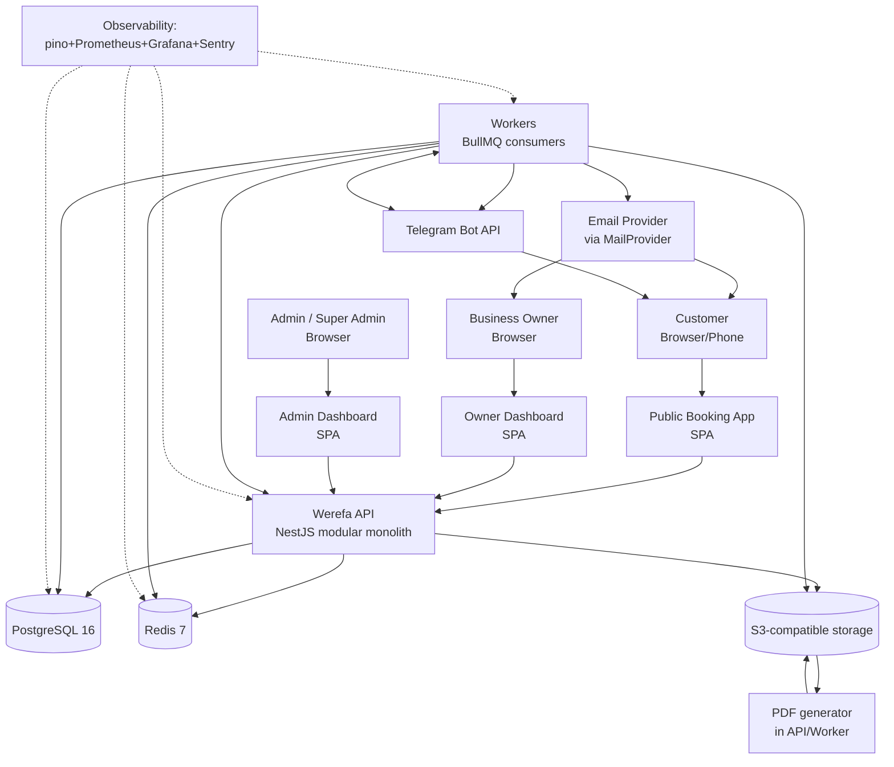

# 02 — System Context

> **Architecture Version:** 1.0.0 | **Source Spec:** Werefa v0.5.0 | **Date:** 2026-09-05 | **Status:** APPROVED — PROMPT 06

## 1. Actors

| Actor              | Description                                                                                                                                                                                                                   | Requirements anchor |
| ------------------ | ----------------------------------------------------------------------------------------------------------------------------------------------------------------------------------------------------------------------------- | ------------------- |
| **Customer**       | No platform account (REQ-040). Books via public page; provides name + phone + optional note (REQ-054/055); may connect Telegram optionally (REQ-056); identifies booking by phone (REQ-109); cannot cancel/modify (REQ-058).  |
| **Business Owner** | Registers self-service (REQ-005); may own multiple businesses (REQ-013); operates own dashboard; accepts/rejects proofs in dashboard or Telegram (REQ-119/120); manages schedule/services/business page; pauses/resumes.      |
| **Admin**          | Exactly 2 (REQ-038); platform-level administrative help; reviews subscription proofs (REQ-137/140); sees current booking status only (REQ-176); cannot view schedule history (REQ-168); cannot change own password (REQ-218). |
| **Super Admin**    | Exactly 1 (REQ-037); manages Admin accounts (REQ-039), force-logout (REQ-220), full history views (REQ-177), PDF exports (REQ-178), security-record deletion (REQ-205/206), emergency recovery (REQ-198).                     |
| **System**         | Actor for automatic changes (REQ-044): auto-completion (REQ-102), auto-resume events, schedule history on automatic changes (REQ-165), reminders, subscription processing.                                                    |

## 2. External systems

| External system                       | Role                                                                                                                       | Interaction                             | Failure handling                                          |
| ------------------------------------- | -------------------------------------------------------------------------------------------------------------------------- | --------------------------------------- | --------------------------------------------------------- |
| **Email provider** (SES/SMTP adapter) | Verification, resets, lockout, affected-booking, subscription reminders, forced-logout emails                              | Async via outbox                        | Retry in background; booking tx unaffected                |
| **Telegram Bot API**                  | Customer bookings/payment mgmt (optional) + owner notifications + business Telegram; accept/reject callbacks (REQ-067/068) | Webhook (hosted) / long-poll (dev)      | Idempotent update handling; failures never block bookings |
| **S3-compatible object storage**      | Payment proofs (customer + subscription), logo, cover, generated PDFs                                                      | Presigned PUT/GET; server-side for PDFs | Uploads staged; retried via idempotency                   |
| **Bank transfer / Telebirr**          | Payment methods the platform instructs (REQ-113/114); no direct provider integration — proof is manual                     | Human process; proof captured           | n/a (documented instructions)                             |
| **Google Maps / OpenStreetMap**       | Map on public page (REQ-212)                                                                                               | Client-side embed                       | Graceful fallback to static link                          |

## 3. Containers (internal components)

## 4. Primary flows (architecture-level)

| #   | Flow                 | Path                                                             | Transactional core                                                |
| --- | -------------------- | ---------------------------------------------------------------- | ----------------------------------------------------------------- |
| 1   | Public availability  | Customer → Public app → API (scheduler) → read model             | None (read-only)                                                  |
| 2   | Book + submit proof  | Customer → Public app → API `POST /public/bookings`              | **Yes** — slot lock + booking + payment created (doc 08)          |
| 3   | Owner verifies       | Owner → Dashboard → API → state transition                       | Yes — Pending→Accepted/Rejected + history + notifications (async) |
| 4   | Verify via Telegram  | Owner → Telegram bot callback → API webhook → transition         | Yes (same transition service)                                     |
| 5   | Subscription payment | Owner → Dashboard → upload proof → Admin → API approve/reject    | Yes — SubscriptionPayment + Subscription state + notifications    |
| 6   | Automatic events     | Workers on schedule → API/services                               | Yes per job — idempotent                                          |
| 7   | Reports/PDF          | Super Admin/Owner → Dashboard → API → report job → S3 → download | Read from history; PDF generation async                           |

## 5. Deployment units

| Unit      | Contents                                 | Scale                            |
| --------- | ---------------------------------------- | -------------------------------- |
| `web`     | Static builds of Public + Dashboard SPAs | CDN/nginx                        |
| `api`     | NestJS app (REST + webhooks)             | 1..N instances behind LB         |
| `worker`  | BullMQ consumers (all jobs)              | 1..N                             |
| `db`      | Managed PostgreSQL 16                    | 1 primary (+ read replica later) |
| `redis`   | Managed Redis 7                          | 1 instance cluster               |
| `storage` | S3 bucket(s)                             | managed                          |

## 6. Data flows that must never exist

- Public page must never expose booking history (REQ-057), payment proofs, or tenant data.
- Telegram/bot must never carry bookings into the system (REQ-059); owner accept/reject callbacks only mutate an existing pending item.
- Workers must never run without tenant context (may only touch rows scoped to the job's `business_id`).
