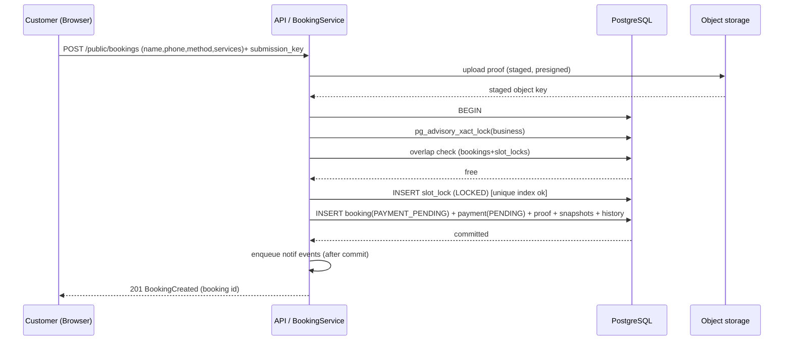
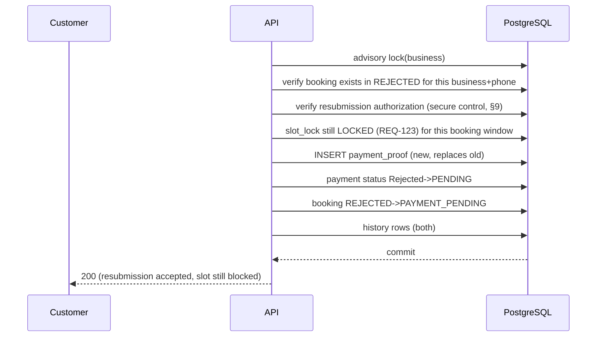
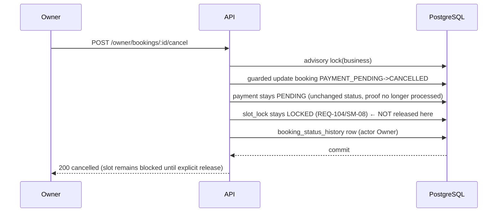
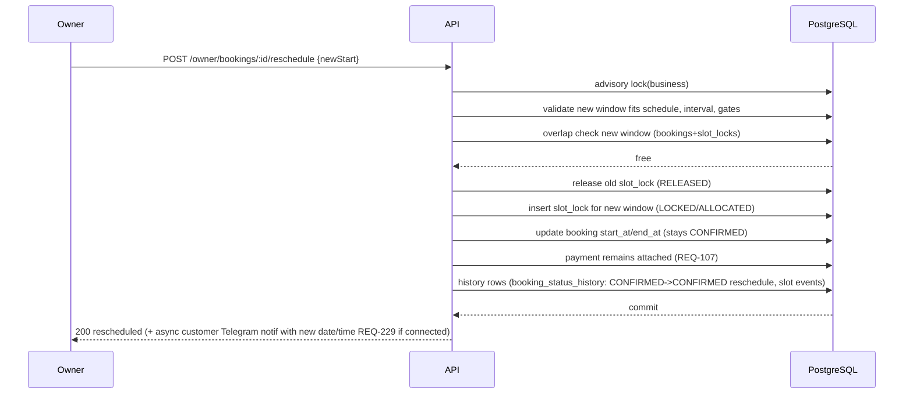

# 08 — Booking Concurrency (Critical)

> **Architecture Version:** 1.0.1 | **Source Spec:** Werefa v0.5.0 | **Date:** 2026-09-05 | **Status:** APPROVED — PROMPT 06 (+ Prompt 06-CORRECTION: unique-index wording precision, §1/§3/§8; resubmission security §9)
> **Binding requirements:** REQ-051, REQ-052, REQ-053, REQ-089, REQ-104, REQ-105/106, REQ-121, REQ-123, REQ-227–230; decisions OQ-SLOT-001, SM-08, SM-09. **Do not** "check then insert."

## 1. Guarantee

> If two customers submit valid payment proof for the **same slot** at nearly the same time, **exactly one succeeds**. The loser receives an "unavailable" result (REQ-053). No path creates two successful bookings for one slot (REQ-121).

This holds for the same slot window and for any two bookings whose scheduled windows **overlap** (a slot is defined by the contiguous window that a chosen service combination occupies). Overlap is impossible between two _distinct slot-lock identities_; it is prevented between two _different but overlapping_ windows by the serialized transaction + the authoritative in-transaction overlap re-check (below), not by the unique index alone.

**Wording note (Prompt 06-CORRECTION):** the partial unique index is **not** described as an "absolute backstop" for _all overlapping_ booking windows. An ordinary unique index on an exact window cannot, by itself, stop two different-but-overlapping windows from both being inserted. The concurrency guarantee rests on, in order:

1. **Advisory lock** — every booking/slot-claim mutation path takes the per-business transaction-scoped `pg_advisory_xact_lock(hashtext(business_id::text))` (mandatory, non-optional).
2. **Authoritative overlap re-check** — availability is re-validated inside that transaction _after_ acquiring the lock.
3. **Database constraint** — the partial unique index is a **defense-in-depth** constraint for _duplicate slot-lock identities_ (the same exact window), not a substitute for the overlap check.

All three layers together deliver REQ-121; the database constraint alone does not.

## 2. Slot identity

A slot is a temporal window on the business's schedule:

```
slot = (business_id, date, start_at, end_at)
```

- Generated by the availability engine (doc 10) at the chosen service combination's total duration (REQ-074) and interval (REQ-088).
- A "slot lock" is a durable row on exactly `(business_id, slot_date, start_at[, end_at])` (doc 07 §2 **uq_slot_lock_active**).
- Booking rows participate in availability via overlap: a slot is unavailable if any active `booking` (statuses PAYMENT_PENDING, CONFIRMED) or active `slot_lock` (LOCKED, ALLOCATED) **overlaps** `[start_at, end_at)`.

## 3. Mechanism — atomic claim

### 3.1 The safe sequence (customer proof submission — T1)

1. **Validate inputs (no locks).** Customer name/phone (REQ-054), payment method (REQ-116), service combination + duration (REQ-074/089), schedule version current, gates (not paused REQ-147, subscription eligible doc 15).
2. **Begin transaction** on the API process (Postgres interactive transaction).
3. **Serialize per business:** `SELECT pg_advisory_xact_lock(hashtext(business_id::text))`. This is a **transaction-scoped advisory lock** that serializes concurrent proof-submission transactions for the same business. (Different businesses never block each other.)
4. **Re-validate availability inside the lock:** issue the overlap query against `booking` + `slot_lock` for the slot window **now** (state may have changed since step 1). If occupied → rollback and return `SLOT_UNAVAILABLE` (REQ-053).
5. **Insert the slot lock** `(LOCKED, booking_id=NULL)` — the partial unique index guarantees at most one active lock **per exact slot identity** (`(business_id, slot_date, start_at, end_at)`); if a transaction somehow slips past step 4 for the same exact window (impossible under step 3, kept as defense-in-depth), the unique index raises `23505` → catch → rollback → `SLOT_UNAVAILABLE`. This index does **not** detect a different-but-overlapping window — overlap is prevented by step 3 (serialization) + step 4 (authoritative check).
6. **Insert booking** (status `PAYMENT_PENDING`) + **payment** (`PENDING`) + **payment proof** (file referenced; `submission_key` unique) + **booking snapshots** (`booking_service`).
7. **Write history.** `booking_status_history` (— → PAYMENT_PENDING, actor System/Customer); `payment_status_history` (None → PENDING).
8. **Commit.** On commit, enqueue **asynchronous** notifications: customer proof-received (REQ-060, Telegram if connected) and owner new-proof notification (REQ-065). Notifications never join this transaction (doc 13).
9. Slot lock remains `LOCKED`, no expiry (OQ-SLOT-001). A concurrent loser's step-4 or step-5 check fails → unavailable.

**Why advisory lock + unique index (ADR-004):** the advisory lock is the **primary** control — it serializes the business's submissions so the overlap re-check (step 4) and insert (step 5) are race-free for the same and for _overlapping_ windows. The unique partial index is a **defense-in-depth** constraint that catches _duplicate slot-lock identities_ (same exact window) even if another code path forgets the lock. Both are required invariants; they are complementary, not interchangeable — the index alone does not (and cannot) prevent two different-but-overlapping windows.

### 3.2 Isolation level

- Default `READ COMMITTED` is sufficient because the advisory lock serializes the critical read-check-write section.
- If the advisory lock is ever bypassed, the unique index still defeats double-insert; a small overlap race could still produce two non-identical windows overlapping — this is why step 3+4 (lock + re-check) is mandatory and covered by concurrency tests (doc 28).

## 4. Idempotency, retries, and duplicates

| Concern                                                                        | Design                                                                                                                                                                                                                                                                                             |
| ------------------------------------------------------------------------------ | -------------------------------------------------------------------------------------------------------------------------------------------------------------------------------------------------------------------------------------------------------------------------------------------------- |
| **Network retry** (customer refreshes/re-submits)                              | Client generates `submission_key` (UUID) before upload; the backend treats same `submission_key` for the same customer/booking as idempotent — returns the already-created booking result (200, not a new booking). Unique constraint on `payment_proof.submission_key`.                           |
| **Duplicate physical submission** (two tabs)                                   | Different `submission_key`s → both enter the transaction; advisory lock serializes them; second sees the slot occupied → unavailable (REQ-053). Same key → idempotent success.                                                                                                                     |
| **Proof-upload failure**                                                       | Uploads go to S3 as a **staged object** before the DB transaction. If the DB commit fails, the staged object is orphaned and cleaned by the orphan job (doc 16/17); the customer retries with the same submission flow. The booking is only visible after commit, so a failed upload = no booking. |
| **Honest client lies** (releases a failed submit then resubmits minutes later) | Slot was never created (transaction rolled back); nothing to release.                                                                                                                                                                                                                              |
| **Owner accept (T2) racing with auto state**                                   | Transition functions use guarded `UPDATE … SET status=‘NEW’ WHERE id=$1 AND status=‘EXPECTED’` and validate rowcount=1; under the per-business advisory lock for booking mutations, races are serialized.                                                                                          |

## 5. Concurrent workflows (all under the same per-business advisory lock)

| Workflow                                                                                        | Lock scope                                  | Behavior                                                                                                                                                                                                            |
| ----------------------------------------------------------------------------------------------- | ------------------------------------------- | ------------------------------------------------------------------------------------------------------------------------------------------------------------------------------------------------------------------- |
| **Concurrent owner actions** on the same business (accept, reject, cancel, reschedule, release) | advisory xact lock on business (short)      | Serialized; each validates current state; version column / guarded update catches stale actions                                                                                                                     |
| **Concurrent customer resubmission** after Rejected (T10)                                       | advisory lock on business                   | Step 4 re-check passes (slot still locked to this booking); new proof replaces old (`replaced_by_proof_id`); payment Rejected→PENDING; stays in `LOCKED`                                                            |
| **Concurrent reschedule** (owner)                                                               | advisory lock on business                   | Withdraws old slot (release old lock) and claims new slot **in the same transaction**; new slot claim runs the same atomic check (REQ-106); failure → entire reschedule rolls back (REQ-107 payment stays attached) |
| **Concurrent schedule change** (owner)                                                          | advisory lock on business (+ version write) | Applied as a new `ScheduleVersion`; existing bookings unchanged (REQ-090); warnings computed post-commit; pending version when paused (REQ-150)                                                                     |
| **Automatic completion / No Show** (workers)                                                    | advisory lock on business, short            | Same guarded transitions; Completed/No Show are terminal (SM-10) so later mutations are refused                                                                                                                     |

## 6. Retry behavior

- **DB-level:** transient serialization/deadlock errors trigger a bounded retry (default 3 attempts, exponential backoff) **inside** the submission service; the advisory lock makes serialization conflicts rare.
- **Idempotency:** retries reuse `submission_key`; result replay is safe.
- **No unbounded loops:** after max retries, return `SLOT_UNAVAILABLE`/`CONFLICT` (doc 23).

## 7. Sequence diagrams

### 7.1 Successful first payment-proof submission (T1)



### 7.2 Losing concurrent submission

```mermaid
sequenceDiagram
  participant A as Customer B (first)
  participant B as Customer C (second)
  participant PG as PostgreSQL
  A->>PG: BEGIN + advisory lock(business)
  B->>PG: BEGIN → waits on advisory lock
  A->>PG: claim + insert booking … commit
  B->>PG: obtains lock; overlap check
  PG-->>B: occupied
  B->>PG: ROLLBACK
  B-->>B: return SLOT_UNAVAILABLE (REQ-053)
```

### 7.3 Rejected proof → resubmission (T10, SM-09 option B)



**Security note (Prompt 06-CORRECTION, §9):** resubmission is **not** authorized by knowledge of the phone number alone; it requires the resubmission verification control in §9.

### 7.4 Owner cancellation while Payment Pending (T8, SM-08)



### 7.5 Owner release of blocked slot (explicit release)

```mermaid
sequenceDiagram
  participant O as Owner
  participant API as API
  participant PG as PostgreSQL
  O->>API: POST /owner/bookings/:id/release-slot
  API->>PG: advisory lock(business)
  API->>PG: valid only for CANCELLED/REJECTED-with-owner-release
  API->>PG: update slot_lock status -> RELEASED (released_by=Owner)
  API->>PG: booking_status_history row (if relevant) ; slot history
  PG-->>API: commit
  API-->>O: 200 slot released
```

### 7.6 Owner reschedule (T7, REQ-105/106/107)



## 8. Failure-mode matrix

| Failure                                                                                                                              | Detection                     | Behavior                                         |
| ------------------------------------------------------------------------------------------------------------------------------------ | ----------------------------- | ------------------------------------------------ |
| Unique index violation `23505` on slot_lock (same exact slot identity)                                                               | catch in service              | rollback → `SLOT_UNAVAILABLE`                    |
| Serialization/deadlock `40001`/`40P01`                                                                                               | catch                         | bounded retry (idempotent)                       |
| Staged proof never committed                                                                                                         | orphan job (doc 17)           | deleted after grace period                       |
| Owner releases slot already allocated to a booking                                                                                   | guarded update rowcount=0     | reject with conflict                             |
| Reschedule target occupied between check and claim (shouldn't happen under advisory lock, but possible if claim path used elsewhere) | unique index / guarded update | rollback → `SLOT_UNAVAILABLE`; booking unchanged |
| Worker completes booking that was cancelled meanwhile                                                                                | guarded status update         | 0 rows → skip, no side effect                    |

## 9. Customer resubmission security (Prompt 06-CORRECTION)

### 9.1 Risk

REQ-109 identifies the booking by the customer's **phone number**; customers have **no platform account** (REQ-040); and there is **no separate customer-facing booking reference** required. This means the only customer-known identifier for a rejected booking is the phone number. Treating _knowledge of a phone number alone_ as unrestricted authorization would let an attacker who knows/guesses a phone resubmit (and thereby keep the slot blocked or inject new proof for) another customer's rejected booking.

Product decisions are **unchanged**: identification stays phone-based; no account; no mandatory new booking code.

### 9.2 Security controls (no new product behavior)

| Control                                    | Mechanism                                                                                                                                                                                                                                                                                                                                                                                                                                                                                                                                                                | Product impact                                                                                                                                             |
| ------------------------------------------ | ------------------------------------------------------------------------------------------------------------------------------------------------------------------------------------------------------------------------------------------------------------------------------------------------------------------------------------------------------------------------------------------------------------------------------------------------------------------------------------------------------------------------------------------------------------------------ | ---------------------------------------------------------------------------------------------------------------------------------------------------------- |
| **Resubmission verification control**      | Resubmitting a rejected booking requires a **one-time, expiring, phone-scoped verification** that links the request to the legitimate holder of the booking. Concretely: during the original submission we already hold the customer's phone (REQ-054); on resubmission, the system sends a short code to that phone (via the approved Telegram channel if connected, else email if held, else no code path) and requires it before the `Rejected → PAYMENT_PENDING` transition. The code is single-use, time-limited, hashed at rest, and bound to the booking's phone. | No new account. No perpetual booking code. Adds a transient security step exclusively to the _resubmission_ (modify/resubmit) path for a rejected booking. |
| **Rate limiting on resubmission attempts** | Per-phone + per-business sliding-window limit on the resubmission endpoint and on verification-code requests (e.g., N requests per window); excessive attempts return `RATE_LIMITED` (doc 23).                                                                                                                                                                                                                                                                                                                                                                           | Plainly anti-abuse; no UX regression for a legitimate customer.                                                                                            |
| **Abuse/guess protection**                 | Exponential backoff between verification attempts; code attempts capped with lockout; all resubmission and verification events are recorded in `security_event`/audit (doc 22) with IP + phone + outcome, retained per the security retention policy (REQ-204).                                                                                                                                                                                                                                                                                                          | Detectable, auditable; no behavioral change for valid users.                                                                                               |
| **Idempotency + business context**         | Resubmission still runs under the per-business advisory lock and requires `business_id` scoping (§3 / doc 04 §5); the verification binds the actor to that specific booking's phone.                                                                                                                                                                                                                                                                                                                                                                                     | Strengthens, does not alter, the existing model.                                                                                                           |

### 9.3 Why not a mandatory new booking code

A brand-new, always-required customer-facing reference code would add product surface not requested (REQ-109 says no separate ref is required) and complicate the public flow for every booking. Instead, the verification control above is a **narrow security mechanism** applied only to the failed-resubmission path, consistent with the approved phone-based experience. It is documented here as an architectural security control, not as a new requirement or product decision.

### 9.4 Data representation

`resubmission_verification(id, booking_id fk, phone, code_hash, purpose, created_at, expires_at, used_at, attempts)` — single-use, hashed, expiring, bound to the booking's phone; `security_event` rows record outcomes. Nothing here introduces a customer account or a general booking reference.

## 10. Non-requests

- **No** external distributed lock service; Postgres advisory locks are correct and simpler.
- **No** TTL-based unlock of any kind (OQ-SLOT-001) — the lock persists until a workflow action releases it.
- **No** queue-based claiming — the claim is synchronous DB work; jobs only handle async side effects.
