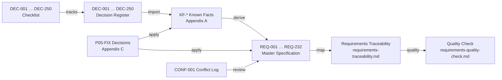

# Decision-to-Requirement Traceability

> **Status:** KF → REQ TRACED / DEC IMPORT PENDING (PROMPT 05-FIX DECISIONS APPLIED)
> **Version:** 0.5.0
> **Last Updated:** 2026-09-05
>
> **PURPOSE:** Ensure every approved decision eventually produces one or more documented requirements. This is the reverse documentation index: decision → requirements → affected documents.
>
> **Change note (Prompt 03):** The `KF-*` product facts are now fully converted into requirements. Every one of the **242 `KF-*` facts** is traced to at least one of the **226 requirements** (REQ-001 … REQ-226) in the master specification. The only remaining gap is the exact `DEC-001 … DEC-250` source wording, which is tracked in [decision-import-checklist.md](decision-import-checklist.md).
>
> **Change note (Prompt 04):** The single known conflict (CONF-001, report sort) passed through the consistency audit and is **RESOLVED** (later decision supersedes earlier rule). This does not change the KF → REQ mapping. See [consistency-audit.md](consistency-audit.md).
>
> **Change note (Prompt 05-FIX):** The **14 final approved decisions** (SM-05 … SM-10/SM-12/SM-13; OQ-SLOT-001/OQ-PROD-001/OQ-CUST-001/OQ-BOOK-001/OQ-PUB-001/OQ-PAY-001) were applied. Six new requirements (REQ-227 … REQ-232, Domain 22 / §30) were added and 22 existing requirements were updated in place, with every affected row's Decision Source set to `RESOLVED — PROMPT 05-FIX <ID>` (see Section 3 diagram and [requirements-traceability.md](requirements-traceability.md)). DEC import remains 0/250 pending.

---

## Related Documents

- [250-approved-decisions.md](250-approved-decisions.md) — canonical decision register (`DEC-*`, `KF-*` identifiers)
- [decision-import-checklist.md](decision-import-checklist.md) — per-decision import tracking
- [01-master-specification.md](01-master-specification.md) — where requirements live (REQ-001 … REQ-232)
- [requirements-traceability.md](requirements-traceability.md) — the detailed REQ → KF matrix (one row per REQ)
- [requirements-quality-check.md](requirements-quality-check.md) — per-requirement quality results
- [02-open-questions.md](02-open-questions.md) — unresolved issues
- [consistency-audit.md](consistency-audit.md) — conflict resolution and audit record

---

## Status Vocabulary

| Status                  | Meaning                                                                                          |
| ----------------------- | ------------------------------------------------------------------------------------------------ |
| `NEEDS DECISION IMPORT` | The decision has been registered but its exact source wording / DEC mapping is not yet imported. |
| `TRACED`                | Fact/content mapped to concrete requirement(s) with full consistency.                            |
| `PARTIALLY TRACED`      | Portions of the content are traced; remaining parts pending.                                     |
| `SUPERSEDED`            | Decision was replaced by a later decision (recorded, not discarded).                             |
| `CONFLICT OPEN`         | Decision is involved in a documented conflict awaiting consistency review.                       |

---

## Section 1 — DEC-001 … DEC-250 (Pending Import)

All 250 decision slots are registered but **cannot yet be mapped**. Their uniform pre-import state is:

| Decision ID       | Domain     | Requirement(s) affected | Document(s) affected                    | Status                  |
| ----------------- | ---------- | ----------------------- | --------------------------------------- | ----------------------- |
| DEC-001 … DEC-250 | UNASSIGNED | PENDING                 | 01-master-specification.md (domain TBD) | `NEEDS DECISION IMPORT` |

Rows will be expanded one-per-decision as each source decision is imported. Example of a fully mapped row (after import):

| Decision ID | Domain            | Requirement(s) affected                     | Document(s) affected           | Status   |
| ----------- | ----------------- | ------------------------------------------- | ------------------------------ | -------- |
| DEC-175     | SCHED / EXCEPTION | REQ-159, REQ-160 (Keep Booking on conflict) | 01-master-specification.md §19 | `TRACED` |

> Tracking of the 250 individual slots is maintained in [decision-import-checklist.md](decision-import-checklist.md).

---

## Section 2 — Known Approved Decision Content (KF-*) — Converged into Requirements

The confirmed product facts captured in [250-approved-decisions.md — Appendix A](250-approved-decisions.md) are approved decision content. All of them have been converted into `REQ-*` requirements. Status below is `TRACED`. The `DEC mapping` column records that the corresponding `DEC-*` number is assigned only when the source text is imported.

> The exact one-to-one row mapping (REQ → KF → document → test) is in [requirements-traceability.md](requirements-traceability.md); this section summarizes at group level.

### 2.1 Business Model (KF-BIZ)

| Decision ID                                 | Domain            | Requirement(s) affected             | Document(s) affected                   | Status   |
| ------------------------------------------- | ----------------- | ----------------------------------- | -------------------------------------- | -------- |
| KF-BIZ-01 … KF-BIZ-12 (DEC mapping pending) | PLATFORM / TENANT | REQ-001 … REQ-011, REQ-015, REQ-127 | 01-master-specification.md §5, §6, §16 | `TRACED` |

### 2.2 Business Account Model (KF-ACCT)

| Decision ID                                   | Domain | Requirement(s) affected | Document(s) affected          | Status   |
| --------------------------------------------- | ------ | ----------------------- | ----------------------------- | -------- |
| KF-ACCT-01 … KF-ACCT-13 (DEC mapping pending) | TENANT | REQ-012 … REQ-023       | 01-master-specification.md §6 | `TRACED` |

### 2.3 Customer Model (KF-CUST)

| Decision ID                                   | Domain                                  | Requirement(s) affected                      | Document(s) affected                        | Status   |
| --------------------------------------------- | --------------------------------------- | -------------------------------------------- | ------------------------------------------- | -------- |
| KF-CUST-01 … KF-CUST-10 (DEC mapping pending) | CUSTOMER / ROLES / LIFECYCLE / PUB-BOOK | REQ-040, REQ-045, REQ-054 … REQ-059, REQ-104 | 01-master-specification.md §8, §10, §14, §9 | `TRACED` |

> Note: KF-CUST-01 duplicates KF-ROLE-05 (both referenced by REQ-040). See register Appendix A and reverse index in `requirements-traceability.md`.

### 2.4 Roles (KF-ROLE)

| Decision ID                                   | Domain                | Requirement(s) affected             | Document(s) affected                    | Status   |
| --------------------------------------------- | --------------------- | ----------------------------------- | --------------------------------------- | -------- |
| KF-ROLE-01 … KF-ROLE-09 (DEC mapping pending) | ROLES / ADMIN / AUDIT | REQ-036 … REQ-044, REQ-165, REQ-217 | 01-master-specification.md §8, §20, §24 | `TRACED` |

> Note: KF-ROLE-02 duplicates KF-SUB-18 (both referenced by REQ-037); KF-ROLE-05 duplicates KF-CUST-01 (REQ-040).

### 2.5 Authentication (KF-AUTH)

| Decision ID                                   | Domain          | Requirement(s) affected                      | Document(s) affected               | Status   |
| --------------------------------------------- | --------------- | -------------------------------------------- | ---------------------------------- | -------- |
| KF-AUTH-01 … KF-AUTH-14 (DEC mapping pending) | AUTH / SECURITY | REQ-024 … REQ-035, REQ-204, REQ-205, REQ-206 | 01-master-specification.md §7, §22 | `TRACED` |

### 2.6 Scheduling (KF-SCHED)

| Decision ID                                     | Domain                                       | Requirement(s) affected                                                                              | Document(s) affected                                    | Status   |
| ----------------------------------------------- | -------------------------------------------- | ---------------------------------------------------------------------------------------------------- | ------------------------------------------------------- | -------- |
| KF-SCHED-01 … KF-SCHED-34 (DEC mapping pending) | SCHED / DATETIME / AUDIT / PAUSE / EXCEPTION | REQ-044, REQ-082 … REQ-099, REQ-142, REQ-150, REQ-151, REQ-152, REQ-159 … REQ-172, REQ-222 … REQ-226 | 01-master-specification.md §13, §17, §18, §19, §20, §25 | `TRACED` |

> Notes: KF-REPORT-21 vs KF-REPORT-22 conflict involves identical Booking ID sort (CONF-001) → REQ-190; KF-SCHED-11 (existing bookings unchanged) feeds REQ-160 via schedule exceptions.

### 2.7 Bookings (KF-BOOK)

| Decision ID                                   | Domain                        | Requirement(s) affected                                        | Document(s) affected                     | Status   |
| --------------------------------------------- | ----------------------------- | -------------------------------------------------------------- | ---------------------------------------- | -------- |
| KF-BOOK-01 … KF-BOOK-17 (DEC mapping pending) | SERVICE / LIFECYCLE / PAYMENT | REQ-070, REQ-074, REQ-076, REQ-100 … REQ-109, REQ-121, REQ-123 | 01-master-specification.md §12, §14, §15 | `TRACED` |

> Prompt 05-FIX: KF-BOOK-04/05/06/10/11/12/14/15/17 are now refined by the state-machine decisions (SM-05 … SM-10/SM-12/SM-13); see [requirements-traceability.md](requirements-traceability.md) and Appendix C of the register.

### 2.8 Payments (KF-PAY)

| Decision ID                                 | Domain  | Requirement(s) affected | Document(s) affected           | Status   |
| ------------------------------------------- | ------- | ----------------------- | ------------------------------ | -------- |
| KF-PAY-01 … KF-PAY-12 (DEC mapping pending) | PAYMENT | REQ-110 … REQ-124       | 01-master-specification.md §15 | `TRACED` |

> Prompt 05-FIX: KF-PAY-05 refined by OQ-PAY-001 (methods exactly Bank Transfer + Telebirr/mobile money; no custom methods); payment status set refined by SM-12 (Pending/Accepted/Rejected only).

### 2.9 Services (KF-SVC)

| Decision ID                                 | Domain  | Requirement(s) affected | Document(s) affected           | Status   |
| ------------------------------------------- | ------- | ----------------------- | ------------------------------ | -------- |
| KF-SVC-01 … KF-SVC-08 (DEC mapping pending) | SERVICE | REQ-071 … REQ-081       | 01-master-specification.md §12 | `TRACED` |

### 2.10 Public Business Page (KF-PUB)

| Decision ID                                 | Domain                                              | Requirement(s) affected                                                            | Document(s) affected                             | Status   |
| ------------------------------------------- | --------------------------------------------------- | ---------------------------------------------------------------------------------- | ------------------------------------------------ | -------- |
| KF-PUB-01 … KF-PUB-29 (DEC mapping pending) | TENANT / PUB-BOOK / PAUSE / PUB-PAGE / SUBSCRIPTION | REQ-007, REQ-008, REQ-045 … REQ-053, REQ-134, REQ-143 … REQ-149, REQ-207 … REQ-216 | 01-master-specification.md §6, §9, §16, §18, §23 | `TRACED` |

### 2.11 Pause / Resume (KF-PAUSE)

| Decision ID                                     | Domain | Requirement(s) affected                               | Document(s) affected           | Status   |
| ----------------------------------------------- | ------ | ----------------------------------------------------- | ------------------------------ | -------- |
| KF-PAUSE-01 … KF-PAUSE-09 (DEC mapping pending) | PAUSE  | REQ-145, REQ-150, REQ-151, REQ-152, REQ-153 … REQ-158 | 01-master-specification.md §18 | `TRACED` |

### 2.12 Subscriptions (KF-SUB)

| Decision ID                                 | Domain                                 | Requirement(s) affected                      | Document(s) affected                         | Status   |
| ------------------------------------------- | -------------------------------------- | -------------------------------------------- | -------------------------------------------- | -------- |
| KF-SUB-01 … KF-SUB-23 (DEC mapping pending) | SUBSCRIPTION / NOTIF / PAYMENT / ROLES | REQ-037, REQ-118, REQ-125 … REQ-141, REQ-142 | 01-master-specification.md §8, §15, §16, §17 | `TRACED` |

> Note: KF-SUB-18 duplicates KF-ROLE-02 (both referenced by REQ-037).

### 2.13 Telegram (KF-TG)

| Decision ID                               | Domain                          | Requirement(s) affected                      | Document(s) affected                          | Status   |
| ----------------------------------------- | ------------------------------- | -------------------------------------------- | --------------------------------------------- | -------- |
| KF-TG-01 … KF-TG-10 (DEC mapping pending) | TG / CUSTOMER / PAYMENT / NOTIF | REQ-056, REQ-060 … REQ-069, REQ-124, REQ-142 | 01-master-specification.md §10, §11, §15, §17 | `TRACED` |

### 2.14 Reports / History (KF-REPORT)

| Decision ID                                       | Domain         | Requirement(s) affected | Document(s) affected                | Status   |
| ------------------------------------------------- | -------------- | ----------------------- | ----------------------------------- | -------- |
| KF-REPORT-01 … KF-REPORT-24 (DEC mapping pending) | REPORT / AUDIT | REQ-173 … REQ-190       | 01-master-specification.md §20, §21 | `TRACED` |

> Note: KF-REPORT-21 vs KF-REPORT-22 — involved in `CONF-001`, which is now **RESOLVED** (later decision supersedes earlier rule). Final rule: Primary = Booking ID, Secondary = Date/time, Final tie-breaker = Actor A–Z. See [consistency-audit.md](consistency-audit.md).

### 2.15 Security (KF-SEC)

| Decision ID                                 | Domain                  | Requirement(s) affected                                | Document(s) affected                         | Status   |
| ------------------------------------------- | ----------------------- | ------------------------------------------------------ | -------------------------------------------- | -------- |
| KF-SEC-01 … KF-SEC-18 (DEC mapping pending) | SECURITY / ADMIN / AUTH | REQ-035, REQ-142, REQ-191 … REQ-203, REQ-217 … REQ-221 | 01-master-specification.md §7, §17, §22, §24 | `TRACED` |

---

## Section 3 — Relational Diagram

> The 14 Prompt 05-FIX decisions (Appendix C of the register) are fully applied: 8 state-machine decisions (SM-05 … SM-10/SM-12/SM-13) and 6 open-question decisions (OQ-SLOT-001/OQ-PROD-001/OQ-CUST-001/OQ-BOOK-001/OQ-PUB-001/OQ-PAY-001). They produced REQ-227 … REQ-232 (Domain 22 / §30) and refined existing requirements in place. This is separate from the still-pending `DEC-001 … DEC-250` source-word import (0/250).

---

## Section 4 — Import Procedure (Updated for Prompt 03)

With KF → REQ derivation **completed**, the procedure now covers DEC import and reconciliation:

1. For each decision: record canonical wording in `250-approved-decisions.md` (replace `NEEDS SOURCE DECISION TEXT`).
2. Assign the decision to a domain.
3. **Confirm** that the derived `REQ-*` requirements still match the imported wording; adjust the requirement only if the DEC content requires it (record the change).
4. Map the decision in this file: expand Section 1 rows and flip statuses to `TRACED`; list affected documents.
5. Reconcile `KF-*` facts against the imported decisions: confirm mapping and resolve the two known duplicate pairs (KF-CUST-01/KF-ROLE-05, KF-ROLE-02/KF-SUB-18).
6. Re-evaluate conflicts (CONF-001) against imported wording; confirm the resolved precedence rule in `01-master-specification.md` §29.4 and `consistency-audit.md`; record any new `CONF-*`.
7. Update checklist, traceability matrix, and open questions.

**Definition of Done (traceability):** All rows reach `TRACED` only when:

- Decision content is canonical (no `NEEDS SOURCE DECISION TEXT`).
- One or more `REQ-*` requirements exist and are traceable to it.
- All affected documents are named.
- No contradictions remain undocumented.
